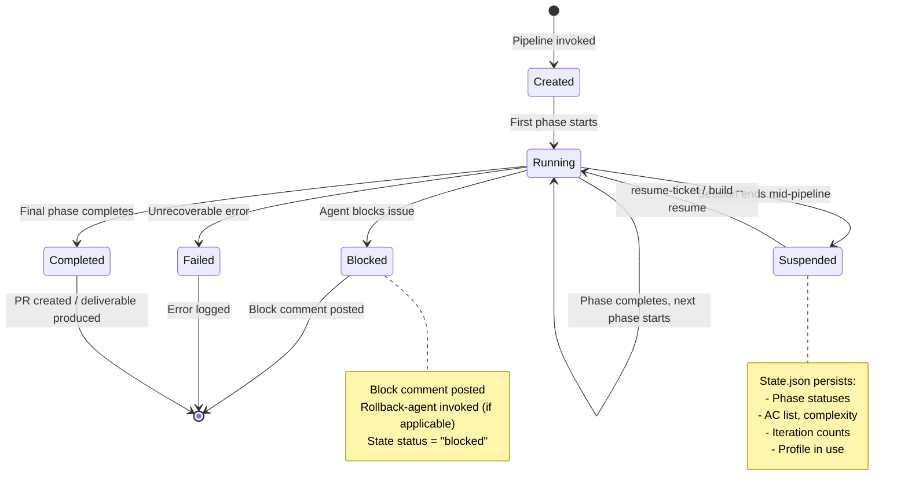

# Forge + ceos-agents Merger Migration: Architecture Design Document

**Author:** Dr. Sarah Chen, Principal Software Architect
**Date:** 2026-03-22
**Version:** 1.0.0
**Status:** PROPOSED
**Companion to:** requirements.md (same directory)

---

## 1. System Overview

### 1.1 Design Philosophy

The merger follows the principle of **additive composition**: new capabilities are layered on top of the existing system, which continues to function unchanged throughout and after the migration. There is no replacement, no abstraction inversion, and no "engine" runtime. The system remains a pure markdown plugin where every file is readable as-is.

### 1.2 Architectural Layers (Post-Migration)

The system has 4 layers after migration (up from 2):

| Layer | Purpose | Contents | How Invoked |
|-------|---------|----------|-------------|
| **Skills** | Unified entry points with mode dispatch | `skills/build/SKILL.md`, `skills/bug-workflow/SKILL.md` | Natural language or `/ceos-agents:build` |
| **Commands** | Single-purpose pipeline orchestration | 24 files in `commands/` | `/ceos-agents:{command}` |
| **Core** | Shared pipeline patterns with contracts | 10 files in `core/` | Referenced by prose in commands and mode adapters |
| **Agents** | Stateless specialist workers | 21 files in `agents/` | Dispatched via Task tool by commands/skills |

The key relationships:
- Skills dispatch to mode adapters (files within the skill directory)
- Mode adapters reference core patterns and dispatch agents
- Commands reference core patterns and dispatch agents
- Core files are never invoked directly -- they are instructions read by the orchestrating layer
- Agents are always invoked via the Task tool and never reference other agents

### 1.3 System Overview Diagram

```mermaid
graph TD
    User([User])

    subgraph "Entry Points"
        BUILD["/build skill<br/>(mode detection + dispatch)"]
        COMMANDS["24 Slash Commands<br/>(fix-ticket, fix-bugs,<br/>implement-feature, scaffold, ...)"]
        ROUTER["bug-workflow skill<br/>(natural language routing)"]
    end

    subgraph "Mode Adapters (skills/build/)"
        MA_CB["mode-code-bugfix"]
        MA_CF["mode-code-feature"]
        MA_CP["mode-code-project"]
        MA_AN["mode-analysis"]
        MA_ST["mode-strategy"]
        MA_CO["mode-content"]
    end

    subgraph "Shared Patterns (core/)"
        CORE_CONFIG["config-reader"]
        CORE_MCP["mcp-preflight"]
        CORE_FRL["fixer-reviewer-loop"]
        CORE_BH["block-handler"]
        CORE_AOI["agent-override-injector"]
        CORE_DH["decomposition-heuristics"]
        CORE_PP["profile-parser"]
        CORE_PPH["post-publish-hook"]
        CORE_FV["fix-verification"]
        CORE_SM["state-manager"]
    end

    subgraph "Agents (21)"
        READ_AGENTS["Read-only (10)<br/>triage-analyst, code-analyst,<br/>reviewer, spec-analyst, architect,<br/>stack-selector, priority-engine,<br/>spec-reviewer, acceptance-gate,<br/>domain-analyst"]
        EXEC_AGENTS["Execution (11)<br/>fixer, test-engineer,<br/>e2e-test-engineer, publisher,<br/>scaffolder, spec-writer,<br/>reproducer, browser-verifier,<br/>rollback-agent, intake-agent,<br/>synthesizer"]
    end

    subgraph "State (.ceos-agents/)"
        STATE["state.json"]
        ELOG["pipeline.log"]
        ARTIFACTS["Browser artifacts"]
    end

    CONFIG["Automation Config<br/>(project CLAUDE.md)"]
    TEMPLATES["Document Templates<br/>(SDLC / custom)"]
    MCP["MCP Servers<br/>(Issue Tracker, Source Control)"]

    User -->|natural language| ROUTER
    User -->|"/build"| BUILD
    User -->|"/fix-ticket"| COMMANDS
    ROUTER -->|routes to| BUILD
    ROUTER -->|routes to| COMMANDS
    BUILD -->|selects| MA_CB & MA_CF & MA_CP & MA_AN & MA_ST & MA_CO

    MA_CB & MA_CF & MA_CP -->|reference| CORE_CONFIG & CORE_MCP & CORE_FRL & CORE_BH & CORE_SM
    MA_AN & MA_ST & MA_CO -->|reference| CORE_CONFIG & CORE_SM
    COMMANDS -->|reference| CORE_CONFIG & CORE_MCP & CORE_FRL & CORE_BH & CORE_SM

    MA_CB & MA_CF & MA_CP -->|dispatch| READ_AGENTS & EXEC_AGENTS
    MA_AN & MA_ST & MA_CO -->|dispatch| READ_AGENTS & EXEC_AGENTS
    COMMANDS -->|dispatch| READ_AGENTS & EXEC_AGENTS

    CORE_CONFIG -->|reads| CONFIG
    MA_AN & MA_ST & MA_CO -->|read| TEMPLATES

    READ_AGENTS & EXEC_AGENTS -->|via| MCP
    CORE_SM -->|writes| STATE & ELOG
    EXEC_AGENTS -->|writes| ARTIFACTS
```



---

## 2. Pipeline Flow Diagrams

### 2.1 Code-Bugfix Pipeline Flow

```mermaid
flowchart TD
    START([Start: /build PROJ-123 or /fix-ticket PROJ-123]) --> CONFIG[Read Automation Config<br/>core/config-reader.md]
    CONFIG --> MCP{MCP Preflight<br/>core/mcp-preflight.md}
    MCP -->|fail| BLOCK_MCP[Block: MCP unavailable]
    MCP -->|pass| TRIAGE[Triage<br/>agent: triage-analyst]

    TRIAGE -->|blocked| BLOCK_TRIAGE[Block: unclear/duplicate]
    TRIAGE -->|success| WRITE_TRIAGE[Write state: triage complete<br/>AC list, complexity, severity]
    WRITE_TRIAGE --> CODE_ANALYSIS[Code Analysis<br/>agent: code-analyst]

    CODE_ANALYSIS --> WRITE_CA[Write state: code_analysis complete<br/>risk, affected files]
    WRITE_CA --> REPRO{Browser Reproduce?}
    REPRO -->|config enabled| REPRODUCER[Reproduce<br/>agent: reproducer]
    REPRO -->|disabled/skipped| PRE_FIX
    REPRODUCER --> PRE_FIX{Pre-fix Hook?}

    PRE_FIX -->|configured| HOOK_PRE[Execute pre-fix hook]
    PRE_FIX -->|not configured| FIX_LOOP
    HOOK_PRE --> FIX_LOOP

    FIX_LOOP[Fixer-Reviewer Loop<br/>core/fixer-reviewer-loop.md]
    FIX_LOOP -->|APPROVED| POST_FIX{Post-fix Hook?}
    FIX_LOOP -->|BLOCKED| ROLLBACK[Rollback<br/>agent: rollback-agent]
    FIX_LOOP -->|NEEDS_DECOMPOSITION| DECOMPOSE[Decompose into subtasks<br/>agent: architect]
    ROLLBACK --> BLOCK_FIX[Block: fix failed]

    DECOMPOSE --> SUBTASK_LOOP[Execute subtasks sequentially<br/>Each: fixer -> reviewer]
    SUBTASK_LOOP --> POST_FIX

    POST_FIX -->|configured| HOOK_POST[Execute post-fix hook + custom agent]
    POST_FIX -->|not configured| TEST
    HOOK_POST --> TEST

    TEST[Test<br/>agent: test-engineer]
    TEST -->|pass| E2E{E2E Test?}
    TEST -->|fail, retries left| TEST
    TEST -->|fail, no retries| ROLLBACK_TEST[Rollback + Block]

    E2E -->|configured| E2E_TEST[E2E Test<br/>agent: e2e-test-engineer]
    E2E -->|not configured| BROWSER_V
    E2E_TEST --> BROWSER_V

    BROWSER_V{Browser Verify?}
    BROWSER_V -->|enabled| BROWSER[Browser Verify<br/>agent: browser-verifier]
    BROWSER_V -->|disabled| ACCEPT_GATE
    BROWSER --> ACCEPT_GATE

    ACCEPT_GATE{Acceptance Gate?<br/>AC >= 3 OR complexity >= M}
    ACCEPT_GATE -->|should run| GATE[Acceptance Gate<br/>agent: acceptance-gate]
    ACCEPT_GATE -->|skip| PRE_PUB
    GATE -->|pass| PRE_PUB
    GATE -->|fail| ROLLBACK_GATE[Rollback + Block]

    PRE_PUB{Pre-publish Hook?}
    PRE_PUB -->|configured| HOOK_PUB[Execute pre-publish hook + custom agent]
    PRE_PUB -->|not configured| PUBLISH
    HOOK_PUB --> PUBLISH

    PUBLISH[Publish<br/>agent: publisher]
    PUBLISH --> POST_PUB[Post-publish<br/>core/post-publish-hook.md]
    POST_PUB --> DONE([Complete: PR created])
```



### 2.2 Analysis Pipeline Flow

```mermaid
flowchart TD
    START([Start: /build --mode analysis "topic"]) --> CONFIG[Read Automation Config<br/>optional -- may not exist]
    CONFIG --> DETECT_TMPL{Template Detection}
    DETECT_TMPL -->|SDLC detected| LOAD_TMPL[Load SDLC templates<br/>Extract section structure]
    DETECT_TMPL -->|custom template| LOAD_CUSTOM[Load custom template]
    DETECT_TMPL -->|no template| DEFAULT[Use default output format]

    LOAD_TMPL & LOAD_CUSTOM & DEFAULT --> INTAKE[Intake<br/>agent: intake-agent]

    INTAKE -->|blocked| BLOCK_INTAKE[Block: no actionable input]
    INTAKE -->|success| WRITE_INTAKE[Write state: intake complete<br/>sources, combined_context]

    WRITE_INTAKE --> SCOPE[Scope Definition<br/>agent: spec-writer<br/>+ analysis domain context]
    SCOPE --> SCOPE_REVIEW[Scope Review<br/>agent: spec-reviewer<br/>+ analysis domain context]

    SCOPE_REVIEW -->|APPROVE| ANALYSIS[Domain Analysis<br/>agent: domain-analyst]
    SCOPE_REVIEW -->|REVISE| SCOPE
    SCOPE_REVIEW -->|BLOCK| BLOCK_SCOPE[Block: scope unresolvable]

    ANALYSIS --> SYNTHESIS[Synthesis<br/>agent: synthesizer<br/>+ template structure]
    SYNTHESIS --> REVIEW[Review<br/>agent: reviewer<br/>+ analysis domain context]

    REVIEW -->|APPROVE| VERIFY[Verification<br/>REVIEWED verdict + confidence]
    REVIEW -->|REQUEST_CHANGES, iterations left| REVISION[Revision<br/>agent: synthesizer]
    REVIEW -->|REQUEST_CHANGES, no iterations| FORCE_OUTPUT[Output with review caveats]
    REVISION --> REVIEW

    VERIFY --> OUTPUT[Final Output<br/>agent: synthesizer<br/>format per template]
    FORCE_OUTPUT --> OUTPUT
    OUTPUT --> DONE([Complete: deliverable produced])
```

### 2.3 Mode Detection Flowchart

```mermaid
flowchart TD
    INPUT([User Input]) --> RESUME{--resume flag?}
    RESUME -->|yes| READ_STATE[Read state.json<br/>Resume in recorded mode]
    RESUME -->|no| MODE_FLAG{--mode flag?}

    MODE_FLAG -->|yes| USE_MODE[Use specified mode]
    MODE_FLAG -->|no| IS_ISSUE{Input matches<br/>issue ID pattern?}

    IS_ISSUE -->|yes| QUERY_TRACKER[Query issue tracker<br/>for type/labels]
    IS_ISSUE -->|no| NL_PARSE[Parse natural language<br/>intent keywords]

    QUERY_TRACKER --> FEATURE_Q{Matches Feature<br/>Workflow query?}
    FEATURE_Q -->|yes| CODE_FEATURE[mode = code-feature]
    FEATURE_Q -->|no| BUG_Q{Matches Bug query?}
    BUG_Q -->|yes| CODE_BUGFIX[mode = code-bugfix]
    BUG_Q -->|no| ASK_USER[Ask user to select mode]

    NL_PARSE --> KEYWORDS{Keyword match?}
    KEYWORDS -->|analyze, assess, evaluate| ANALYSIS[candidate = analysis]
    KEYWORDS -->|strategy, plan, roadmap| STRATEGY[candidate = strategy]
    KEYWORDS -->|write, document, content| CONTENT[candidate = content]
    KEYWORDS -->|build, create, scaffold| CODE_PROJECT[candidate = code-project]
    KEYWORDS -->|ambiguous| ASK_USER

    ANALYSIS & STRATEGY & CONTENT & CODE_PROJECT --> TEMPLATE_HINT{--template flag<br/>suggests mode?}
    TEMPLATE_HINT -->|overrides| OVERRIDE_MODE[Adjust candidate]
    TEMPLATE_HINT -->|no| CONFIRM

    OVERRIDE_MODE --> CONFIRM{--yolo flag?}
    CONFIRM -->|yes| USE_DETECTED[Use detected mode]
    CONFIRM -->|no| ASK_CONFIRM[Present mode to user<br/>Proceed? Y/n/change]

    ASK_CONFIRM -->|Y| USE_DETECTED
    ASK_CONFIRM -->|n| ABORT([Abort])
    ASK_CONFIRM -->|change| SHOW_ALL[Show all 6 modes<br/>User selects]
    SHOW_ALL --> USE_DETECTED

    USE_MODE & USE_DETECTED & READ_STATE --> DISPATCH[Load mode adapter<br/>mode-{name}.md]
```

---

## 3. State Lifecycle Diagram



---

## 4. Data Flow Diagrams

### 4.1 Data Flow: Code-Bugfix Pipeline

```
Phase 1: Config
  IN:  project CLAUDE.md
  OUT: config variables (tracker type, retry limits, hooks, profiles, ...)

Phase 2: MCP Preflight
  IN:  config.issue_tracker_type
  OUT: mcp_available (boolean)

Phase 3: Triage
  IN:  issue ID, issue tracker data (via MCP)
  OUT: severity, area, complexity (XS/S/M/L), AC list (2-5 items),
       reproduction_steps (optional), triage checkpoint comment

Phase 4: Code Analysis
  IN:  issue description, AC list
  OUT: risk (LOW/MEDIUM/HIGH), affected_files (max 5),
       estimated_diff_lines, change_area_count

Phase 5: Reproduction (optional)
  IN:  reproduction_steps, Browser Verification config
  OUT: reproduction-result.json, reproducer-script.js, before-screenshot

Phase 6: Pre-fix Hook (optional)
  IN:  config.hooks.pre_fix command
  OUT: hook exit code

Phase 7: Fixer-Reviewer Loop
  IN:  AC list, code-analyst report, reproduction result,
       config.retry_limits.fixer_iterations, agent overrides
  OUT: approved code changes (git commits), iteration count,
       verdict history, AC fulfillment per iteration

Phase 8: Post-fix Hook (optional)
  IN:  config.hooks.post_fix command, custom agent name
  OUT: hook exit code, custom agent output

Phase 9: Test
  IN:  config.build_command, config.test_command,
       config.retry_limits.test_attempts
  OUT: test results (pass/fail), attempt count

Phase 10: E2E Test (optional)
  IN:  config.e2e_test.framework, config.e2e_test.command
  OUT: E2E test results

Phase 11: Browser Verify (optional)
  IN:  reproduction-result.json, reproducer-script.js,
       Browser Verification config
  OUT: verification-result.json, after-screenshot

Phase 12: Acceptance Gate (conditional)
  IN:  AC list, code changes, test results,
       complexity, AC count
  OUT: per-AC verdict (FULFILLED/PARTIALLY/NOT ADDRESSED)

Phase 13: Pre-publish Hook (optional)
  IN:  config.hooks.pre_publish, custom agent name
  OUT: hook exit code

Phase 14: Publish
  IN:  config.remote, config.base_branch, config.branch_naming,
       config.pr_labels, config.pr_description_template
  OUT: PR URL, branch name

Phase 15: Post-publish (optional)
  IN:  config.hooks.post_publish, config.notifications
  OUT: hook exit code, webhook response
```

### 4.2 Data Flow: Analysis Pipeline

```
Phase 1: Config (optional)
  IN:  project CLAUDE.md (may not exist)
  OUT: config variables or defaults

Phase 2: Intake
  IN:  user input (URLs, text, files, issue refs)
  OUT: sources[], combined_context, key_entities[],
       ambiguities[], suggested_scope

Phase 3: Scope Definition
  IN:  intake summary, analysis domain context block
  OUT: scope document (purpose, key questions, data sources,
       methods, limitations)

Phase 4: Scope Review
  IN:  scope document, analysis domain context block
  OUT: APPROVE / REVISE verdict, feedback items

Phase 5: Domain Analysis
  IN:  intake summary, approved scope
  OUT: findings[] (question, evidence, method, conclusion, confidence),
       themes[], gaps[], risks[], recommendations[] (max 10)

Phase 6: Synthesis
  IN:  findings, scope, template structure (if detected)
  OUT: draft report (executive summary + sections per template)

Phase 7: Review
  IN:  draft report, analysis domain context block
  OUT: APPROVE / REQUEST_CHANGES verdict, feedback items[]

Phase 8: Revision Loop (max 3)
  IN:  reviewer feedback, previous draft
  OUT: revised draft

Phase 9: Verification
  IN:  final draft
  OUT: REVIEWED verdict, confidence (HIGH/MEDIUM/LOW),
       methodology assessment, evidence quality assessment

Phase 10: Output
  IN:  final draft, template structure, output path
  OUT: deliverable document(s) in specified format
```

### 4.3 Cross-Phase Data Persistence

```
                    Session Memory          state.json              External
                    (ephemeral)             (persistent)            (permanent)
                    ─────────────           ──────────────          ────────────
Triage AC list      ●                       ●                      ● (issue comment)
Complexity          ●                       ●
Code-analyst report ●                       ● (summary fields)
Iteration counts    ●                       ●
Reviewer verdicts   ●                       ● (history array)
Profile in use      ●                       ●
Decomposition plan  ●                       ● (subtasks array)      ● (yaml, legacy)
PR URL              ●                       ●                      ● (issue comment)
Block details       ●                       ●                      ● (issue comment)
```

This shows that state.json bridges the gap between ephemeral session memory and permanent external artifacts, enabling resume without data loss.

---

## 5. Agent Dispatch Architecture

### 5.1 Dispatch Mechanism

All agents are dispatched via the Claude Code Task tool:

```
Task(agent='ceos-agents:{agent-name}', input='{context}')
```

The dispatching layer (command or mode adapter) is responsible for:
1. Assembling the context string (input for the agent)
2. Injecting agent overrides (via core/agent-override-injector.md)
3. Injecting domain context blocks (for non-code modes, via mode adapter)
4. Reading the agent's output and extracting structured data
5. Updating state.json with the phase result

### 5.2 Domain Context Injection

For non-code modes, existing agents (reviewer, spec-writer, spec-reviewer, priority-engine) receive domain-specific instructions appended to their context. This uses the same mechanism as Agent Overrides but is injected by the mode adapter rather than by a user file.

Injection order:
1. Agent's base prompt (from `agents/{name}.md`)
2. Agent Override (from `{customization-path}/{name}.md`, if exists)
3. Domain Context Block (from mode adapter, if non-code mode)

The domain context block is appended as:

```markdown
## Domain Context
{domain-specific instructions from mode adapter}
```

This ensures:
- Base agent behavior is preserved
- User customizations layer on top
- Mode-specific adaptation layers last (highest priority)

### 5.3 Agent Communication Pattern

Agents do not communicate directly. All inter-agent data flow passes through the orchestrating layer:

```
Orchestrator (command/mode adapter)
    |
    ├── Dispatch Agent A ──→ Receive Output A
    |                            |
    |   ← Parse structured data ←┘
    |   → Write to state.json
    |   → Assemble context for Agent B
    |
    ├── Dispatch Agent B ──→ Receive Output B
    |                            |
    └── ...
```

This pattern is unchanged from the current system. The core extraction does not introduce direct agent-to-agent communication.

---

## 6. SDLC Template Integration Architecture

### 6.1 Template Detection Flow

```mermaid
flowchart TD
    START([Pipeline starts]) --> FLAG{--template flag?}

    FLAG -->|"sdlc" or "sdlc:{tier}"| SDLC_LOAD[Load SDLC templates<br/>from known path]
    FLAG -->|file/dir path| CUSTOM_LOAD[Load custom template<br/>from specified path]
    FLAG -->|"none"| NO_TMPL[Disable template detection]
    FLAG -->|not specified| AUTO_DETECT{Scan project docs/<br/>for YAML frontmatter}

    AUTO_DETECT -->|found type + sections| SDLC_DETECT[SDLC templates detected<br/>Determine tier by file count]
    AUTO_DETECT -->|not found| CHECK_CONFIG{Document Templates<br/>in Automation Config?}

    CHECK_CONFIG -->|configured| CONFIG_LOAD[Load from config path]
    CHECK_CONFIG -->|not configured| NO_TMPL

    SDLC_LOAD & CUSTOM_LOAD & SDLC_DETECT & CONFIG_LOAD --> PARSE[Parse template frontmatter<br/>Extract sections array]
    PARSE --> INJECT[Inject section structure<br/>into synthesizer context]

    NO_TMPL --> DEFAULT[Synthesizer uses<br/>default output structure]
```

### 6.2 Template Data Model

```
Template
├── type: string (e.g., "overview", "requirements", "decisions")
├── purpose: string
├── audience: string[]
├── sections: Section[]
│   ├── name: string
│   ├── required: boolean
│   └── prompt: string (guidance for content generation)
└── links: Link[] (optional)
    ├── type: string (e.g., "implements", "depends-on")
    └── target: string
```

The synthesizer maps its output to the template's `sections` array:
- For each `required: true` section: the synthesizer MUST produce content
- For each `required: false` section: the synthesizer produces content if relevant
- The `prompt` field guides what content should appear in each section
- Section order from the template is preserved in the output

### 6.3 Extension Points for Custom Templates

Any markdown file with the following YAML frontmatter structure is recognized as a template:

```yaml
---
type: {string}
purpose: {string}
sections:
  - name: {string}
    required: {boolean}
    prompt: {string}
---
```

This means:
- SDLC templates are the built-in supported format
- Any project can create custom templates following the same structure
- Templates from other systems (ISO documentation, regulatory templates) can be converted to this format
- The `type` field is informational -- the system does not interpret it beyond logging

---

## 7. Extension Points

### 7.1 Adding a New Mode

To add a new mode (e.g., `testing`, `devops`):

1. Create `skills/build/mode-{name}.md` with the mode adapter contract (Description, Applicable When, Phase Sequence, Domain Context Blocks, Output Format, SDLC Template Integration)
2. Update the mode detection algorithm in `skills/build/SKILL.md` to recognize the new mode's keywords
3. Add new agents if the mode requires capabilities not covered by existing agents
4. Add domain context blocks for existing agents that need adaptation
5. Add a workflow example in `examples/workflows/`
6. Update `docs/reference/build-command.md`

No changes to core files, existing commands, or existing agents required.

### 7.2 Adding a New Agent

To add a new agent:

1. Create `agents/{name}.md` with the standard frontmatter (name, description, model, style) and section structure (Goal, Expertise, Process, Constraints)
2. Update `CLAUDE.md` agent roster
3. Update `docs/reference/agents.md`
4. If the agent is read-only: add to `rollback-agent.md` skip list
5. Add to `tests/scenarios/happy-path.sh` inventory (dynamic, so may auto-detect)
6. Add to `tests/scenarios/frontmatter-completeness.sh` (dynamic, so may auto-detect)
7. Version bump: MINOR

### 7.3 Adding a New Document Template Format

To support a new template standard beyond SDLC:

1. Ensure template files have YAML frontmatter with `type`, `purpose`, and `sections` fields
2. Create a detection rule in the template detection flow (Section 6.1) or use the `--template` flag to point to the template directory
3. No code changes required -- the synthesizer reads any template that follows the frontmatter contract

### 7.4 Adding a New Core Pattern

To extract a new shared pattern:

1. Create `core/{pattern-name}.md` with the standard structure (Purpose, Input Contract, Process, Output Contract, Failure Handling)
2. Update consuming commands to reference the new core file
3. Add structural test in `tests/scenarios/core-include-refs.sh`
4. Version bump: PATCH (internal refactor)

---

## 8. Error Handling Architecture

### 8.1 Error Propagation Model

Errors propagate upward through the layer stack:

```
Agent failure
  → Block signal with {agent, step, reason, detail, recommendation}
    → core/block-handler.md processes the block
      → Rollback-agent invoked (if applicable: fixer/reviewer/test-engineer)
      → Block comment posted to issue tracker
      → State.json updated with block details
      → Notification webhook fired (if configured)
        → Orchestrator moves to next issue (fix-bugs) or terminates (fix-ticket)
```

### 8.2 Failure Categories

| Category | Handling | Retry? | Rollback? |
|----------|----------|--------|-----------|
| Agent block (explicit) | Block handler | No (agent decided to block) | Yes (for fixer/reviewer/test) |
| Agent timeout | Block handler | No | Yes |
| MCP unavailable | Block handler | No | No (nothing to roll back) |
| Build failure | Retry up to build_retries | Yes | No (keep code, retry build) |
| Test failure | Retry up to test_attempts | Yes | Yes (on final failure) |
| Fixer-reviewer loop exhaustion | Block handler | No | Yes |
| State write failure | Log + continue | Yes (1 retry) | No (non-fatal) |
| Template parse failure | Fallback to default format | No | No |
| Hook failure (pre-fix/post-fix) | Block handler | No | Depends on phase |
| Hook failure (post-publish) | Log warning | No | No (advisory) |

### 8.3 Non-Code Mode Error Handling

Non-code modes have a different error profile because there is no "build" or "test" to fail. The primary failure modes are:

| Failure | Handling |
|---------|----------|
| Intake finds no usable input | Block: "No actionable input" |
| Scope review loop exhaustion | Block: "Scope could not be agreed" |
| Domain analyst finds insufficient evidence | Mark questions as `confidence: INSUFFICIENT`, continue |
| Reviewer-synthesizer loop exhaustion | Output with caveats (do NOT block) |
| Template section cannot be populated | Include section with "Not applicable" note |

The principle: non-code modes are more tolerant of partial results. A code pipeline that cannot compile is useless. An analysis with some low-confidence findings is still valuable. Therefore, non-code modes prefer "output with caveats" over "block and abort."

---

## 9. Security and Isolation

### 9.1 Agent Isolation

Agents run in the Claude Code session context with full tool access (inherited, not declared). Isolation is behavioral, not structural:

- Read-only agents are instructed to NEVER modify files. This is enforced by the `read-only-agents.sh` test checking for write-tool phrases, but ultimately relies on the model following instructions.
- Execution agents operate within the current working directory (or worktree).
- No agent has access to other agents' internal state -- all communication is through the orchestrator.

### 9.2 State File Security

- State files are written to `.ceos-agents/` in the project working directory
- `.ceos-agents/` should be added to `.gitignore` by the pipeline (it is runtime state, not source)
- State files may contain issue tracker data (AC text, severity) -- projects should consider this for sensitive issues
- No credentials are stored in state files

### 9.3 Template Security

- Templates are read-only -- the pipeline never modifies template files
- Custom templates from `--template` flag are read from the filesystem -- the user is responsible for template file trustworthiness
- Template `prompt` fields are injected into agent context -- malicious prompts in template files could influence agent behavior (same risk level as Agent Overrides)

---

## 10. Performance Considerations

### 10.1 State File I/O

- State writes occur at every phase transition (10-15 writes per pipeline run)
- Atomic write protocol (tmp + rename) adds ~1ms per write on local filesystem
- Pipeline.log appends are cheap (open, append, close)
- For fix-bugs parallel mode: each worktree writes to its own `.ceos-agents/{ISSUE-ID}/` directory -- no contention

### 10.2 Core File Reading

- Commands and mode adapters reference core files by path
- The LLM reads the file content when following the instruction "Follow the process defined in `core/X.md`"
- This adds one file read per core reference -- typically 3-5 file reads per pipeline run
- The `/build` skill uses `$CLAUDE_SKILL_DIR` for mode adapter reads, which is a proven pattern from the forge skill

### 10.3 Template Detection

- Template auto-detection scans `docs/` directory for YAML frontmatter -- typically < 50 files
- Template parsing reads frontmatter only (not full file content)
- Performance impact is negligible

---

*End of Architecture Design Document*
