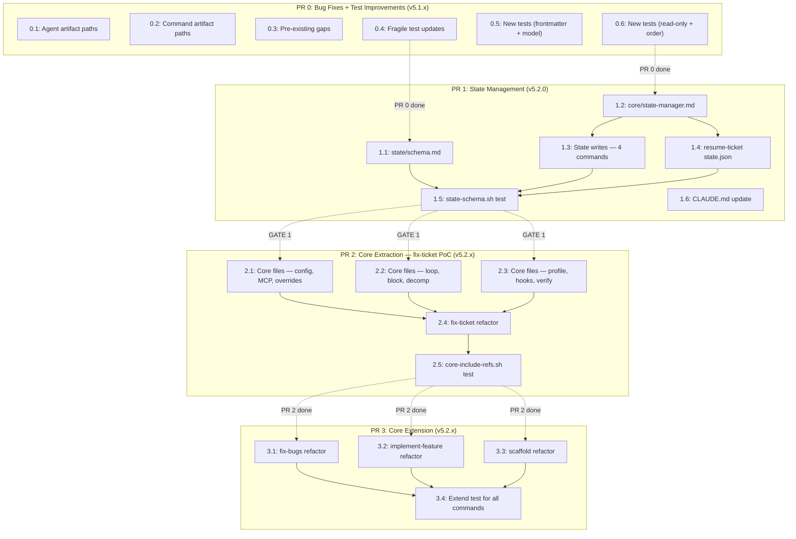

# Phase A Implementation Plan — Task Graph

**Scope:** PR 0-3 only (v5.1.x PATCH through v5.2.x PATCH)
**Total tasks:** 21
**Estimated total lines changed:** ~1,285

---

## PR 0: Bug Fixes + Test Improvements (v5.1.x PATCH)

### Task 0.1: Fix .claude/ race condition in agent files
- **Files:** `agents/reproducer.md`, `agents/browser-verifier.md`
- **Change:** Replace all `.claude/` artifact paths with `.ceos-agents/{ISSUE-ID}/` equivalents across both agent files. In `reproducer.md`: replace 8 occurrences of `.claude/reproducer-script.js` and `.claude/reproduction-result.json`; add a step to create `.ceos-agents/{ISSUE-ID}/` directory; update the NEVER-commit constraint. In `browser-verifier.md`: replace 6 occurrences of `.claude/reproduction-result.json`, `.claude/reproducer-script.js`, `.claude/verification-result.json`, and `.claude/verifier-script.js`; update the NEVER-commit constraint.
- **Dependencies:** none
- **Estimated lines:** ~35
- **Acceptance:** `grep -c '\.claude/' agents/reproducer.md agents/browser-verifier.md` returns 0 for each file (zero occurrences of `.claude/` in either agent)
- **Rollback:** `git checkout -- agents/reproducer.md agents/browser-verifier.md`

### Task 0.2: Fix .claude/ race condition in command files
- **Files:** `commands/fix-ticket.md`, `commands/fix-bugs.md`
- **Change:** Update 3 references in `fix-ticket.md` and 3 references in `fix-bugs.md` that read `.claude/reproduction-result.json` to read `.ceos-agents/{ISSUE-ID}/reproduction-result.json`. Update the Screenshot storage default from `.claude/screenshots` to `.ceos-agents/{ISSUE-ID}/screenshots` in both commands' Browser Verification config sections. Add instruction to create `.ceos-agents/{ISSUE-ID}/` directory in the browser reproduction step (step 4e in fix-ticket, corresponding step in fix-bugs).
- **Dependencies:** none
- **Estimated lines:** ~25
- **Acceptance:** `grep '\.claude/reproduction-result\|\.claude/verification-result\|\.claude/reproducer-script' commands/fix-ticket.md commands/fix-bugs.md` returns empty
- **Rollback:** `git checkout -- commands/fix-ticket.md commands/fix-bugs.md`

### Task 0.3: Fix pre-existing gaps (spec-writer emoji + skill router)
- **Files:** `agents/spec-writer.md`, `skills/bug-workflow/SKILL.md`
- **Change:** (1) In `spec-writer.md` line 88: change `[ceos-agents] Pipeline Block` to `[ceos-agents] 🔴 Pipeline Block` to match the Block Comment Template standard. (2) In `skills/bug-workflow/SKILL.md`: add a new row to the Intent Mapping table after line 37: `| Discuss / debate a topic with multiple perspectives | ceos-agents:discuss | Topic (natural language) | No |`. This brings the table from 23 to 24 entries, matching the 24 commands.
- **Dependencies:** none
- **Estimated lines:** ~3
- **Acceptance:** `grep '\[ceos-agents\].*Pipeline Block' agents/spec-writer.md | grep -v '🔴'` returns empty; `grep 'discuss' skills/bug-workflow/SKILL.md` returns a table row match
- **Rollback:** `git checkout -- agents/spec-writer.md skills/bug-workflow/SKILL.md`

### Task 0.4: Update 3 fragile tests (happy-path, verify-fail, pipeline-consistency)
- **Files:** `tests/scenarios/happy-path.sh`, `tests/scenarios/verify-fail.sh`, `tests/scenarios/pipeline-consistency.sh`
- **Change:** (1) `happy-path.sh`: Replace the hardcoded command name loop (lines 9-17) and agent name loop (lines 20-28) with dynamic count checks: count files in `commands/*.md` and verify >= 24; count files in `agents/*.md` and verify >= 18. (2) `verify-fail.sh`: Remove step-number-specific patterns (`9d\.`, `8c\.`, `10b\.`) from grep checks; keep only the section-name-based patterns (`Fix Verification`, `Feature Verification`) which are already present as OR fallbacks. (3) `pipeline-consistency.sh`: Replace the hardcoded `PIPELINE_FILES` list on line 8 with dynamic discovery: `PIPELINE_FILES=$(grep -rl 'rollback-agent\|fixer.*Task tool' "$CMDS"/*.md)`.
- **Dependencies:** none
- **Estimated lines:** ~30
- **Acceptance:** All 3 tests pass: `bash tests/scenarios/happy-path.sh && bash tests/scenarios/verify-fail.sh && bash tests/scenarios/pipeline-consistency.sh`
- **Rollback:** `git checkout -- tests/scenarios/happy-path.sh tests/scenarios/verify-fail.sh tests/scenarios/pipeline-consistency.sh`

### Task 0.5: Add frontmatter-completeness.sh and model-assignment.sh tests
- **Files:** `tests/scenarios/frontmatter-completeness.sh` (NEW), `tests/scenarios/model-assignment.sh` (NEW)
- **Change:** (1) `frontmatter-completeness.sh`: Iterate all `agents/*.md` files; verify each has `name:`, `description:`, `model:`, and `style:` in the YAML frontmatter block (between the first `---` and second `---`). (2) `model-assignment.sh`: Verify model assignments match CLAUDE.md table — opus agents (fixer, reviewer, architect, priority-engine, spec-writer, spec-reviewer), haiku agents (publisher, rollback-agent), sonnet for all others. Extract `model:` from each agent's frontmatter and validate.
- **Dependencies:** none
- **Estimated lines:** ~65
- **Acceptance:** Both tests pass; removing `style:` from any agent fails frontmatter-completeness; changing `model: sonnet` to `model: opus` in triage-analyst fails model-assignment
- **Rollback:** `rm tests/scenarios/frontmatter-completeness.sh tests/scenarios/model-assignment.sh`

### Task 0.6: Add read-only-agents.sh and section-order.sh tests
- **Files:** `tests/scenarios/read-only-agents.sh` (NEW), `tests/scenarios/section-order.sh` (NEW)
- **Change:** (1) `read-only-agents.sh`: Check the 10 read-only agents (triage-analyst, code-analyst, reviewer, spec-analyst, architect, stack-selector, priority-engine, spec-reviewer, acceptance-gate, domain-analyst) contain no file-write phrases (`Write tool`, `Edit tool`, `write to file`, `create file`, `save file`, `git commit`, `git add`). Gracefully skip agents whose files are not found (domain-analyst does not exist yet). (2) `section-order.sh`: Verify every `agents/*.md` file contains `## Goal`, `## Expertise`, `## Process`, `## Constraints` headings in that order by comparing line numbers.
- **Dependencies:** none
- **Estimated lines:** ~65
- **Acceptance:** Both tests pass; adding "Write tool" to reviewer.md fails read-only-agents; swapping Goal and Expertise in any agent fails section-order
- **Rollback:** `rm tests/scenarios/read-only-agents.sh tests/scenarios/section-order.sh`

---

## PR 1: State Management Infrastructure (v5.2.0 MINOR)

### Task 1.1: Create state/schema.md documentation
- **Files:** `state/schema.md` (NEW)
- **Change:** Create the state.json schema documentation file per Section 7.2-7.5 of the requirements specification. Include: full JSON schema example with all fields, field definitions table (schema_version, run_id, mode, pipeline, status, config, triage, code_analysis, reproduction, fixer_reviewer, decomposition, test, e2e_test, browser_verification, acceptance_gate, publisher, hooks, block), RUN-ID determination rules (ISSUE-ID for tracker pipelines, timestamp for non-tracker, scaffold-timestamp for scaffold), atomic write protocol (temp file + rename, retry once, log on failure), event log format (pipeline.log as JSONL with event types table).
- **Dependencies:** none
- **Estimated lines:** ~95
- **Acceptance:** File exists; contains all 11 top-level field names from the schema; contains "atomic write" and "pipeline.log" references
- **Rollback:** `rm -r state/`

### Task 1.2: Create core/state-manager.md contract
- **Files:** `core/state-manager.md` (NEW)
- **Change:** Create the state-manager contract file per Section 4.11 of the requirements. Sections: Purpose (read/write/resume contract for state.json), Input Contract for write (run_id, field_path, value), Input Contract for read (run_id), Input Contract for resume (run_id), Output Contract for write (atomic file update + event log append), Output Contract for read (full state object or null), Output Contract for resume (resume_point + resume_context, with heuristic fallback), Failure Handling (atomic write failure retry, corrupted state fallback).
- **Dependencies:** none
- **Estimated lines:** ~60
- **Acceptance:** File exists at `core/state-manager.md`; contains `## Purpose`, `## Input Contract`, `## Output Contract`, `## Failure Handling`; references atomic write and heuristic fallback
- **Rollback:** `rm core/state-manager.md`

### Task 1.3: Add state.json writes to all 4 pipeline commands
- **Files:** `commands/fix-ticket.md`, `commands/fix-bugs.md`, `commands/implement-feature.md`, `commands/scaffold.md`
- **Change:** For each command, add state initialization and phase-transition writes:
  - **fix-ticket.md** (~50 lines added): After MCP pre-flight, create `.ceos-agents/{ISSUE-ID}/` and write initial state.json (`status: "running"`, `mode: "code-bugfix"`, `pipeline: "fix-ticket"`). Add state update instructions after triage (write triage fields), code-analyst (write code_analysis fields), each fixer-reviewer iteration (write iteration count + verdict), test (write test.status), browser verification (write browser_verification fields), acceptance gate (write verdict), publisher (write pr_url, status: "completed"), and block handler (write block object, status: "blocked"). Reference `core/state-manager.md` atomic write protocol.
  - **fix-bugs.md** (~50 lines added): Same pattern. Per-issue state directories for parallel mode. `mode: "code-bugfix"`, `pipeline: "fix-bugs"`.
  - **implement-feature.md** (~45 lines added): Same pattern with feature-specific phases (spec-analyst, architect, decomposition decision). `mode: "code-feature"`, `pipeline: "implement-feature"`.
  - **scaffold.md** (~45 lines added): `mode: "code-project"`, `pipeline: "scaffold"`, `run_id: "scaffold-{timestamp}"`. State updates at spec-writer, scaffolder, architect, fixer-reviewer, test phases.
- **Dependencies:** Task 1.2 (state-manager contract must exist for reference)
- **Estimated lines:** ~95 (across 4 files, each well under the 100-line limit per file)
- **Acceptance:** `grep -c 'state.json\|state-manager' commands/fix-ticket.md` >= 5; same for fix-bugs, implement-feature, scaffold; state write instructions at triage, fixer-reviewer, test, publisher, and block handler in each relevant command
- **Rollback:** `git checkout -- commands/fix-ticket.md commands/fix-bugs.md commands/implement-feature.md commands/scaffold.md`

### Task 1.4: Update resume-ticket.md to prefer state.json
- **Files:** `commands/resume-ticket.md`
- **Change:** Add a new priority-0 detection step before the existing heuristic: "If `.ceos-agents/{ISSUE-ID}/state.json` exists, read it and determine resume point from `status` and per-phase status fields." Map state.json phase statuses to existing checkpoint names: `triage.status == "completed" && code_analysis.status == "pending"` maps to `POST_TRIAGE`, etc. Preserve the entire existing heuristic table as fallback when state.json does not exist. Update `DECOMPOSE_PARTIAL` detection to check `.ceos-agents/{ISSUE-ID}/state.json` first (look at `decomposition.status`), then fall back to `.claude/decomposition/{ISSUE-ID}.yaml`. Add explicit text: "If `.ceos-agents/{ISSUE-ID}/state.json` does not exist, fall back to the heuristic detection below."
- **Dependencies:** Task 1.2 (state-manager contract defines the resume contract)
- **Estimated lines:** ~35
- **Acceptance:** `grep -c 'state.json' commands/resume-ticket.md` >= 3; the existing heuristic table is still present; the words "fall back" or "fallback" appear
- **Rollback:** `git checkout -- commands/resume-ticket.md`

### Task 1.5: Add state-schema.sh test
- **Files:** `tests/scenarios/state-schema.sh` (NEW)
- **Change:** Create a test that verifies: (1) `state/schema.md` exists, (2) it contains required top-level fields (schema_version, run_id, mode, pipeline, status, triage, code_analysis, fixer_reviewer, test, publisher, block), (3) `core/state-manager.md` exists with `## Input Contract` and `## Output Contract` sections, (4) all 4 pipeline commands (fix-ticket, fix-bugs, implement-feature, scaffold) reference `state.json`, (5) resume-ticket.md references `state.json`.
- **Dependencies:** Tasks 1.1-1.4
- **Estimated lines:** ~35
- **Acceptance:** Test passes: `bash tests/scenarios/state-schema.sh`
- **Rollback:** `rm tests/scenarios/state-schema.sh`

### Task 1.6: Update CLAUDE.md with state directory documentation
- **Files:** `CLAUDE.md`
- **Change:** In the Repository Structure section, add entries for: `.ceos-agents/` ("Per-run pipeline state files (state.json, pipeline.log, browser artifacts)"), `state/` ("State schema documentation"), `core/` ("Shared pipeline pattern contracts"). This prepares the documentation for PR 2 as well. No other CLAUDE.md sections are changed.
- **Dependencies:** none
- **Estimated lines:** ~10
- **Acceptance:** `grep '.ceos-agents/' CLAUDE.md` matches; `grep 'state/' CLAUDE.md` matches; `grep 'core/' CLAUDE.md` matches
- **Rollback:** `git checkout -- CLAUDE.md`

---

## PR 2: Core Pattern Extraction — fix-ticket Proof of Concept (v5.2.x PATCH)

### Task 2.1: Create core pattern files — config, MCP, overrides (3 files)
- **Files:** `core/config-reader.md` (NEW), `core/mcp-preflight.md` (NEW), `core/agent-override-injector.md` (NEW)
- **Change:** Create 3 core pattern files per Sections 4.2, 4.3, 4.6 of the requirements. Each follows the standard structure: Purpose, Input Contract, Process (numbered steps), Output Contract, Failure Handling.
  - `config-reader.md` (~55 lines): Config parsing from `## Automation Config` — all variable names, defaults, required vs optional sections, failure on missing required sections.
  - `mcp-preflight.md` (~25 lines): MCP server connectivity check — input is issue_tracker_type, output is mcp_available boolean, failure blocks pipeline.
  - `agent-override-injector.md` (~15 lines): Load `{path}/{agent-name}.md` if it exists, append as `## Project-Specific Instructions`, silent skip if not found.
- **Dependencies:** none
- **Estimated lines:** ~95
- **Acceptance:** All 3 files exist with `## Purpose`, `## Input Contract`, `## Output Contract`, `## Failure Handling` sections
- **Rollback:** `rm core/config-reader.md core/mcp-preflight.md core/agent-override-injector.md`

### Task 2.2: Create core pattern files — loop, block, decomposition (3 files)
- **Files:** `core/fixer-reviewer-loop.md` (NEW), `core/block-handler.md` (NEW), `core/decomposition-heuristics.md` (NEW)
- **Change:** Create 3 core pattern files per Sections 4.4, 4.5, 4.7 of the requirements.
  - `fixer-reviewer-loop.md` (~65 lines): Iteration loop with context, max_iterations, AC, override path, state_run_id inputs; APPROVED/BLOCKED/NEEDS_DECOMPOSITION outputs; rollback-agent on block.
  - `block-handler.md` (~45 lines): Post block comment, set issue state, invoke rollback, fire webhook; avoids infinite loop on comment posting failure.
  - `decomposition-heuristics.md` (~25 lines): Tri-state flag (FORCE/DISABLED/AUTO), risk/files/diff/areas thresholds, DECOMPOSE/SINGLE_PASS output.
- **Dependencies:** none
- **Estimated lines:** ~95 total
- **Acceptance:** All 3 files exist with standard contract sections; `fixer-reviewer-loop.md` contains `APPROVED`, `BLOCKED`, `NEEDS_DECOMPOSITION`; `decomposition-heuristics.md` contains threshold values
- **Rollback:** `rm core/fixer-reviewer-loop.md core/block-handler.md core/decomposition-heuristics.md`

### Task 2.3: Create core pattern files — profile, hooks, verification (3 files)
- **Files:** `core/profile-parser.md` (NEW), `core/post-publish-hook.md` (NEW), `core/fix-verification.md` (NEW)
- **Change:** Create 3 core pattern files per Sections 4.8, 4.9, 4.10 of the requirements.
  - `profile-parser.md` (~20 lines): Parse pipeline profile, extract skip/extra stages, validate fixer/reviewer/publisher not in skip list.
  - `post-publish-hook.md` (~15 lines): Execute post-publish hooks and webhooks; failures are advisory (log warning, do not block).
  - `fix-verification.md` (~20 lines): Run verify command after PR merge; PASSED/FAILED/SKIPPED output; re-open issue on failure.
- **Dependencies:** none
- **Estimated lines:** ~55
- **Acceptance:** All 3 files exist with standard contract sections
- **Rollback:** `rm core/profile-parser.md core/post-publish-hook.md core/fix-verification.md`

### Task 2.4: Refactor fix-ticket.md to reference core/ files
- **Files:** `commands/fix-ticket.md`
- **Change:** Replace inline pattern implementations with references to core/ files. Nine specific replacements:
  1. Configuration section: Add "Follow the process defined in `core/config-reader.md`" and simplify the duplicated variable listing (keep section header and command-specific items like Browser Verification config).
  2. MCP pre-flight (section 0): Replace inline text with "Follow `core/mcp-preflight.md`."
  3. Pipeline profile parsing: Replace with reference to `core/profile-parser.md`; keep the command-specific stage map.
  4. Decomposition decision (4b): Add reference to `core/decomposition-heuristics.md`; keep command-specific threshold overrides if any.
  5. Fixer-reviewer loop (steps 5-7): Add reference to `core/fixer-reviewer-loop.md`; keep command-specific context assembly.
  6. Block handler (step X): Replace with reference to `core/block-handler.md`.
  7. Agent override rule (in Rules section): Replace with reference to `core/agent-override-injector.md`.
  8. Post-publish (step 9a-9b): Replace with reference to `core/post-publish-hook.md`.
  9. Fix verification (step 9d): Replace with reference to `core/fix-verification.md`.
  Each replacement uses the form: "Follow the process defined in `core/X.md`" with command-specific context passed as the input contract specifies. No functionality is removed — the command still describes the full pipeline flow.
- **Dependencies:** Tasks 2.1, 2.2, 2.3 (all core files must exist)
- **Estimated lines:** ~80 net change (lines removed from inline logic > lines added as references + context assembly)
- **Acceptance:** `grep -c 'core/' commands/fix-ticket.md` >= 7; `bash tests/harness/run-tests.sh` passes; fix-ticket.md still contains all step headings (### 1 through ### 9d and ### X)
- **Rollback:** `git checkout -- commands/fix-ticket.md`

### Task 2.5: Add core-include-refs.sh test
- **Files:** `tests/scenarios/core-include-refs.sh` (NEW)
- **Change:** Create a test that verifies: (1) all 10 `core/*.md` files exist (config-reader, mcp-preflight, fixer-reviewer-loop, block-handler, agent-override-injector, decomposition-heuristics, profile-parser, post-publish-hook, fix-verification, state-manager), (2) each core file contains `## Purpose`, `## Input Contract`, `## Output Contract`, `## Failure Handling` sections, (3) `fix-ticket.md` references at least 7 core/ files. This test will be extended in PR 3 to cover remaining commands.
- **Dependencies:** Tasks 2.1-2.4
- **Estimated lines:** ~40
- **Acceptance:** Test passes: `bash tests/scenarios/core-include-refs.sh`; removing any core file causes failure
- **Rollback:** `rm tests/scenarios/core-include-refs.sh`

---

## PR 3: Core Extension to Remaining Commands (v5.2.x PATCH)

### Task 3.1: Refactor fix-bugs.md to reference core/ files
- **Files:** `commands/fix-bugs.md`
- **Change:** Same pattern as Task 2.4 but for fix-bugs. Replace inline implementations of: config reading, MCP pre-flight, pipeline profile parsing, fixer-reviewer loop, block handler, agent override injection, post-publish hook, fix verification, and decomposition heuristics with references to corresponding core/ files. Preserve fix-bugs-specific logic: batch mode, worktree management, per-issue iteration, parallel execution config, and the unique batch summary output format.
- **Dependencies:** PR 2 complete (all core/ files exist + fix-ticket proven)
- **Estimated lines:** ~85
- **Acceptance:** `grep -c 'core/' commands/fix-bugs.md` >= 7; `bash tests/harness/run-tests.sh` passes
- **Rollback:** `git checkout -- commands/fix-bugs.md`

### Task 3.2: Refactor implement-feature.md to reference core/ files
- **Files:** `commands/implement-feature.md`
- **Change:** Same pattern as Task 2.4 but for implement-feature. Replace inline implementations with references. Preserve implement-feature-specific logic: spec-analyst phase, architect phase with `maps_to` traceability, AC coverage check, always-on acceptance gate (unlike fix-ticket where it's conditional), and feature-specific decomposition thresholds. Note: implement-feature does not use browser verification or reproduction, so those core references are not applicable.
- **Dependencies:** PR 2 complete
- **Estimated lines:** ~70
- **Acceptance:** `grep -c 'core/' commands/implement-feature.md` >= 6; `bash tests/harness/run-tests.sh` passes
- **Rollback:** `git checkout -- commands/implement-feature.md`

### Task 3.3: Refactor scaffold.md to reference core/ files
- **Files:** `commands/scaffold.md`
- **Change:** Scaffold uses a subset of core patterns. Replace inline implementations for: fixer-reviewer loop, block handler, agent override injection. Scaffold does NOT use: MCP pre-flight (no issue tracker for most modes), pipeline profile parsing (not applicable), post-publish hook (different publish model), fix verification (not applicable), decomposition heuristics (scaffold always decomposes via architect). Config reading is partial — scaffold uses lazy/inline config reading; add reference to `core/config-reader.md` with a note: "Scaffold reads config lazily — only when an issue tracker ID is provided via `--issue`. Otherwise, config sections are optional." Keep all scaffold-specific logic unchanged: spec-writer/spec-reviewer loop, scaffolder phase, spec/ folder generation, --no-implement path, all scaffold flags.
- **Dependencies:** PR 2 complete
- **Estimated lines:** ~50
- **Acceptance:** `grep -c 'core/' commands/scaffold.md` >= 3; `bash tests/harness/run-tests.sh` passes
- **Rollback:** `git checkout -- commands/scaffold.md`

### Task 3.4: Extend core-include-refs.sh test for all commands
- **Files:** `tests/scenarios/core-include-refs.sh`
- **Change:** Add checks for the 3 newly refactored commands: (1) `fix-bugs.md` references >= 7 core/ files, (2) `implement-feature.md` references >= 6 core/ files, (3) `scaffold.md` references >= 3 core/ files. These supplement the existing fix-ticket check from Task 2.5.
- **Dependencies:** Tasks 3.1, 3.2, 3.3
- **Estimated lines:** ~15 (additions to existing file)
- **Acceptance:** Test passes: `bash tests/scenarios/core-include-refs.sh` — all 4 commands verified
- **Rollback:** `git checkout -- tests/scenarios/core-include-refs.sh`

---

## Dependency Graph

---

## Parallel Execution Groups

### PR 0 — 1 group (all 6 tasks are independent)

| Group | Tasks | Can Run In Parallel |
|-------|-------|:---:|
| 0-A | 0.1, 0.2, 0.3, 0.4, 0.5, 0.6 | Yes |

All 6 tasks touch different files with no overlap. Assign all to parallel implementation agents.

### PR 1 — 3 groups (sequential dependency chain)

| Group | Tasks | Can Run In Parallel | Depends On |
|-------|-------|:---:|------------|
| 1-A | 1.1, 1.2, 1.6 | Yes | PR 0 complete |
| 1-B | 1.3, 1.4 | Yes | Task 1.2 |
| 1-C | 1.5 | — | Tasks 1.1, 1.3, 1.4 |

Group 1-A creates the contract files and docs (no dependencies between them). Group 1-B adds state writes to commands (both depend on the state-manager contract). Group 1-C is the integration test.

### PR 2 — 2 groups

| Group | Tasks | Can Run In Parallel | Depends On |
|-------|-------|:---:|------------|
| 2-A | 2.1, 2.2, 2.3 | Yes | GATE 1 |
| 2-B | 2.4, 2.5 | Sequential | All Group 2-A tasks |

Group 2-A creates all 9 core pattern files (state-manager already exists from PR 1). Group 2-B refactors fix-ticket and adds the test. Task 2.5 depends on 2.4.

### PR 3 — 2 groups

| Group | Tasks | Can Run In Parallel | Depends On |
|-------|-------|:---:|------------|
| 3-A | 3.1, 3.2, 3.3 | Yes | PR 2 complete |
| 3-B | 3.4 | — | All Group 3-A tasks |

Group 3-A refactors the 3 remaining commands (independent files). Group 3-B extends the test.

---

## Gate Criteria

### After PR 0 (pre-requisite for PR 1):
1. Full test suite passes: `bash tests/harness/run-tests.sh` — all existing + 4 new tests green
2. Zero `.claude/` artifact references in agents and commands: `grep -r '\.claude/reproduction-result\|\.claude/verification-result\|\.claude/reproducer-script\|\.claude/verifier-script' agents/ commands/` returns empty
3. Spec-writer emoji fix confirmed: `grep '\[ceos-agents\].*Pipeline Block' agents/spec-writer.md | grep -v '🔴'` returns empty
4. Skill router gap fixed: `grep -c 'discuss' skills/bug-workflow/SKILL.md` >= 1 (in the intent mapping table)
5. No functional regression: all 3 updated fragile tests pass with the current codebase (no false failures)

### After PR 0-1 (GATE 1 — required before PR 2-3):
1. `state/schema.md` exists with complete field definitions (11 top-level fields documented)
2. `core/state-manager.md` exists with read/write/resume contracts and atomic write protocol
3. All 4 pipeline commands contain state.json write instructions: `grep -l 'state.json' commands/fix-ticket.md commands/fix-bugs.md commands/implement-feature.md commands/scaffold.md` returns 4 files
4. `resume-ticket.md` references state.json with heuristic fallback preserved: both `state.json` and the existing checkpoint detection table are present in the file
5. `state-schema.sh` test passes
6. Full test suite green
7. **Manual validation:** Read `resume-ticket.md` end-to-end and confirm: (a) state.json detection takes priority, (b) heuristic table is still present as fallback, (c) no existing checkpoint name has been renamed

### After PR 2-3 (GATE 2 — required before Phase B / PR 4+):
1. All 10 `core/*.md` files exist: config-reader, mcp-preflight, fixer-reviewer-loop, block-handler, agent-override-injector, decomposition-heuristics, profile-parser, post-publish-hook, fix-verification, state-manager
2. Each core file has 4 standard sections: `## Purpose`, `## Input Contract`, `## Output Contract`, `## Failure Handling`
3. Core reference counts: fix-ticket >= 7, fix-bugs >= 7, implement-feature >= 6, scaffold >= 3
4. `core-include-refs.sh` test passes (verifying all of the above)
5. Full test suite green — all scenarios pass, including the 4 new structural tests from PR 0
6. **Manual validation:** Read `fix-ticket.md` end-to-end and confirm: (a) every pipeline phase from triage through publisher is still described, (b) core/ references replace inline logic without removing functionality, (c) command-specific logic (context assembly, step ordering, dry-run behavior) is preserved
7. No command interface change: flags, arguments, and user-visible output format are identical to pre-PR-2 state

---

## Risk Mitigations

| Risk | Impact | Probability | Mitigation | Detection |
|------|--------|-------------|-----------|-----------|
| Core file reference mechanism fails (LLM ignores `core/X.md`) | HIGH | LOW | PR 2 scoped to fix-ticket only as PoC; full revert restores inline logic | Manual dry-run at GATE 2 step 6 |
| State.json writes add excessive verbosity to commands | MEDIUM | MEDIUM | Each write is ~2 lines; review total addition per file before merge | PR 1 review: no command exceeds 100 added lines |
| New structural tests are too strict | LOW | LOW | Tests use >= counts and pattern matching, not exact line numbers | Run suite after each PR; verify no false positives |
| Race condition fix breaks browser verification users | MEDIUM | LOW | `.ceos-agents/{ISSUE-ID}/` dir created before use; no old paths deleted | Grep verification in PR 0 gate criteria |
| resume-ticket state.json conflicts with heuristic | MEDIUM | LOW | State.json checked first; heuristic only runs if absent; no ambiguity | GATE 1 manual validation step 7 |
| Parallel task merge conflicts within PR | LOW | MEDIUM | Tasks within each PR touch different files; merge to integration branch | Review file overlap before parallel dispatch |

---

## Summary

| PR | Version | Tasks | New Files | Modified Files | Est. Lines | Timeline |
|----|---------|-------|-----------|----------------|------------|----------|
| PR 0 | v5.1.x PATCH | 6 | 4 | 8 | ~225 | 1-2 days |
| PR 1 | v5.2.0 MINOR | 6 | 4 | 6 | ~435 | 2-3 days |
| PR 2 | v5.2.x PATCH | 5 | 10 | 1 | ~405 | 2-3 days |
| PR 3 | v5.2.x PATCH | 4 | 0 | 4 | ~220 | 1-2 days |
| **Total** | | **21** | **18** | **19** | **~1,285** | **6-10 days** |

**Maximum parallelism per PR:** PR 0 = 6 agents, PR 1 = 3 agents (Group 1-A), PR 2 = 3 agents (Group 2-A), PR 3 = 3 agents (Group 3-A).

**Critical path:** Task 1.2 → Task 1.3 → Task 1.5 → Task 2.1/2.2/2.3 → Task 2.4 → Task 2.5 → Task 3.1/3.2/3.3 → Task 3.4
