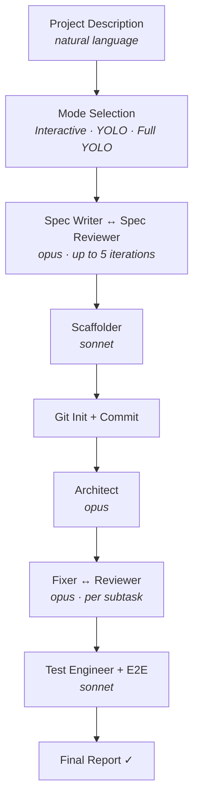
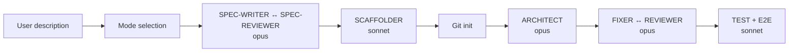

# Agent 3 Research — Documentation Files That Reference Scaffold Steps (CRITICAL)

**Area:** Documentation staleness risk — exhaustive search for all files referencing scaffold step labels that will be renamed/removed by the infrastructure redesign.

**Research date:** 2026-03-27

---

## 1. Search Results: Exact String Matches

### 1.1 "Step 4b" — All Occurrences

| File | Line | Exact Content |
|------|------|---------------|
| `commands/scaffold.md` | 263 | `### Step 4b: Tracker Configuration (Auto-Finalize) — Full YOLO skips this step` |
| `commands/scaffold.md` | 265 | `If mode is Full YOLO → skip to Step 4c (TODOs remain — cannot guess tracker URLs in unattended mode).` |
| `commands/scaffold.md` | 272 | `If \`incomplete_keys\` is empty → skip to Step 4c (no TODOs to fill).` |
| `commands/scaffold.md` | 302 | `If Issue Tracker Instance was filled in Step 4b:` |
| `CHANGELOG.md` | 58 | `- **Scaffold auto-finalize (Steps 4b/4c):** After skeleton generation, scaffold interactively configures tracker values (Instance, Project, Remote) instead of leaving TODO markers. MCP guidance displayed when tracker is configured. Full YOLO skips (cannot guess URLs).` |
| `CHANGELOG.md` | 159 | `- **Quality scorecard in scaffolder** (S5): new Step 4b generates an 8-check quality scorecard ...` *(this refers to scaffolder agent's internal step numbering, not scaffold command)* |
| `docs/plans/roadmap.md` | 142 | `**Files:** \`commands/scaffold.md\` (Steps 4b, 4c)` |
| `docs/plans/2026-03-27-scaffold-infrastructure-design.md` | 9 | `After \`/scaffold\` completes (Step 4: Git init → Step 4b: Tracker Configuration → Step 4c: MCP Guidance), the project is in a dead state:` |
| `docs/plans/2026-03-27-scaffold-infrastructure-design.md` | 11 | `1. **Step 4b** asks for tracker/SC values, writes them to CLAUDE.md, but does nothing else — no MCP setup, no connectivity check, no repo push` |
| `docs/plans/2026-03-27-scaffold-infrastructure-design.md` | 30 | `Replaces the current Step 4b and Step 4c. Moves to the **very beginning** of scaffold, before Mode Selection.` |
| `docs/plans/2026-03-27-scaffold-infrastructure-design.md` | 107 | `- **Step 4b** (Tracker Configuration) → replaced by Step 0-INFRA + Step 4 auto-fill` |
| `docs/plans/2026-03-27-scaffold-infrastructure-design.md` | 125 | `\| Step 4b \| **REMOVED** — replaced by Step 0-INFRA \|` |
| `docs/plans/2026-03-03-redmine-tracker-support-design.md` | 141 | `#### \`commands/onboard.md\` — Step 4b (PR Description Template footer)` *(onboard, not scaffold)* |
| `docs/plans/2026-03-03-redmine-tracker-support-plan.md` | 165 | `- Modify: \`commands/onboard.md:123-127\` (Step 4b PR footers)` *(onboard)* |
| `docs/plans/2026-03-03-redmine-tracker-support-plan.md` | 184 | `**Step 2: Replace Step 4b inline per-tracker footers**` *(onboard)* |
| `docs/plans/2026-03-08-ac-pipeline-v5-plan.md` | 329 | `**Section: Orchestration, Step 4b (Decomposition decision)**` *(implement-feature, not scaffold)* |
| `docs/plans/2026-03-08-ac-pipeline-v5-plan.md` | 651 | `**Section: Process** — Add a new Step 4b after Step 4 (Verify) and before Step 5 (Output):` *(reviewer agent)* |
| `docs/plans/2026-03-08-ac-pipeline-v5-plan-REVIEW.md` | 210 | `- \`fix-ticket.md\` (Step 4b) ✓` *(fix-ticket)* |

**SCAFFOLD-RELEVANT "Step 4b" files (must be updated):**
- `commands/scaffold.md` — lines 263, 265, 272, 302 (the actual step definitions)
- `CHANGELOG.md` — line 58 (historical entry, leave as-is — it documents what v5.3.0 shipped)
- `docs/plans/roadmap.md` — line 142 (inside a DONE section for v5.3.0 — leave as-is)

---

### 1.2 "Step 4c" — All Occurrences

| File | Line | Exact Content |
|------|------|---------------|
| `commands/scaffold.md` | 265 | `If mode is Full YOLO → skip to Step 4c (TODOs remain — cannot guess tracker URLs in unattended mode).` |
| `commands/scaffold.md` | 272 | `If \`incomplete_keys\` is empty → skip to Step 4c (no TODOs to fill).` |
| `commands/scaffold.md` | 300 | `### Step 4c: MCP Guidance` |
| `docs/plans/2026-03-27-scaffold-infrastructure-design.md` | 9 | `Step 4c: MCP Guidance` (in problem description) |
| `docs/plans/2026-03-27-scaffold-infrastructure-design.md` | 12 | `2. **Step 4c** prints informational text "run \`/init\`" — never actually runs it` |
| `docs/plans/2026-03-27-scaffold-infrastructure-design.md` | 30 | `Replaces the current Step 4b and Step 4c.` |
| `docs/plans/2026-03-27-scaffold-infrastructure-design.md` | 108 | `- **Step 4c** (MCP Guidance) → replaced by Step 0-MCP inline \`/init\`` |
| `docs/plans/2026-03-27-scaffold-infrastructure-design.md` | 126 | `\| Step 4c \| **REMOVED** — replaced by Step 0-MCP \|` |

**SCAFFOLD-RELEVANT "Step 4c" files (must be updated):**
- `commands/scaffold.md` — lines 265, 272, 300 (the actual step definitions)

---

### 1.3 "Step 9" — Scaffold-Context Occurrences

| File | Line | Exact Content |
|------|------|---------------|
| `commands/scaffold.md` | 481 | `### Step 9: Issue Tracker (Optional)` |
| `commands/scaffold.md` | 544 | `- Step 9 — creating cards in issue tracker (only when tracker is configured and user opts in)` |
| `docs/plans/2026-03-06-scaffold-v2-design.md` | 394 | `Step 9: Issue tracker (optional)` *(historical design doc)* |
| `docs/plans/2026-03-06-scaffold-v2-EXECUTE.md` | 115 | `- Ověř: Step 9 (issue tracker) je podmíněný na TODO markery v CLAUDE.md` *(historical)* |
| `docs/plans/2026-03-06-scaffold-v2-implementation-plan.md` | 148 | `3.5. Update MCP pre-flight check: only required when \`--issue\` flag is used or Step 9 (issue tracker cards).` *(historical)* |
| `docs/plans/2026-03-06-scaffold-v2-implementation-plan.md` | 458 | `Step 9: Issue tracker (optional — create cards)` *(historical)* |
| `docs/plans/2026-03-06-scaffold-v2-implementation-plan.md` | 468 | `\| MCP pre-flight \| Always required \| Only when \`--issue\` flag or Step 9 (issue tracker cards) \|` *(historical)* |
| `docs/plans/2026-03-06-scaffold-v2-implementation-plan.md` | 744 | `#### Step 9: Issue Tracker (Optional)` *(historical)* |
| `docs/plans/2026-03-27-scaffold-infrastructure-design.md` | 13 | `3. **Step 9** creates tracker cards AFTER implementation — too late to be useful` |
| `docs/plans/2026-03-27-scaffold-infrastructure-design.md` | 109 | `- **Step 9** (Issue Tracker Optional) → replaced by Step 4e (moved before implementation)` |
| `docs/plans/2026-03-27-scaffold-infrastructure-design.md` | 130 | `\| Step 9 \| **REMOVED** — replaced by Step 4e \|` |

**Non-scaffold "Step 9" occurrences (NOT about scaffold):**
- `commands/init.md:195` — init command step
- `commands/onboard.md:212` — onboard step
- Various brainstorm docs, implementation plans for onboard
- `docs/plans/2026-02-25-v2.0-implementation-plan.md:987` — old plan
- `docs/plans/2026-02-28-v3.0-implementation-plan.md:1417` — old plan

**SCAFFOLD-RELEVANT "Step 9" files (must be updated):**
- `commands/scaffold.md` — lines 481, 544 (the actual step definition and MCP pre-flight reference)
- `docs/reference/pipelines.md` — Stage table row for Step 9 (line 280: `\| 9 \| Issue Tracker \| (command) \| N/A \| Optional — create cards from spec/epics/ \|`)

---

### 1.4 "Tracker Configuration" — All Occurrences

| File | Line | Exact Content |
|------|------|---------------|
| `commands/scaffold.md` | 263 | `### Step 4b: Tracker Configuration (Auto-Finalize) — Full YOLO skips this step` |
| `docs/plans/2026-03-27-scaffold-infrastructure-design.md` | 107 | `- **Step 4b** (Tracker Configuration) → replaced by Step 0-INFRA + Step 4 auto-fill` |

**Must update:** `commands/scaffold.md` line 263.

---

### 1.5 "MCP Guidance" — All Occurrences

| File | Line | Exact Content |
|------|------|---------------|
| `commands/scaffold.md` | 300 | `### Step 4c: MCP Guidance` |
| `docs/plans/2026-03-27-scaffold-infrastructure-design.md` | 9 | `Step 4c: MCP Guidance` (in problem description) |
| `docs/plans/2026-03-27-scaffold-infrastructure-design.md` | 108 | `- **Step 4c** (MCP Guidance) → replaced by Step 0-MCP inline \`/init\`` |

**Must update:** `commands/scaffold.md` line 300.

---

### 1.6 "Issue Tracker (Optional)" — All Occurrences

| File | Line | Exact Content |
|------|------|---------------|
| `commands/scaffold.md` | 481 | `### Step 9: Issue Tracker (Optional)` |
| `docs/plans/2026-03-06-scaffold-v2-implementation-plan.md` | 744 | `#### Step 9: Issue Tracker (Optional)` *(historical design doc)* |

**Must update:** `commands/scaffold.md` line 481.

---

### 1.7 "Auto-Finalize" / "auto-finalize" — All Occurrences

| File | Line | Exact Content |
|------|------|---------------|
| `commands/scaffold.md` | 263 | `### Step 4b: Tracker Configuration (Auto-Finalize) — Full YOLO skips this step` |
| `CHANGELOG.md` | 55 | `**MINOR** — scaffold-to-deployment workflow: auto-finalize, config validity gate, status readiness, feature from chat, local deployment verification.` |
| `CHANGELOG.md` | 58 | `- **Scaffold auto-finalize (Steps 4b/4c):**` |
| `docs/plans/roadmap.md` | 138 | `### Scaffold Auto-Finalize` |

**Must update:** `commands/scaffold.md` line 263.
**Leave as-is:** CHANGELOG entries (historical record), roadmap entry (already in a DONE section or PLANNED section describing what was built in v5.3.0).

---

## 2. Scaffold Pipeline Section in Key Documents

### 2.1 CLAUDE.md — "Scaffold Pipeline" Section (lines 63–77)

```
## Scaffold Pipeline

```
User description → [Mode selection] → SPEC-WRITER ↔ SPEC-REVIEWER (opus)
  → [Spec checkpoint] → SCAFFOLDER (sonnet, +test infrastructure, +scorecard)
  → Validate → Git init
  → ARCHITECT (opus, +maps_to) → [Feature plan checkpoint]
  → FIXER ↔ REVIEWER (opus) → TEST ENGINEER (sonnet)
  → [Spec compliance check (spec-reviewer --verify)]
  → E2E-TEST-ENGINEER (sonnet) → Final report
```
```

**STALE RISK:** This diagram does NOT show Step 4b/4c. It also omits Step 9 (Issue Tracker). The new design will add Step 0-INFRA and Step 0-MCP BEFORE "Mode selection", and replace "Git init" with a broader "Git init + auto-fill + push" node. The diagram is already simplified enough that it may not need changes — but the absence of Step 4b/4c means it is already partially consistent with the new design. However, it also does not show Step 0-INFRA which is the major new entry point.

---

### 2.2 README.md — Scaffold Pipeline Diagram (lines 110–126)



**STALE RISK (HIGH):** This is the most VISIBLE public diagram. It:
- Does NOT show Step 4b/4c (not referenced → not stale on those)
- Does NOT show Step 9 Issue Tracker (omitted — somewhat stale already)
- Will be STALE after redesign because the new "Git Init + Commit" becomes "Git Init + Auto-Config + Push" and needs Step 0-INFRA before Mode Selection

The `Mode Selection` node needs a predecessor `Infrastructure Declaration` node if the new Step 0-INFRA is added.

---

### 2.3 docs/architecture.md — Scaffold Pipeline Section (lines 114–135)



**STALE RISK (HIGH):** Same as README — does not show Step 4b/4c or Step 9 today, but will need Step 0-INFRA prepended before Mode selection, and "Git init" → "Git init + auto-config + push".

---

### 2.4 docs/reference/pipelines.md — Scaffold Pipeline

**Mermaid diagram (lines 208–265):** Shows the full scaffold flow including `GIT_INIT` → `ARCHITECT` path. Does NOT explicitly show Step 4b, 4c, or the tracker cards step. The diagram shows `E2E` → `TRACKER` → `REPORT`. This `TRACKER` node (line 256) will become STALE — it represents current Step 9 which is being removed.

**Stage table (lines 269–281):**

```
| Step | Stage | Agent | Model | Notes |
|------|-------|-------|-------|-------|
| 0  | Mode Selection        | (command) | N/A    | Interactive / YOLO with checkpoint / Full YOLO |
| 1  | Specification         | spec-writer ↔ spec-reviewer | opus | Loop up to Spec iterations (default 5) |
| 2  | Spec Checkpoint       | (command) | N/A    | Skip in Full YOLO; user approves or aborts |
| 3  | Skeleton Generation   | scaffolder | sonnet | Reads tech stack from spec/README.md; generates E2E Test + Decomposition config |
| 4  | Git Init              | (command) | N/A    | Commits both spec/ and skeleton |
| 5  | Architecture          | architect  | opus   | Decomposes epics into dependency-aware batches |
| 6  | Feature Plan Checkpoint | (command) | N/A  | Skip in Full YOLO; user approves batch plan |
| 7  | Feature Implementation | fixer ↔ reviewer + test-engineer | opus/sonnet | Per-subtask loop with block handler + rollback |
| 8  | E2E Tests             | e2e-test-engineer | sonnet | Covers critical user flows from spec |
| 9  | Issue Tracker         | (command) | N/A    | Optional — create cards from spec/epics/ |
| 10 | Final Report          | (command) | N/A    | Summary with features, tests, TODOs |
```

**STALE RISK (CRITICAL):** This stage table is the canonical reference for step numbers. After redesign:
- Step 0 becomes Step 0 (Mode Selection) but moves AFTER the new Step 0-INFRA
- New steps 0-INFRA and 0-MCP need entries
- Step 4 expands to include auto-fill + `.mcp.json` generation
- New Step 4d (Push to Remote) needs an entry
- New Step 4e (Create Tracker Issues) replaces Step 9
- Step 9 row needs to be removed or updated
- Step 10 notes need updating

---

### 2.5 docs/reference/commands.md — /scaffold Entry (lines 192–229)

No explicit step number references (Step 4b/4c/9). Uses prose description:

```
What it does: In v2 mode (default), the user selects a mode (Interactive, YOLO with checkpoint, Full YOLO), then spec-writer generates a project specification with spec-reviewer quality gate, scaffolder generates the skeleton, and the feature pipeline (architect → fixer/reviewer/test-engineer) implements all features from the spec.
```

**STALE RISK (LOW):** Prose description does not reference the removed steps. Will need minor update to mention infrastructure declaration step if implemented.

---

### 2.6 docs/getting-started.md

No scaffold step references (Step 4b, 4c, 9, auto-finalize). Only mentions scaffolding at a high level: `project scaffolding`. **No changes needed.**

---

### 2.7 CHANGELOG.md — Scaffold Entries (v5.3.0 section, lines 53–81)

```
- **Scaffold auto-finalize (Steps 4b/4c):** After skeleton generation, scaffold interactively configures tracker values (Instance, Project, Remote) instead of leaving TODO markers. MCP guidance displayed when tracker is configured. Full YOLO skips (cannot guess URLs).
- **Scaffold Step 10 (Final Report):** Conditional next steps — points to `/onboard --update` instead of "edit CLAUDE.md manually".
- **Scaffold Step 0:** State initialization now sets `parent_run_id: null` at pipeline start.
```

**STALE RISK (NONE):** These are historical records. Do not modify changelog entries — they document what was shipped in v5.3.0. The new v5.5.0 entry will describe the replacement.

---

## 3. Additional Step References in scaffold.md

### "Step 0:" context in scaffold.md

- Line 51: `### Step 0: Mode Selection`
- Line 53: `Generate \`run_id\` as \`scaffold-{timestamp}\`...`
- Line 55: `If \`--no-implement\`: → Skip to legacy flow...`
- Line 151: `### Step 0b: Brainstorming Phase (optional)`

**Impact:** The redesign moves Mode Selection AFTER Step 0-INFRA and Step 0-MCP. The `run_id` generation should move to Step 0-INFRA (or remain at Step 0). Step 0b (Brainstorming) is unchanged per the design doc.

### "Step 10" in scaffold context

- `commands/scaffold.md:503`: `### Step 10: Final Report`
- `commands/scaffold.md:443`: `fail-fast → STOP pipeline, jump to Step 10 (report what was completed)`
- `commands/scaffold.md:449`: `If still failing → STOP and jump to Step 10 (report)`
- `tests/scenarios/scaffold-v2-happy-path.sh:66`: checks for "Final Report" (string-based, no step number check)
- `CHANGELOG.md:70`: `- **Scaffold Step 10 (Final Report):`

**STALE RISK (MEDIUM):** Step 10 stays as Step 10 per the design document ("Step 10 (Report) → Updated to show infrastructure status"). The step is not removed, only its content changes. The `jump to Step 10` references in the block handler section of scaffold.md are fine.

---

## 4. Mermaid Diagrams Showing Scaffold Flow

### Files with Mermaid Diagrams

1. **README.md** (lines 112–124) — scaffold flowchart, simplified, no step numbers
2. **docs/architecture.md** (lines 118–127) — scaffold graph LR, no step numbers
3. **docs/reference/pipelines.md** (lines 208–265) — full scaffold flowchart with `TRACKER` node (represents Step 9)

### Specific Stale Elements in Mermaid Diagrams

In `docs/reference/pipelines.md` diagram:
```mermaid
E2E --> TRACKER{Issue Tracker<br/>Cards?}
TRACKER --> REPORT([Final Report])
```
This `TRACKER` node represents current Step 9. After redesign, it becomes Step 4e (moved before implementation). The arrow `E2E → TRACKER → REPORT` will be stale — tracker issue creation happens BEFORE implementation now (at Step 4e, after git init).

---

## 5. Test Files Referencing Scaffold Steps

### tests/scenarios/scaffold-v2-happy-path.sh

Checks by string match, not step numbers:
- `grep "Mode Selection"` — still valid (Step 0 content present)
- `grep "architect agent"` — still valid
- `grep "Feature Implementation Loop"` — still valid (Step 7)
- `grep "E2E Tests"` — still valid (Step 8)
- `grep "Final Report"` — still valid (Step 10)
- **No check for Step 9 string** — no `grep "Issue Tracker"` test

**STALE RISK (LOW):** Tests do not check for Step 4b, 4c, or Step 9 strings explicitly. However, if the new design adds Step 0-INFRA, a test should verify it is present. Currently no test would fail from removing Step 4b/4c/9.

### tests/scenarios/scaffold-v2-no-implement.sh

Checks for `--no-implement`, `Legacy Flow`, `stack-selector`, `EXIT pipeline`, `Create issues in your issue tracker`. None of these are being removed by the new design. **No changes needed.**

---

## 6. docs/guides/ Directory

Searched all files in `docs/guides/`. No references to Step 4b, Step 4c, Step 9, auto-finalize, Tracker Configuration, or MCP Guidance (scaffold context). **No changes needed in guides.**

---

## 7. examples/ Directory

No references to Step 4b, Step 4c, Step 9, auto-finalize, Tracker Configuration, or MCP Guidance (scaffold context). **No changes needed in examples.**

---

## 8. core/ Directory

No references to any scaffold step labels. **No changes needed in core.**

---

## 9. checklists/ Directory

No references to any scaffold step labels. **No changes needed in checklists.**

---

## 10. state/schema.md

References `scaffold` pipeline as an example but no scaffold step labels. **No changes needed.**

---

## 11. agents/ Directory

No references to Step 4b, Step 4c, Step 9, auto-finalize, or scaffold-specific step labels. **No changes needed.**

---

## 12. Summary: Files That MUST Be Updated

| Priority | File | Lines | Change Required |
|----------|------|-------|-----------------|
| CRITICAL | `commands/scaffold.md` | 263 | Remove/replace `### Step 4b: Tracker Configuration (Auto-Finalize)` section |
| CRITICAL | `commands/scaffold.md` | 265, 272 | Remove references `skip to Step 4c` |
| CRITICAL | `commands/scaffold.md` | 300–307 | Remove/replace `### Step 4c: MCP Guidance` section |
| CRITICAL | `commands/scaffold.md` | 481–501 | Remove/replace `### Step 9: Issue Tracker (Optional)` section |
| CRITICAL | `commands/scaffold.md` | 544 | Remove `Step 9 — creating cards in issue tracker` from MCP Pre-flight section |
| CRITICAL | `commands/scaffold.md` | 302 | Remove `If Issue Tracker Instance was filled in Step 4b:` reference |
| CRITICAL | `commands/scaffold.md` | 51–66 | Add new Step 0-INFRA and Step 0-MCP BEFORE current Step 0 (Mode Selection) |
| CRITICAL | `commands/scaffold.md` | 251–261 | Extend Step 4 (Git Init) with auto-fill + `.mcp.json` generation |
| CRITICAL | `commands/scaffold.md` | (new) | Add Step 4d: Push to Remote |
| CRITICAL | `commands/scaffold.md` | (new) | Add Step 4e: Create Tracker Issues |
| CRITICAL | `docs/reference/pipelines.md` | 269–281 | Update stage table — add 0-INFRA, 0-MCP, 4d, 4e rows; remove Step 9 row |
| CRITICAL | `docs/reference/pipelines.md` | 208–265 | Update mermaid diagram — remove TRACKER node (Step 9), add INFRA_DECL node before MODE |
| HIGH | `README.md` | 112–126 | Update scaffold mermaid — add INFRA_DECL node before Mode Selection; update Git Init label |
| HIGH | `docs/architecture.md` | 118–135 | Update scaffold graph — add Step 0-INFRA before Mode selection |
| HIGH | `CLAUDE.md` | 66–73 | Update Scaffold Pipeline text diagram — add infrastructure step before mode selection |
| MEDIUM | `docs/reference/commands.md` | 219 | Update prose to mention infrastructure declaration step |

---

## 13. Files That Must NOT Be Modified (Historical Records)

| File | Reason |
|------|--------|
| `CHANGELOG.md` — v5.3.0 section | Documents what shipped in v5.3.0; historical immutable |
| `docs/plans/roadmap.md` — v5.3.0 DONE section | Completed items; historical |
| `docs/plans/2026-03-27-scaffold-infrastructure-design.md` | This IS the new design doc — it describes the changes to be made |
| All `docs/plans/2026-03-06-scaffold-v2-*.md` | Historical implementation plans for v4.x scaffold v2 |
| All brainstorm docs | Historical brainstorming |

---

## 14. CRITICAL Finding: MCP Pre-flight Check Section

In `commands/scaffold.md` lines 540–551, the MCP Pre-flight Check section explicitly lists:

```
MCP pre-flight check is only required when:
- `--issue` flag is used (Step 1 — reading issue description from tracker)
- Step 9 — creating cards in issue tracker (only when tracker is configured and user opts in)
```

After redesign, this section must change because:
1. Step 9 is removed
2. MCP verification now happens at Step 0-MCP (before Mode Selection)
3. The new triggers are different: "at Step 0-MCP when user declares infrastructure as ready"

This is a **HIGH RISK stale reference** — it is in a separate Rules section at the bottom of scaffold.md, easy to miss when updating the step definitions.

---

## 15. CRITICAL Finding: Full YOLO Mode References to Removed Steps

In `commands/scaffold.md`:
- Line 265: `If mode is Full YOLO → skip to Step 4c (TODOs remain — cannot guess tracker URLs in unattended mode).`
- Line 500: `If mode is Full YOLO and tracker configured: Skip — do not create cards automatically in Full YOLO.`

Per the new design doc (`2026-03-27-scaffold-infrastructure-design.md` line 166): "In Full YOLO mode, Step 0-INFRA question is STILL asked (it cannot be skipped)." This inverts the current Full YOLO behavior for Steps 4b/4c. The YOLO mode behavior descriptions in scaffold.md will need careful review to ensure all `Full YOLO → skip` clauses are correct.

---

## 16. Scaffold-to-Deployment Linkage (v5.3.0 → v5.5.0 continuity)

The v5.3.0 CHANGELOG described Steps 4b/4c as the "Scaffold auto-finalize" feature. The v5.5.0 design REPLACES this with Steps 0-INFRA and 0-MCP. Any reviewer who reads the v5.3.0 docs and then looks at scaffold.md after the update will see a structural change. The v5.5.0 CHANGELOG entry should explicitly say "Replaces Steps 4b/4c and Step 9" so the history is traceable.
