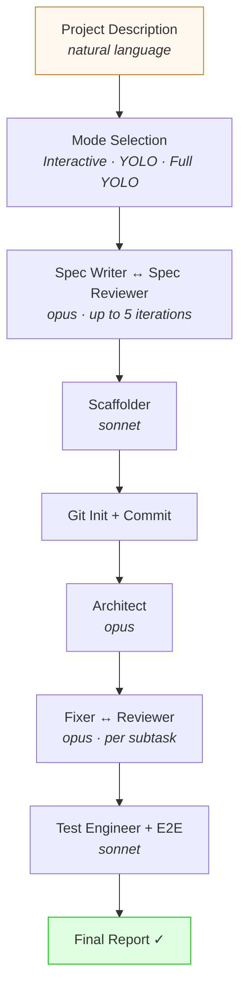
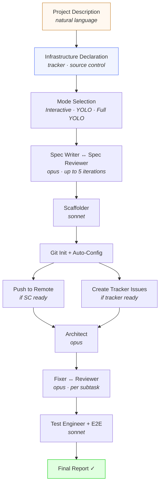
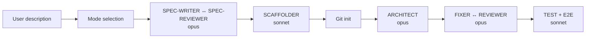
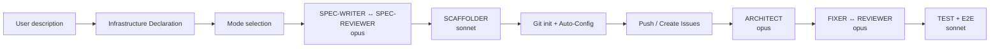
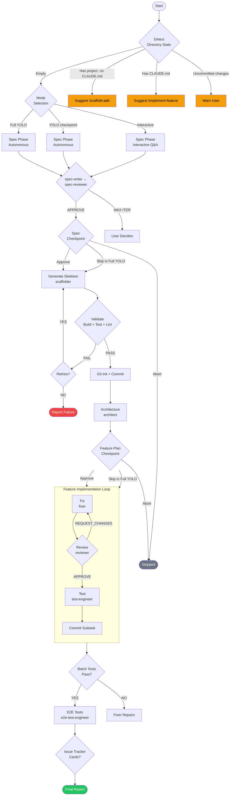
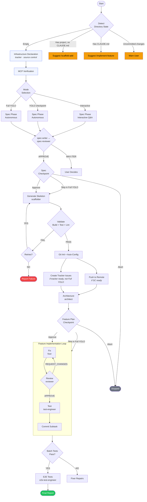

# Design Specification — Scaffold Infrastructure Redesign v5.5.0

This document contains the COMPLETE new content for every changed section. The implementer should use these sections verbatim, applying them via Edit tool replacements.

---

## 1. `commands/scaffold.md` Changes

### 1.1 Step 0-INFRA: Infrastructure Declaration (NEW)

Insert this section AFTER the State Detection section (after "If state is not 1 and user does not confirm -> stop.") and BEFORE `## Orchestration`.

**BEFORE (context for placement):**
```markdown
If state is not 1 and user does not confirm → stop.

## Orchestration
```

**NEW content to insert between them:**
```markdown
### Step 0-INFRA: Infrastructure Declaration

Before mode selection, collect infrastructure intent. This step always runs — including Full YOLO mode.

Display:
```
Before we scaffold, tell me about your infrastructure:

1. Issue tracker:
   (a) I have a tracker project ready (YouTrack / GitHub / Jira / Linear / Gitea / Redmine)
   (b) Not now — I'll set it up later via /init + /onboard

2. Source control:
   (a) I have a git remote ready (e.g., GitHub, Gitea, GitLab)
   (b) Not now — I'll set it up later
```

**If `--issue` flag was provided:** Auto-set tracker = "ready", display: `Detected issue tracker from --issue flag: tracker auto-configured as ready.` Skip the tracker question. Ask only the source control question.

**If tracker = "ready":** Collect details:
- Tracker type: `[youtrack/github/jira/linear/gitea/redmine]`
- Instance URL (show format example from `docs/reference/trackers.md` Instance & Project Defaults table)
- Project key/name

**If SC = "ready":** Collect details:
- Remote (owner/repo format)
- Base branch (default: main)

**Store in-memory variables** (these are used by Steps 0-MCP, 4, 4d, 4e, and Final Report — do NOT re-read CLAUDE.md for these values later):

| Variable | Value |
|----------|-------|
| `tracker_type` | User's tracker type or `null` |
| `tracker_instance` | User's instance URL or `null` |
| `tracker_project` | User's project key or `null` |
| `sc_remote` | User's remote (owner/repo) or `null` |
| `sc_base_branch` | User's base branch or `"main"` |
| `tracker_effective_status` | `"ready"` or `"later"` |
| `sc_effective_status` | `"ready"` or `"later"` |

Four valid combinations:

| Tracker | SC | Downstream Behavior |
|---|---|---|
| ready | ready | Full integration — verify MCP, auto-fill config, push, create issues |
| ready | later | Tracker only — verify tracker MCP, create issues, git stays local |
| later | ready | SC only — verify SC MCP, push to remote, no tracker issues |
| later | later | Fully local — TODO markers in CLAUDE.md, user configures later via `/init` + `/onboard --update` |
```

### 1.2 Step 0-MCP: MCP Verification (NEW)

Insert immediately after Step 0-INFRA, before `## Orchestration` / `### Step 0: Mode Selection`.

```markdown
### Step 0-MCP: MCP Verification

<!-- Replicates init.md Steps 3-7 detection logic. Keep in sync. -->

Runs immediately after Step 0-INFRA. Only checks services the user declared as "ready".

**Required in-memory values from Step 0-INFRA:** `tracker_type`, `tracker_instance`, `tracker_effective_status`, `sc_effective_status`.

For each service declared "ready":

1. **Determine expected MCP package.** Read the MCP Server Detection table from `docs/reference/trackers.md` to find the expected package name for the declared tracker type. For SC, look for `mcp__*` tools related to git/GitHub/Gitea operations.

2. **Check MCP tool accessibility.** Scan available tools for at least one `mcp__*` tool matching the expected package.

3. **If MCP tool not found:**
   - Display: `MCP server for {type} not detected in current session.`
   - Display guidance: the expected package name, required environment variables (from trackers.md), and a note to run `/ceos-agents:init` after scaffold completes.
   - Offer: `Continue without {service}? [Y/n/Abort]`
     - Y (or Enter) → downgrade: set `{service}_effective_status = "downgraded"`, continue
     - n → re-check (user may have configured it)
     - Abort → STOP scaffold entirely
   - **In Full YOLO mode:** auto-downgrade without prompt. Display: `MCP for {type} not available — downgrading to "later".`

4. **If MCP tool found — verify connectivity:**
   - Tracker: attempt to list issues from declared project (1 result). OK → proceed. FAIL → same downgrade prompt as step 3.
   - SC: attempt to verify the declared remote exists. OK → proceed. FAIL → same downgrade prompt as step 3.

5. **If `--issue` flag was provided and tracker MCP verification fails:**
   - Display: `Could not reach tracker to fetch issue {ID}. Please describe your project instead.`
   - Set `tracker_effective_status = "downgraded"`.
   - Discard the `--issue` input source. Fall back to asking for a project description at Step 1.

After all checks, the `tracker_effective_status` and `sc_effective_status` variables hold the final values (`"ready"`, `"later"`, or `"downgraded"`) used by all downstream steps.
```

### 1.3 Step numbering comment (NEW)

Insert at the very beginning of `## Orchestration`, immediately after the heading:

**BEFORE:**
```markdown
## Orchestration

### Step 0: Mode Selection
```

**AFTER:**
```markdown
## Orchestration

<!-- Step numbering: 0-INFRA and 0-MCP use label suffixes to avoid collision with existing Step 0b. Steps 4d and 4e use letter suffixes per standard convention. -->

### Step 0: Mode Selection
```

### 1.4 Modified Step 0: Mode Selection

The `--no-implement` exit now occurs here (after 0-INFRA and 0-MCP have already run):

**BEFORE:**
```markdown
### Step 0: Mode Selection

Generate `run_id` as `scaffold-{timestamp}` (format: `scaffold-YYYYMMDD-HHmmss`). Create `.ceos-agents/{run_id}/` directory. Initialize `state.json` following the schema in `state/schema.md` with `status: "running"`, `mode: "code-project"`, `pipeline: "scaffold"`, `run_id: "{run_id}"`, `parent_run_id: null`. Follow atomic write protocol from `core/state-manager.md`.

If `--no-implement`:
→ Skip to legacy flow: stack-selector → scaffolder → validate → move → git init → report (v3.x behavior, steps L1–L6 below). EXIT pipeline.
```

**AFTER:**
```markdown
### Step 0: Mode Selection

Generate `run_id` as `scaffold-{timestamp}` (format: `scaffold-YYYYMMDD-HHmmss`). Create `.ceos-agents/{run_id}/` directory. Initialize `state.json` following the schema in `state/schema.md` with `status: "running"`, `mode: "code-project"`, `pipeline: "scaffold"`, `run_id: "{run_id}"`, `parent_run_id: null`. Follow atomic write protocol from `core/state-manager.md`.

If `--no-implement`:
→ Skip to legacy flow: stack-selector → scaffolder → validate → move → git init → push (if SC ready) → report (v3.x behavior, steps L1–L6 below). EXIT pipeline.
```

### 1.5 Modified Step 4: Git Init (EXTENDED)

**BEFORE:**
```markdown
### Step 4: Git Init

```bash
git init
git add .
git commit -m "feat: initial project scaffold

Stack: {language} + {framework}
Spec: {N} epics, {M} user stories
Generated by ceos-agents /scaffold"
```
```

**AFTER:**
```markdown
### Step 4: Git Init + Auto-Config

**Required in-memory values from Step 0-INFRA:** `tracker_type`, `tracker_instance`, `tracker_project`, `sc_remote`, `sc_base_branch`, `tracker_effective_status`, `sc_effective_status`.

**4a. Auto-fill CLAUDE.md:**
- For services where `{service}_effective_status` is `"ready"`: fill Automation Config values automatically from in-memory variables. Replace any `<!-- TODO: ... -->` markers for those keys with the collected values.
- For services where `{service}_effective_status` is `"later"` or `"downgraded"`: keep TODO markers in CLAUDE.md (no change).

**4b-replaced. Generate `.mcp.json.example`:**
- Based on `tracker_type` from Step 0-INFRA (if tracker was declared), generate `.mcp.json.example` with the correct MCP server package and `<YOUR_*>` token placeholders. Read the MCP Server Detection table from `docs/reference/trackers.md` for the package name.
- If SC was declared "ready" and the remote is GitHub/Gitea, include the SC MCP server entry as well.
- Add `.mcp.json` to `.gitignore` (never commit real tokens).
- This file is a template only — real tokens are NOT collected during scaffold.

**4c-replaced. Git init and commit:**

```bash
git init
git add .
git commit -m "feat: initial project scaffold

Stack: {language} + {framework}
Spec: {N} epics, {M} user stories
Generated by ceos-agents /scaffold"
```
```

### 1.6 Remove Step 4b (ENTIRE SECTION)

**BEFORE (to be removed):**
```markdown
### Step 4b: Tracker Configuration (Auto-Finalize) — Full YOLO skips this step

If mode is Full YOLO → skip to Step 4c (TODOs remain — cannot guess tracker URLs in unattended mode).

Check the generated CLAUDE.md for TODO markers (`<!-- TODO:`):

1. Scan all `| Key | Value |` rows in `## Automation Config` for values containing `<!-- TODO:`.
2. Collect incomplete keys into a list: `incomplete_keys[]`.

If `incomplete_keys` is empty → skip to Step 4c (no TODOs to fill).

Display:
```
Your project needs a few configuration values before the pipeline can run.
I'll ask about each one now. Press Enter to skip any value.
```

For each incomplete key, prompt the user:

**Issue Tracker keys:**
- `Type` → "Issue tracker type? [youtrack/github/jira/linear/gitea/redmine]" (default from spec if available)
- `Instance` → "What is your {Type} instance URL?" (show format example)
- `Project` → "What is your project key/name in {Type}?"
- `Bug query` → Auto-fill from tracker type defaults. Display: "I'll use this bug query: `{query}`. Change? [Enter to keep / type new]"
- `State transitions` → Auto-fill from tracker type defaults. Display and confirm.
- `On start set` → Auto-fill from tracker type defaults.

**Source Control keys:**
- `Remote` → "What is your repository remote? (e.g., owner/repo)"
- `Base branch` → "Base branch? [main]"
- `Branch naming` → Show default pattern, confirm.

After collecting values:
1. Write values into CLAUDE.md, replacing `<!-- TODO: ... -->` markers with user-provided values using the Edit tool
2. Re-validate CLAUDE.md (scan for remaining TODOs)
3. Commit the config changes: `git add CLAUDE.md && git commit -m "chore: configure Automation Config"`
```

### 1.7 Remove Step 4c (ENTIRE SECTION)

**BEFORE (to be removed):**
```markdown
### Step 4c: MCP Guidance

If Issue Tracker Instance was filled in Step 4b:
- Display: "To connect to {Type} at {Instance}, configure an MCP server. Run `/ceos-agents:init` to set it up."

If Issue Tracker Instance was NOT filled (TODOs remain): skip this step.

This is informational only — scaffold does NOT block on MCP availability.
```

### 1.8 Step 4d: Push to Remote (NEW)

Insert immediately after the modified Step 4, before Step 5.

```markdown
### Step 4d: Push to Remote

**Required in-memory values from Step 0-INFRA:** `sc_remote`, `sc_base_branch`, `sc_effective_status`.

If `sc_effective_status` is NOT `"ready"` → skip this step.

Push the initial scaffold to the declared remote:

```bash
git remote add origin {sc_remote}
git push -u origin {sc_base_branch}
```

**In Full YOLO mode:** run without confirmation prompt. On failure → WARN only (display error, continue pipeline).

**On failure (any mode):** display warning: `Push to remote failed: {error}. You can push manually later.` Continue pipeline — do NOT block.
```

### 1.9 Step 4e: Create Tracker Issues (NEW)

Insert immediately after Step 4d, before Step 5.

```markdown
### Step 4e: Create Tracker Issues

**Required in-memory values from Step 0-INFRA:** `tracker_type`, `tracker_instance`, `tracker_project`, `tracker_effective_status`.

**Guard clause — skip this step if ANY of:**
- `tracker_effective_status` is NOT `"ready"`
- Mode is Full YOLO
- `spec/epics/` directory does not exist or is empty

If none of the guard conditions apply, proceed:

1. Iterate over `spec/epics/*.md` files (sorted by filename prefix):
   - For each epic file:
     a. Create an epic-level issue in the tracker project (title from epic heading, description from epic content).
     b. Do NOT apply the `On start set` state transition from Automation Config. Issues represent planned work, not started work. The `On start set` transition applies when `/implement-feature` begins working on each issue.
     c. For each user story within the epic: create a sub-issue under the epic issue.
     d. Write the created issue ID back into the spec file as a reference comment.
     e. Track the result: success or failure for this epic.

2. **Partial failure handling (accumulator pattern):**
   - On individual epic failure: log the failure (`WARN: Could not create tracker issue for {epic filename}: {error}`), continue to next epic.
   - After iteration completes: if any epics succeeded, commit the partial links:
     ```bash
     git add spec/
     git commit -m "chore: link spec epics to tracker issues"
     ```
   - Display result: `Created {N}/{M} tracker issues. {remaining text if N < M}`
   - If N < M: `Remaining epics can be linked later via /implement-feature.`
   - Pipeline continues — this is a WARN, not a BLOCK.

3. If ALL epics succeeded: commit and display: `Created {M}/{M} tracker issues.`
```

### 1.10 Remove Step 9: Issue Tracker (ENTIRE SECTION)

**BEFORE (to be removed):**
```markdown
### Step 9: Issue Tracker (Optional)

Check if Issue Tracker section in generated CLAUDE.md has TODO markers
  (look for `<!-- TODO:` in Instance or Project values).
If TODO markers present → skip (no tracker configured).

If tracker configured and mode is not Full YOLO:
  "Create cards in issue tracker for implemented features? [Y/n]"

  If yes:
    For each spec/epics/*.md:
      Create epic card in tracker (summary from epic title, description from epic content)
      For each user story in epic:
        Create sub-issue under epic card
        Link back to spec file in repo
      Set status per State transitions from Automation Config

  If no → skip.

If mode is Full YOLO and tracker configured:
  Skip — do not create cards automatically in Full YOLO.
```

### 1.11 Renamed and Modified Step 9: Final Report (was Step 10)

**BEFORE:**
```markdown
### Step 10: Final Report

Update `state.json`: set top-level `status` to `"completed"`. Follow atomic write protocol from `core/state-manager.md`.

Display:
```
## Scaffold Complete

**Project:** {name from spec/README.md Vision section, or project description}
**Mode:** {Interactive | YOLO with checkpoint | Full YOLO}
**Stack:** {from spec/README.md Tech Stack}
**Spec:** {N} iterations, {APPROVED | approved with warnings}
**Features:** {implemented} / {total} ({blocked} blocked)
**Tests:** {unit count} unit, {integration count} integration, {e2e count} e2e
**Commits:** {count}

### Generated files: {count}
### Spec: spec/
### Blocked features (if any):
- {subtask title} — {block reason}

### Remaining TODOs in CLAUDE.md:
- [ ] Issue Tracker instance
- [ ] Source Control remote

### Next steps:
{if TODOs remain in CLAUDE.md}
1. Complete configuration: run `/ceos-agents:onboard --update`
2. Run `/ceos-agents:check-setup` to validate configuration
3. Run `/ceos-agents:scaffold-validate` to verify project state

{if all config is complete}
1. Your project is ready. Try `/ceos-agents:implement-feature` with a tracker issue.
2. Run `/ceos-agents:check-setup` to validate configuration
3. Run `/ceos-agents:scaffold-validate` to verify project state
```
```

**AFTER:**
```markdown
### Step 9: Final Report

**Required in-memory values from Step 0-INFRA:** `tracker_type`, `tracker_instance`, `tracker_project`, `sc_remote`, `tracker_effective_status`, `sc_effective_status`.

Update `state.json`: set top-level `status` to `"completed"`. Follow atomic write protocol from `core/state-manager.md`.

Display:
```
## Scaffold Complete

**Project:** {name from spec/README.md Vision section, or project description}
**Mode:** {Interactive | YOLO with checkpoint | Full YOLO}
**Stack:** {from spec/README.md Tech Stack}
**Spec:** {N} iterations, {APPROVED | approved with warnings}

### Infrastructure
{if tracker_effective_status == "ready"}
  Tracker: Connected ({tracker_type} @ {tracker_instance} — {tracker_project}, {N} epics created)
{else if tracker_effective_status == "downgraded"}
  Tracker: Downgraded — MCP unavailable during scaffold. Configure via /ceos-agents:init
{else}
  Tracker: Not configured — run /ceos-agents:init + /ceos-agents:onboard --update
{/if}

{if sc_effective_status == "ready"}
  SC:      Pushed ({sc_remote} — {sc_base_branch})
{else if sc_effective_status == "downgraded"}
  SC:      Downgraded — MCP unavailable during scaffold. Push manually and run /ceos-agents:init
{else}
  SC:      Not configured — set up a remote and run /ceos-agents:init
{/if}

{if .mcp.json.example was generated}
  MCP:     .mcp.json.example generated (copy to .mcp.json and fill tokens for future sessions)
{/if}

### Implementation
**Features:** {implemented} / {total} ({blocked} blocked)
**Tests:** {unit count} unit, {integration count} integration, {e2e count} e2e
**Commits:** {count}

### Generated files: {count}
### Spec: spec/
### Blocked features (if any):
- {subtask title} — {block reason}

### Next steps:
{if tracker_effective_status != "ready" OR sc_effective_status != "ready"}
1. Fill tokens in .mcp.json (copy from .mcp.json.example)
2. Run `/ceos-agents:init` to configure MCP servers
3. Run `/ceos-agents:onboard --update` to complete Automation Config
4. Run `/ceos-agents:check-setup` to validate configuration
{else if .mcp.json.example was generated but .mcp.json does not exist}
1. Copy .mcp.json.example to .mcp.json and fill in your API tokens
2. Run `/ceos-agents:check-setup` to validate configuration
3. Use `/ceos-agents:implement-feature` with a tracker issue
{else}
1. Your project is ready. Try `/ceos-agents:implement-feature` with a tracker issue.
2. Run `/ceos-agents:check-setup` to validate configuration
3. Run `/ceos-agents:scaffold-validate` to verify project state
{/if}
```
```

### 1.12 Step 7 jump references: "Step 10" -> "Step 9"

**BEFORE (L443):**
```markdown
         - fail-fast → STOP pipeline, jump to Step 10 (report what was completed)
```

**AFTER:**
```markdown
         - fail-fast → STOP pipeline, jump to Step 9 (report what was completed)
```

**BEFORE (L449):**
```markdown
    If still failing → STOP and jump to Step 10 (report)
```

**AFTER:**
```markdown
    If still failing → STOP and jump to Step 9 (report)
```

### 1.13 MCP Pre-flight Check (COMPLETE REWRITE)

**BEFORE:**
```markdown
## MCP Pre-flight Check

MCP pre-flight check is only required when:
- `--issue` flag is used (Step 1 — reading issue description from tracker)
- Step 9 — creating cards in issue tracker (only when tracker is configured and user opts in)

For `--no-implement`, keep the same behavior as v3.x (MCP check before stack-selector).

Before any MCP operation, verify MCP tool availability:
- Read Type from Automation Config (Issue Tracker section)
- Check that at least one `mcp__*` tool matching the tracker type is accessible
- If not accessible → STOP with: "MCP server for {Type} is not available. Run `/ceos-agents:check-setup` for diagnostics or `/ceos-agents:init` to configure."
```

**AFTER:**
```markdown
## MCP Pre-flight Check

After v5.5.0, MCP availability is verified proactively at Step 0-MCP — not lazily before individual operations. The pre-flight logic below covers cases outside Step 0-MCP coverage.

**Cases requiring an additional MCP check:**

- `--issue` flag: Step 1 fetches the issue description from the tracker. Before fetching, verify the tracker MCP tool is still accessible (Step 0-MCP may have run earlier in the session but the tool could become unavailable). If inaccessible → apply `--issue` downgrade fallback (see Step 0-MCP step 5: discard --issue, fall back to project description prompt).

- `--no-implement` legacy flow: Step 0-INFRA and Step 0-MCP fire before L1 (stack-selector). If the user declared tracker or SC as "ready", the MCP was already verified at Step 0-MCP. For "later" services, no MCP check is needed.

**When Step 0-MCP covers the check (no additional pre-flight needed):**

- Step 4d (push to remote): SC MCP was verified at Step 0-MCP. No additional check.
- Step 4e (create tracker issues): Tracker MCP was verified at Step 0-MCP. No additional check.

**Standard error message:**

If MCP inaccessible at any check point:
→ STOP: "MCP server for {Type} is not available. Run `/ceos-agents:check-setup` for diagnostics or `/ceos-agents:init` to configure."

**Critical — in-memory state for Steps 4, 4d, and 4e:** Do NOT re-read CLAUDE.md for tracker type or remote values in Steps 4, 4d, and 4e. CLAUDE.md may still contain TODO markers at that point. Use the values collected at Step 0-INFRA stored in-memory as `tracker_type`, `tracker_instance`, `tracker_project`, `sc_remote`, `sc_base_branch`, `tracker_effective_status`, `sc_effective_status`.
```

### 1.14 Modified --no-implement Legacy Flow: L5 + L5b

**BEFORE:**
```markdown
#### L5. Git init

```bash
git init
git add .
git commit -m "feat: initial project scaffold

Stack: {language} + {framework}
Generated by ceos-agents /scaffold"
```
```

**AFTER:**
```markdown
#### L5. Git init

```bash
git init
git add .
git commit -m "feat: initial project scaffold

Stack: {language} + {framework}
Generated by ceos-agents /scaffold"
```

#### L5b. Push to Remote (if SC ready)

**Required in-memory values from Step 0-INFRA:** `sc_remote`, `sc_base_branch`, `sc_effective_status`.

If `sc_effective_status` is `"ready"`:

```bash
git remote add origin {sc_remote}
git push -u origin {sc_base_branch}
```

On failure → WARN only: `Push to remote failed: {error}. You can push manually later.` Continue to L6.

If `sc_effective_status` is NOT `"ready"` → skip L5b.
```

### 1.15 Modified --no-implement Legacy Flow: L6 Report

**BEFORE:**
```markdown
#### L6. Report

Display to the user:
```
## Scaffold Complete

**Stack:** {summary}
**Files:** {count} files generated
**Validation:** Build ✓ | Tests ✓ | Lint ✓ | CLAUDE.md ✓

### Generated files:
{file list with brief description}

### Next steps:
1. Review CLAUDE.md and configure Automation Config (Issue Tracker instance, Source Control remote)
2. Create issues in your issue tracker for features you want to implement
3. Run `/ceos-agents:implement-feature <ISSUE-ID>` to implement each feature
4. Run `/ceos-agents:check-setup` to validate your Automation Config
```

END of --no-implement legacy flow.
```

**AFTER:**
```markdown
#### L6. Report

**Required in-memory values from Step 0-INFRA:** `tracker_effective_status`, `sc_effective_status`, `sc_remote`.

Display to the user:
```
## Scaffold Complete

**Stack:** {summary}
**Files:** {count} files generated
**Validation:** Build ✓ | Tests ✓ | Lint ✓ | CLAUDE.md ✓

### Generated files:
{file list with brief description}

### Next steps:
{if tracker_effective_status == "ready"}
1. Your tracker is connected. Use `/ceos-agents:implement-feature` with an issue ID.
{else}
1. Create issues in your issue tracker for features you want to implement
{/if}
{if sc_effective_status == "ready"}
2. Your code is pushed to {sc_remote}.
{else}
2. Set up source control and push your code to a remote repository
{/if}
3. Run `/ceos-agents:check-setup` to validate your Automation Config
4. Fill tokens in .mcp.json (copy from .mcp.json.example) for future sessions
```

END of --no-implement legacy flow.
```

### 1.16 Modified Rules section

**BEFORE:**
```markdown
- Scaffolder generates CLAUDE.md — but Issue Tracker instance and Source Control remote
  require manual completion (marked with TODO comments)
```

**AFTER:**
```markdown
- Scaffolder generates CLAUDE.md — Issue Tracker and Source Control values are auto-filled from Step 0-INFRA
  in-memory state when services are declared "ready"; TODO markers remain for "later" or "downgraded" services
```

---

## 2. `CLAUDE.md` — Scaffold Pipeline Section

**BEFORE:**
```markdown
## Scaffold Pipeline

```
User description → [Mode selection] → SPEC-WRITER ↔ SPEC-REVIEWER (opus)
  → [Spec checkpoint] → SCAFFOLDER (sonnet, +test infrastructure, +scorecard)
  → Validate → Git init
  → ARCHITECT (opus, +maps_to) → [Feature plan checkpoint]
  → FIXER ↔ REVIEWER (opus) → TEST ENGINEER (sonnet)
  → [Spec compliance check (spec-reviewer --verify)]
  → E2E-TEST-ENGINEER (sonnet) → Final report
```

With `--no-implement`: `STACK-SELECTOR (sonnet) → SCAFFOLDER (sonnet) → Validate → Git init` (v3.x behavior).
```

**AFTER:**
```markdown
## Scaffold Pipeline

```
[0-INFRA: infra declaration] → [0-MCP: MCP check]
  → User description → [Mode selection] → SPEC-WRITER ↔ SPEC-REVIEWER (opus)
  → [Spec checkpoint] → SCAFFOLDER (sonnet, +test infrastructure, +scorecard)
  → Validate → Git init → [4d: push] → [4e: tracker issues]
  → ARCHITECT (opus, +maps_to) → [Feature plan checkpoint]
  → FIXER ↔ REVIEWER (opus) → TEST ENGINEER (sonnet)
  → [Spec compliance check (spec-reviewer --verify)]
  → E2E-TEST-ENGINEER (sonnet) → Final report
```

With `--no-implement`: `[0-INFRA] → [0-MCP] → STACK-SELECTOR (sonnet) → SCAFFOLDER (sonnet) → Validate → Git init → [push if SC ready]` (v3.x behavior).
```

---

## 3. `README.md` — Scaffold Pipeline Mermaid Diagram

**BEFORE:**
```markdown
### Scaffold Pipeline



With `--no-implement`: Stack Selector → Scaffolder → Validate → Git Init (v3.x skeleton only).
```

**AFTER:**
```markdown
### Scaffold Pipeline



With `--no-implement`: Infrastructure Declaration → Stack Selector → Scaffolder → Validate → Git Init + Push (v3.x skeleton only).
```

---

## 4. `docs/architecture.md` — Scaffold Pipeline Section

**BEFORE:**
```markdown
### Scaffold Pipeline

The scaffold pipeline creates a new project from scratch. In v2 mode (default), it generates a specification, builds the skeleton, and implements all features:



Key characteristics:
- Three modes: Interactive (Q&A), YOLO with checkpoint (autonomous + approval), Full YOLO (fully autonomous)
- Spec-writer ↔ spec-reviewer loop refines the specification (max 5 iterations)
- Scaffolder reads tech stack from spec/README.md (v2 mode) or stack-selector (--no-implement)
- Architect decomposes epics into dependency-aware batches
- Features are implemented per-subtask with fixer/reviewer/test-engineer
- With `--no-implement`: stack-selector → scaffolder → validate → git init (v3.x behavior)
```

**AFTER:**
```markdown
### Scaffold Pipeline

The scaffold pipeline creates a new project from scratch. In v2 mode (default), it generates a specification, builds the skeleton, and implements all features:



Key characteristics:
- Infrastructure declaration (Step 0-INFRA) and MCP verification (Step 0-MCP) run before mode selection
- Three modes: Interactive (Q&A), YOLO with checkpoint (autonomous + approval), Full YOLO (fully autonomous)
- Spec-writer ↔ spec-reviewer loop refines the specification (max 5 iterations)
- Scaffolder reads tech stack from spec/README.md (v2 mode) or stack-selector (--no-implement)
- After git init: auto-fill CLAUDE.md config, push to remote (Step 4d), create tracker issues (Step 4e)
- Architect decomposes epics into dependency-aware batches
- Features are implemented per-subtask with fixer/reviewer/test-engineer
- With `--no-implement`: infrastructure declaration → stack-selector → scaffolder → validate → git init + push (v3.x behavior)
```

---

## 5. `docs/reference/pipelines.md` — Scaffold v2 Pipeline

### 5.1 Mermaid Diagram

**BEFORE:**
```markdown

```

**AFTER:**
```markdown

```

### 5.2 Stages Table

**BEFORE:**
```markdown
### Stages

| Step | Stage | Agent | Model | Notes |
|------|-------|-------|-------|-------|
| 0 | Mode Selection | (command) | N/A | Interactive / YOLO with checkpoint / Full YOLO |
| 1 | Specification | spec-writer ↔ spec-reviewer | opus | Loop up to Spec iterations (default 5) |
| 2 | Spec Checkpoint | (command) | N/A | Skip in Full YOLO; user approves or aborts |
| 3 | Skeleton Generation | scaffolder | sonnet | Reads tech stack from spec/README.md; generates E2E Test + Decomposition config |
| 4 | Git Init | (command) | N/A | Commits both spec/ and skeleton |
| 5 | Architecture | architect | opus | Decomposes epics into dependency-aware batches |
| 6 | Feature Plan Checkpoint | (command) | N/A | Skip in Full YOLO; user approves batch plan |
| 7 | Feature Implementation | fixer ↔ reviewer + test-engineer | opus/sonnet | Per-subtask loop with block handler + rollback |
| 8 | E2E Tests | e2e-test-engineer | sonnet | Covers critical user flows from spec |
| 9 | Issue Tracker | (command) | N/A | Optional — create cards from spec/epics/ |
| 10 | Final Report | (command) | N/A | Summary with features, tests, TODOs |
```

**AFTER:**
```markdown
### Stages

| Step | Stage | Agent | Model | Notes |
|------|-------|-------|-------|-------|
| 0-INFRA | Infrastructure Declaration | (command) | N/A | Collects tracker/SC intent; always runs (even Full YOLO) |
| 0-MCP | MCP Verification | (command) | N/A | Verifies MCP for declared "ready" services; auto-downgrades in Full YOLO |
| 0 | Mode Selection | (command) | N/A | Interactive / YOLO with checkpoint / Full YOLO |
| 1 | Specification | spec-writer ↔ spec-reviewer | opus | Loop up to Spec iterations (default 5) |
| 2 | Spec Checkpoint | (command) | N/A | Skip in Full YOLO; user approves or aborts |
| 3 | Skeleton Generation | scaffolder | sonnet | Reads tech stack from spec/README.md; generates E2E Test + Decomposition config |
| 4 | Git Init + Auto-Config | (command) | N/A | Commits spec/ + skeleton; auto-fills CLAUDE.md from 0-INFRA; generates .mcp.json.example |
| 4d | Push to Remote | (command) | N/A | If SC ready; WARN on failure |
| 4e | Create Tracker Issues | (command) | N/A | If tracker ready, not Full YOLO; accumulator pattern for partial failure |
| 5 | Architecture | architect | opus | Decomposes epics into dependency-aware batches |
| 6 | Feature Plan Checkpoint | (command) | N/A | Skip in Full YOLO; user approves batch plan |
| 7 | Feature Implementation | fixer ↔ reviewer + test-engineer | opus/sonnet | Per-subtask loop with block handler + rollback |
| 8 | E2E Tests | e2e-test-engineer | sonnet | Covers critical user flows from spec |
| 9 | Final Report | (command) | N/A | Summary with infrastructure status, features, tests, next steps |
```

---

## 6. `docs/reference/commands.md` — /scaffold Description

**BEFORE:**
```markdown
**What it does:** In v2 mode (default), the user selects a mode (Interactive, YOLO with checkpoint, Full YOLO), then spec-writer generates a project specification with spec-reviewer quality gate, scaffolder generates the skeleton, and the feature pipeline (architect → fixer/reviewer/test-engineer) implements all features from the spec. With `--no-implement`, falls back to v3.x behavior: stack-selector → scaffolder → skeleton only.
```

**AFTER:**
```markdown
**What it does:** In v2 mode (default), the user first declares infrastructure intent (issue tracker and source control availability), then selects a mode (Interactive, YOLO with checkpoint, Full YOLO). Spec-writer generates a project specification with spec-reviewer quality gate, scaffolder generates the skeleton with auto-configured CLAUDE.md, and the feature pipeline (architect → fixer/reviewer/test-engineer) implements all features from the spec. After git init, the scaffold pushes to the declared remote (Step 4d) and creates tracker issues from spec epics (Step 4e) when infrastructure is ready. The `--issue` flag auto-detects tracker availability. With `--no-implement`, falls back to v3.x behavior with infrastructure declaration: stack-selector → scaffolder → skeleton → push (if SC ready).
```

---

## 7. `CHANGELOG.md` — v5.5.0 Entry

Insert before the `## [5.4.1]` entry:

```markdown
## [5.5.0] — 2026-03-27

**MINOR** — scaffold infrastructure redesign: front-loaded infrastructure declaration, MCP verification, auto-push, tracker issue creation. Replaces Steps 4b/4c/9 with Steps 0-INFRA/0-MCP/4d/4e. No breaking changes to Automation Config contract.

### Added
- **Step 0-INFRA: Infrastructure Declaration:** New step before mode selection. Collects issue tracker and source control intent (ready/later). In-memory state variables carry infrastructure decisions through the entire pipeline without re-reading CLAUDE.md. Always runs, including in Full YOLO mode.
- **Step 0-MCP: MCP Verification:** New step after 0-INFRA. Verifies MCP connectivity for declared "ready" services. References `docs/reference/trackers.md` for package detection. Offers downgrade-or-abort on failure. In Full YOLO, auto-downgrades without prompt.
- **Step 4d: Push to Remote:** Pushes initial scaffold to declared remote when SC is ready. WARN on failure (never blocks pipeline).
- **Step 4e: Create Tracker Issues:** Creates tracker issues from `spec/epics/*.md` when tracker is ready. Accumulator pattern for partial failure — creates as many as possible, reports N/M, continues as WARN. Skipped in Full YOLO mode. Issues created without `On start set` transition (planned work, not started).
- **`.mcp.json.example` generation:** Step 4 generates a template MCP config with `<YOUR_*>` token placeholders. `.mcp.json` added to `.gitignore`.
- **`--issue` auto-detect:** When `--issue` flag is provided, tracker is auto-configured as "ready" at Step 0-INFRA. If MCP verification fails at Step 0-MCP, falls back to project description prompt.
- **`--no-implement` L5b: Push to Remote:** Legacy flow extended with push-to-remote when SC is declared ready.
- **`--no-implement` L6 conditional report:** Next steps adapt based on declared infrastructure status (ready vs later).

### Changed
- **Full YOLO behavior:** Step 0-INFRA infrastructure question is now asked even in Full YOLO mode. Previously, tracker configuration (Step 4b) was silently skipped in Full YOLO. This is an intentional change — infrastructure is a prerequisite decision that cannot be defaulted.
- **Step 4 renamed:** "Git Init" → "Git Init + Auto-Config". Auto-fills CLAUDE.md from Step 0-INFRA in-memory state for "ready" services.
- **Step 10 renamed to Step 9:** Final Report renumbered after removal of old Step 9. Infrastructure status section added to report output.
- **MCP Pre-flight Check rewritten:** Now references Step 0-MCP as primary verification point. Covers `--issue` and `--no-implement` edge cases. Explicit instruction to use in-memory state, not re-read CLAUDE.md.

### Removed
- **Step 4b: Tracker Configuration (Auto-Finalize)** — Replaced by Step 0-INFRA (front-loaded, not post-skeleton).
- **Step 4c: MCP Guidance** — Replaced by Step 0-MCP (proactive verification, not informational text).
- **Step 9: Issue Tracker (Optional)** — Replaced by Step 4e (moved before implementation, not after).

### Known Limitations
- In-memory infrastructure state is not persisted to `state.json`. If scaffold crashes mid-pipeline and is resumed via `/resume-ticket`, the user must re-answer infrastructure questions. State persistence deferred to future release.

### Details
- 19 agents (unchanged), 25 commands (unchanged)
- Scaffold pipeline: 16 named stages (was 15: +0-INFRA, +0-MCP, +4d, +4e, -4b, -4c, -old Step 9, renumber 10→9)
- Net change: +4 steps added, -3 steps removed, 1 renumbered = +1 net stage
```

---

## 8. Test File Changes

### 8.1 `tests/scenarios/scaffold-v2-happy-path.sh`

Add after existing assertions (exact insertion point: after the last `assert_contains` or `grep -q` line):

```bash
# --- v5.5.0 Step additions ---

# Step 0-INFRA: Infrastructure Declaration present
grep -q "Infrastructure Declaration" "$SCAFFOLD_CMD"
assert_result "scaffold-v2 contains Step 0-INFRA: Infrastructure Declaration"

# Step 0-MCP present
grep -q "0-MCP" "$SCAFFOLD_CMD"
assert_result "scaffold-v2 contains Step 0-MCP"

# Step 4d: Push to Remote present
grep -q "Push to Remote" "$SCAFFOLD_CMD"
assert_result "scaffold-v2 contains Step 4d: Push to Remote"

# Step 4e: Create Tracker Issues present
grep -q "Create Tracker Issues" "$SCAFFOLD_CMD"
assert_result "scaffold-v2 contains Step 4e: Create Tracker Issues"

# --- v5.5.0 Step removals (regression guards) ---

# Step 4b REMOVED
! grep -q "Step 4b" "$SCAFFOLD_CMD"
assert_result "scaffold-v2 does NOT contain Step 4b (removed in v5.5.0)"

# Step 4c REMOVED
! grep -q "Step 4c" "$SCAFFOLD_CMD"
assert_result "scaffold-v2 does NOT contain Step 4c (removed in v5.5.0)"

# Old Step 9: Issue Tracker REMOVED
! grep -q "Step 9: Issue Tracker" "$SCAFFOLD_CMD"
assert_result "scaffold-v2 does NOT contain 'Step 9: Issue Tracker' (removed in v5.5.0)"

# --- v5.5.0 Ordering assertion ---

# Step 0-INFRA appears before Mode Selection
INFRA_LINE=$(grep -n "Infrastructure Declaration" "$SCAFFOLD_CMD" | head -1 | cut -d: -f1)
MODE_LINE=$(grep -n "Step 0: Mode Selection" "$SCAFFOLD_CMD" | head -1 | cut -d: -f1)
[ "$INFRA_LINE" -lt "$MODE_LINE" ]
assert_result "Step 0-INFRA appears before Step 0: Mode Selection"

# Step 9 is now Final Report (not Issue Tracker)
grep -q "Step 9: Final Report" "$SCAFFOLD_CMD"
assert_result "Step 9 is now Final Report (renumbered from Step 10)"

# No remaining "Step 10" references
! grep -q "Step 10" "$SCAFFOLD_CMD"
assert_result "No remaining 'Step 10' references in scaffold.md"
```

### 8.2 `tests/scenarios/scaffold-v2-no-implement.sh`

Add after existing assertions:

```bash
# --- v5.5.0 ---

# Step 0-INFRA present even in --no-implement flow
grep -q "Infrastructure Declaration" "$SCAFFOLD_CMD"
assert_result "scaffold-v2 contains Infrastructure Declaration (runs for --no-implement too)"

# L5b Push to Remote present in legacy flow
grep -q "L5b" "$SCAFFOLD_CMD"
assert_result "scaffold-v2 legacy flow contains L5b (Push to Remote)"
```

---

## Summary of All Section Replacements

For implementer reference — the exact `old_string` → `new_string` pairs for Edit tool operations on `commands/scaffold.md`:

1. Insert Step 0-INFRA + Step 0-MCP between State Detection and Orchestration
2. Insert step numbering comment at start of Orchestration
3. Modify `--no-implement` exit text in Step 0
4. Replace Step 4 content (extended with auto-config)
5. Delete Step 4b entirely
6. Delete Step 4c entirely
7. Insert Step 4d after Step 4
8. Insert Step 4e after Step 4d
9. Delete Step 9: Issue Tracker entirely
10. Replace Step 10 heading and content with Step 9: Final Report
11. Replace "jump to Step 10" with "jump to Step 9" (2 locations)
12. Replace entire MCP Pre-flight Check section
13. Insert L5b after L5 in legacy flow
14. Replace L6 Report in legacy flow
15. Update Rules section scaffolder CLAUDE.md line
