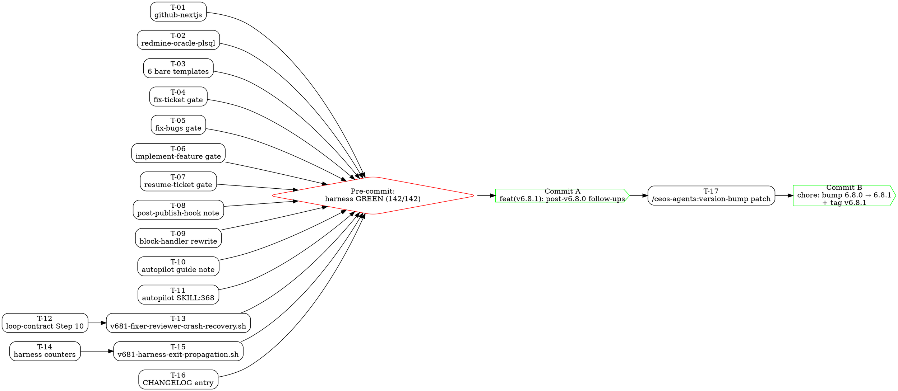

# Phase 6: Plan — v6.8.1 PATCH

Dependency-ordered task graph for Phase 7 execution. Content commit = T-01..T-16; version-bump commit = T-17.

## Meta
- Total tasks: 17 (16 content + 1 version-bump)
- Max parallel width (Tier 1): 13
- Critical path depth: 4 tiers (Tier 1 → Tier 2 → Tier 3 → Tier 4)
- Files touched: 19 modified + 2 created = 21 distinct paths (Tier 1-3); +2 modified (plugin.json, marketplace.json) in Tier 4
- Commits: exactly 2 — Commit A (content + CHANGELOG), Commit B (version-bump + tag)
- Expected harness baseline post-merge: 142/142 (140 baseline + 2 new v681- scenarios)

---

## Section 1: Task Inventory

Each task is atomic and independently implementable by a fresh subagent reading only this plan + `.forge/phase-4-spec/*.md` + (where relevant) `.forge/phase-5-tdd/tests/*.sh`.

### T-01 — Insert `### Autopilot (optional)` block into `github-nextjs.md` existing comment block

- **Title:** Add Autopilot row to github-nextjs.md (inside existing `<!-- -->` block)
- **Files touched:** `C:/gitea_ceos-agents/examples/configs/github-nextjs.md`
- **Requirements covered:** R-ITEM-1.1, R-ITEM-1.2, R-ITEM-1.3, R-ITEM-1.4 (for this file)
- **Acceptance criteria covered:** AC-ITEM-1.1, 1.2, 1.3, 1.4 (for this file)
- **Verbatim change summary:** Insert the 9-line block from `design.md:48-60` (`### Autopilot (optional)` + header row + alignment row + 7 key rows) inside the existing `<!-- ... -->` comment block at lines 50-134, after `### Metrics (optional)` and before closing `-->`. Opt-in semantics preserved.
- **Dependencies:** none
- **Estimated size:** XS (~10 lines)
- **Parallelism tier:** 1

### T-02 — Insert `### Autopilot` active-section block into `redmine-oracle-plsql.md`

- **Title:** Add Autopilot row to redmine-oracle-plsql.md (active section, before comment divider at line 113)
- **Files touched:** `C:/gitea_ceos-agents/examples/configs/redmine-oracle-plsql.md`
- **Requirements covered:** R-ITEM-1.1, R-ITEM-1.2, R-ITEM-1.3, R-ITEM-1.4 (for this file)
- **Acceptance criteria covered:** AC-ITEM-1.1, 1.2, 1.3, 1.4 (for this file)
- **Verbatim change summary:** Insert the verbatim block from `design.md:84-94` (`### Autopilot` with NO `(optional)` suffix, plus 9 table lines) after `### Decomposition` (~line 111) and before the `> **Uncomment...` divider at line 113. Active-section style per roadmap audience relevance.
- **Dependencies:** none
- **Estimated size:** XS (~10 lines)
- **Parallelism tier:** 1

### T-03 — Append new divider + comment block containing `### Autopilot (optional)` to the 6 bare templates

- **Title:** Add divider + commented Autopilot block to 6 bare templates
- **Files touched:**
  - `C:/gitea_ceos-agents/examples/configs/github-python-fastapi.md`
  - `C:/gitea_ceos-agents/examples/configs/github-dotnet.md`
  - `C:/gitea_ceos-agents/examples/configs/gitea-spring-boot.md`
  - `C:/gitea_ceos-agents/examples/configs/jira-react.md`
  - `C:/gitea_ceos-agents/examples/configs/youtrack-python.md`
  - `C:/gitea_ceos-agents/examples/configs/redmine-rails.md`
- **Requirements covered:** R-ITEM-1.1, R-ITEM-1.2, R-ITEM-1.3, R-ITEM-1.4 (for these 6 files)
- **Acceptance criteria covered:** AC-ITEM-1.1, 1.2, 1.3, 1.4 (for these 6 files)
- **Verbatim change summary:** For each of the 6 bare templates, append at end-of-file the exact 14-line block from `design.md:63-78` — a blank line, the `> **Uncomment and customize optional sections as needed.**` divider, a blank line, `<!--`, the `### Autopilot (optional)` heading, header row, alignment row, 7 key rows, and `-->`. Identical text across all 6 files.
- **Dependencies:** none
- **Estimated size:** S (~90 lines total across 6 files)
- **Parallelism tier:** 1
- **Justification for bundling:** Six identical appends; one task avoids subagent coordination overhead and eliminates risk of drift between template variants.

### T-04 — Add issue_id regex gate to `skills/fix-ticket/SKILL.md` (Step 0)

- **Title:** Insert issue_id validation gate in fix-ticket Step 0
- **Files touched:** `C:/gitea_ceos-agents/skills/fix-ticket/SKILL.md`
- **Requirements covered:** R-ITEM-2.1, R-ITEM-2.2 (this skill), R-ITEM-2.3, R-ITEM-2.4, R-ITEM-2.5, R-ITEM-2.6
- **Acceptance criteria covered:** AC-ITEM-2.1, 2.2, 2.3, 2.4, 2.5, 2.6 (this skill)
- **Verbatim change summary:** Insert the verbatim gate block from `design.md:123-136` (the fenced `bash` block containing `[[ ! "${ISSUE_ID}" =~ ^[A-Za-z0-9#_-]+$ ]]` plus surrounding prose naming valid/reject examples) in Step 0 immediately AFTER `ISSUE_ID` is read from the skill argument and BEFORE the `.ceos-agents/{ISSUE-ID}/` reference near line 87. Operative gate-line placement check: `gate_line < path_line` (AC-ITEM-2.2).
- **Dependencies:** none
- **Estimated size:** XS (~16 lines inserted)
- **Parallelism tier:** 1

### T-05 — Add issue_id regex gate to `skills/fix-bugs/SKILL.md` (top of per-issue loop body)

- **Title:** Insert issue_id validation gate at top of per-issue loop in fix-bugs
- **Files touched:** `C:/gitea_ceos-agents/skills/fix-bugs/SKILL.md`
- **Requirements covered:** R-ITEM-2.1, R-ITEM-2.2 (this skill, loop placement), R-ITEM-2.3, R-ITEM-2.4, R-ITEM-2.5, R-ITEM-2.6
- **Acceptance criteria covered:** AC-ITEM-2.1, 2.2, 2.3, 2.4, 2.5, 2.6 (this skill)
- **Verbatim change summary:** Insert the same gate block from `design.md:123-136` at the TOP of the per-issue loop body (NOT at outer Step 0 — `ISSUE_ID` is not bound there), immediately after `ISSUE_ID` is assigned from the loop iterator and BEFORE the directory-creation line near line 90. Gate failure skips the offending issue (consistent with `On error: skip` semantics); other issues continue.
- **Dependencies:** none
- **Estimated size:** XS (~16 lines inserted)
- **Parallelism tier:** 1

### T-06 — Add issue_id regex gate to `skills/implement-feature/SKILL.md` (Step 0)

- **Title:** Insert issue_id validation gate in implement-feature Step 0
- **Files touched:** `C:/gitea_ceos-agents/skills/implement-feature/SKILL.md`
- **Requirements covered:** R-ITEM-2.1, R-ITEM-2.2 (this skill), R-ITEM-2.3, R-ITEM-2.4, R-ITEM-2.5, R-ITEM-2.6
- **Acceptance criteria covered:** AC-ITEM-2.1, 2.2, 2.3, 2.4, 2.5, 2.6 (this skill)
- **Verbatim change summary:** Insert the verbatim gate block from `design.md:123-136` in Step 0 immediately AFTER `ISSUE_ID` is read and BEFORE the path reference near line 89.
- **Dependencies:** none
- **Estimated size:** XS (~16 lines)
- **Parallelism tier:** 1

### T-07 — Add issue_id regex gate to `skills/resume-ticket/SKILL.md` (Step 0)

- **Title:** Insert issue_id validation gate in resume-ticket Step 0
- **Files touched:** `C:/gitea_ceos-agents/skills/resume-ticket/SKILL.md`
- **Requirements covered:** R-ITEM-2.1, R-ITEM-2.2 (this skill), R-ITEM-2.3, R-ITEM-2.4, R-ITEM-2.5, R-ITEM-2.6
- **Acceptance criteria covered:** AC-ITEM-2.1, 2.2, 2.3, 2.4, 2.5, 2.6 (this skill)
- **Verbatim change summary:** Insert the verbatim gate block from `design.md:123-136` in Step 0 immediately AFTER `ISSUE_ID` is read and BEFORE the path reference near line 17.
- **Dependencies:** none
- **Estimated size:** XS (~16 lines)
- **Parallelism tier:** 1

### T-08 — Add JSON-encode "Field value safety" paragraph to `core/post-publish-hook.md` Section 4

- **Title:** Insert Field value safety note in post-publish-hook Section 4
- **Files touched:** `C:/gitea_ceos-agents/core/post-publish-hook.md`
- **Requirements covered:** R-ITEM-3.1
- **Acceptance criteria covered:** AC-ITEM-3.1, AC-ITEM-3.4 (negative: no inline `-d '{...}'` remains)
- **Verbatim change summary:** Insert the verbatim 11-line paragraph from `design.md:165-177` into Section 4 after the "Advisory failure" sentence and before the Section 4 close (~after line 102). Paragraph contains the literal phrase "Field value safety", discusses heredoc vs JSON-encoding, cross-references the issue_id regex gate, and points to `core/block-handler.md` Step 5 for the canonical `jq -n --arg` pattern.
- **Dependencies:** none (cross-references T-04..T-07's gate but grep for them is absent; safe to land independently)
- **Estimated size:** S (~12 lines)
- **Parallelism tier:** 1

### T-09 — Rewrite `core/block-handler.md` Step 5: heredoc + `--proto` + `jq -n --arg`

- **Title:** Rewrite block-handler Step 5 webhook fire with heredoc + jq structural payload
- **Files touched:** `C:/gitea_ceos-agents/core/block-handler.md`
- **Requirements covered:** R-ITEM-3.2, R-ITEM-3.4
- **Acceptance criteria covered:** AC-ITEM-3.2, AC-ITEM-3.4
- **Verbatim change summary:** Full replacement of the existing Step 5 block (~lines 40-44) with the verbatim 30-line block from `design.md:180-210`. New block: (a) `jq -n --arg` structural payload construction for event/issue_id/agent/reason/timestamp, (b) `curl --proto "=http,https"` + `--data-binary @-` + heredoc `<<EOF ... EOF`, (c) explanatory prose about `jq` string escaping, `--proto` restriction, and why heredoc+`${payload}` is safe. NO `${var:1:-1}` substring construct (POSIX-safe).
- **Dependencies:** none
- **Estimated size:** M (~30 lines inserted, ~5 lines removed)
- **Parallelism tier:** 1

### T-10 — Append "Payload field safety" note to `docs/guides/autopilot.md`

- **Title:** Append Payload field safety note to autopilot guide
- **Files touched:** `C:/gitea_ceos-agents/docs/guides/autopilot.md`
- **Requirements covered:** R-ITEM-3.3, R-ITEM-3.4
- **Acceptance criteria covered:** AC-ITEM-3.3, AC-ITEM-3.4
- **Verbatim change summary:** Append the verbatim 10-line paragraph from `design.md:214-222` after line 286 in the webhook-payload section. Paragraph contains literal phrases "Payload field safety", "jq -n --arg", and "percent-encoded"; disallows interpolating variables into single-quoted JSON literals for free-form text fields.
- **Dependencies:** none
- **Estimated size:** XS (~10 lines)
- **Parallelism tier:** 1

### T-11 — Reconcile lock-timeout phrasing at `skills/autopilot/SKILL.md:368`

- **Title:** Fix lock-timeout troubleshooting prose in autopilot SKILL.md
- **Files touched:** `C:/gitea_ceos-agents/skills/autopilot/SKILL.md`
- **Requirements covered:** R-ITEM-4.1
- **Acceptance criteria covered:** AC-ITEM-4.1a, AC-ITEM-4.1b
- **Verbatim change summary:** Replace the single-line prose at line 368 verbatim — `design.md:246-248` defines the CURRENT (erroneous `<120min old`) line, and `design.md:251-253` defines the REPLACEMENT line. Replacement must contain the literal phrases "effective stale threshold", "125 min" (with "primary path" nearby), "121 min" (with "BusyBox" nearby), and MUST NOT contain "<120min old".
- **Dependencies:** none
- **Estimated size:** XS (1 line rewritten)
- **Parallelism tier:** 1

### T-12 — Patch `core/fixer-reviewer-loop.md` Step 10 with cumulative tokens + crash-recovery prose

- **Title:** Rewrite fixer-reviewer-loop Step 10 to document cumulative token accumulation + crash recovery
- **Files touched:** `C:/gitea_ceos-agents/core/fixer-reviewer-loop.md`
- **Requirements covered:** R-ITEM-5.1
- **Acceptance criteria covered:** AC-ITEM-5.1a, AC-ITEM-5.1b
- **Verbatim change summary:** Full replacement of Step 10 (line 28) with the verbatim block from `design.md:279-280`. Replacement text MUST contain `tokens_used += iteration_tokens_used`, `duration_ms += iteration_duration_ms`, `tool_uses += iteration_tool_uses`, AND a sentence using the phrase "crashes mid-loop" (or `crash.*mid-loop`) AND "preserves" (operative grep anchors for T-13 scenario assertions and hidden suite grep patterns).
- **Dependencies:** none
- **Estimated size:** S (~3 lines rewritten into ~5 lines)
- **Parallelism tier:** 1
- **Critical ordering note:** The anchor phrases (`tokens_used += iteration_tokens_used`, `crash`, `preserves`) are the exact strings T-13's scenario greps for. T-12 and T-13 MUST land in the same commit (Commit A); textual ordering within the commit is immaterial since the scenario runs at harness-time, not at edit-time.

### T-13 — Copy `v681-fixer-reviewer-crash-recovery.sh` scenario into `tests/scenarios/`

- **Title:** Add Item 5 regression scenario to tests/scenarios/
- **Files touched:** `C:/gitea_ceos-agents/tests/scenarios/v681-fixer-reviewer-crash-recovery.sh` (NEW)
- **Requirements covered:** R-ITEM-5.2, R-ITEM-5.3, R-ITEM-5.4
- **Acceptance criteria covered:** AC-ITEM-5.2, AC-ITEM-5.3, AC-ITEM-5.4
- **Verbatim change summary:** Copy the draft at `C:/gitea_ceos-agents/.forge/phase-5-tdd/tests/v681-fixer-reviewer-crash-recovery.sh` to `tests/scenarios/v681-fixer-reviewer-crash-recovery.sh` verbatim. Ensure executable bit is set (`chmod +x`). The scenario asserts (a) per-iteration `tokens_used` accumulation language in loop contract, (b) crash-recovery semantics, (c) cumulative semantics in `state/schema.md`, (d) running-total write rule in `core/state-manager.md`, plus 1 negative assertion that no per-iteration breakdown arrays exist.
- **Dependencies:** T-12 (loop contract prose must exist for assertions 1-2 to pass when scenario runs)
- **Estimated size:** S (~55-line file copied)
- **Parallelism tier:** 2

### T-14 — Replace `((N++))` with `N=$((N+1))` in `tests/harness/run-tests.sh`

- **Title:** Fix harness counter increment form (PASS/SKIP/FAIL)
- **Files touched:** `C:/gitea_ceos-agents/tests/harness/run-tests.sh`
- **Requirements covered:** R-ITEM-6.1, R-ITEM-6.2, R-ITEM-6.3
- **Acceptance criteria covered:** AC-ITEM-6.1a, AC-ITEM-6.1b, AC-ITEM-6.2, AC-ITEM-6.3
- **Verbatim change summary:** Three single-line edits per `design.md:364-384`:
  - Line 42: `((PASS++))` → `PASS=$((PASS + 1))`
  - Line 48: `((SKIP++))` → `SKIP=$((SKIP + 1))`
  - Line 52: `((FAIL++))` → `FAIL=$((FAIL + 1))`
  Lines 66-68 (aggregate-run exit-code branch) unchanged. No other logic changes.
- **Dependencies:** none
- **Estimated size:** XS (3 lines)
- **Parallelism tier:** 1

### T-15 — Copy `v681-harness-exit-propagation.sh` meta-test into `tests/scenarios/`

- **Title:** Add Item 6 harness meta-test to tests/scenarios/
- **Files touched:** `C:/gitea_ceos-agents/tests/scenarios/v681-harness-exit-propagation.sh` (NEW)
- **Requirements covered:** R-ITEM-6.4
- **Acceptance criteria covered:** AC-ITEM-6.4a, AC-ITEM-6.4b, AC-ITEM-6.1a/b (runtime grep), AC-ITEM-6.2 (functional)
- **Verbatim change summary:** Copy the draft at `C:/gitea_ceos-agents/.forge/phase-5-tdd/tests/v681-harness-exit-propagation.sh` to `tests/scenarios/v681-harness-exit-propagation.sh` verbatim. Ensure executable bit. 4 assertions: 3 static grep (PASS/SKIP/FAIL safe-form present and unsafe-form absent) + 1 functional (inject temp failing scenario, assert non-zero harness exit).
- **Dependencies:** T-14 (harness fix must exist before meta-test grep Assertions 1-3 pass)
- **Estimated size:** S (~65-line file copied)
- **Parallelism tier:** 2

### T-16 — Prepend v6.8.1 CHANGELOG block

- **Title:** Add v6.8.1 entry to CHANGELOG.md
- **Files touched:** `C:/gitea_ceos-agents/CHANGELOG.md`
- **Requirements covered:** R-RELEASE-1
- **Acceptance criteria covered:** AC-RELEASE-1a, AC-RELEASE-1b, AC-RELEASE-1c
- **Verbatim change summary:** Prepend (above the existing `## [6.8.0]` heading) the verbatim block from `design.md:494-509`. Block contains:
  - Heading `## [6.8.1] — 2026-04-18`
  - One-paragraph summary (PATCH — ...)
  - `### Fixed` subsection enumerating all 6 items by path (`examples/configs/*`, `skills/autopilot/SKILL.md:368`, 4 skills, 3 core/doc files, `core/fixer-reviewer-loop.md` Step 10, `tests/harness/run-tests.sh`)
  - `### Internal` subsection listing the two new test scenarios (`v681-fixer-reviewer-crash-recovery.sh`, `v681-harness-exit-propagation.sh`)
  - MUST reference the corrected `examples/configs/*` path; MUST NOT reference `examples/config-templates/*` inside the v6.8.1 block (AC-RELEASE-1c negative).
  - MUST NOT include `### Added` subsection inside the v6.8.1 block (per v6.8.0 precedent; test-infrastructure goes under `### Internal`).
- **Dependencies:** none textually — but reviewer-friendliness: T-16 should be bundled in the same commit as T-01..T-15 so the CHANGELOG entry matches the actual diff.
- **Estimated size:** S (~18 lines prepended)
- **Parallelism tier:** 3

### T-17 — Run `/ceos-agents:version-bump patch` to bump 6.8.0 → 6.8.1

- **Title:** Bump plugin version 6.8.0 → 6.8.1 via version-bump skill
- **Files touched (by skill):**
  - `C:/gitea_ceos-agents/.claude-plugin/plugin.json`
  - `C:/gitea_ceos-agents/.claude-plugin/marketplace.json`
- **Requirements covered:** R-RELEASE-2
- **Acceptance criteria covered:** AC-RELEASE-2a, AC-RELEASE-2b, AC-RELEASE-2c, AC-RELEASE-2d
- **Verbatim change summary:** Invoke `/ceos-agents:version-bump patch` (via Skill tool with `skill: ceos-agents:version-bump`, `args: patch`). The skill:
  1. Validates CHANGELOG contains `## [6.8.1]` heading (Step 6 guard — requires T-16 committed first).
  2. Validates clean working tree (Step 7 guard — requires Commit A landed first).
  3. Updates `plugin.json` `"version": "6.8.1"` and `marketplace.json` `"version": "6.8.1"`.
  4. Creates commit `chore: bump version 6.8.0 → 6.8.1`.
  5. Creates tag `v6.8.1` on that commit.
- **Dependencies:** T-16 (CHANGELOG heading) AND Commit A (all of T-01..T-16) must be finalized first.
- **Estimated size:** XS (skill-managed; ~2 JSON lines + 1 commit + 1 tag)
- **Parallelism tier:** 4 (strictly serialized AFTER Commit A)

---

## Section 2: Suggested Task Breakdown — Justification

The breakdown aligns with the user's suggested ~17 tasks. Departures from the Phase 6 prompt's 10-task suggestion:

- **Split Item 1 into T-01 + T-02 + T-03** (not single T-01). Three tasks, not one: `github-nextjs.md` has a pre-existing comment block (insert inside), `redmine-oracle-plsql.md` uses active-section placement, and the 6 bare templates get identical divider-append. Each is structurally distinct; bundling all 8 files into one task risks the subagent conflating the three placement patterns. T-03 bundles the 6 identical bare-template appends (same block, same location pattern) because drift between them is the real risk and a single subagent eliminates it.
- **Split Item 2 into T-04..T-07** (not single T-02). Four tasks: each skill has a distinct file path AND a distinct step-numbering context (Step 0 vs loop body). The gate content is verbatim-identical across files, but placement logic differs. Parallel fan-out (Tier 1) is maximized.
- **Split Item 3 into T-08 + T-09 + T-10** (not single T-03). Three distinct files, three distinct insert types (new paragraph, full Step 5 rewrite, append-after-line-286). Parallelizable.
- **Item 4 stays one task (T-11).** Single-line rewrite; no split possible.
- **Item 5 stays two tasks (T-12 + T-13).** T-12 (content) and T-13 (test) are strict prerequisite pair.
- **Item 6 stays two tasks (T-14 + T-15).** Same pattern.
- **CHANGELOG is T-16**, separate from content tasks, at Tier 3 so it lands after all content is known-ready.
- **Version-bump is T-17**, strictly Tier 4 after Commit A. Separate commit mandated by user memory.

Total: 17 tasks. This structure maximizes parallel fan-out in Tier 1 (13 independent tasks) while enforcing the two strict prerequisite chains (T-12→T-13, T-14→T-15) and the atomic release-flow (T-16→Commit A→T-17→Commit B+tag).

---

## Section 3: Dependency Graph (DAG)

### Adjacency list

```
T-01 → (Commit A staging)
T-02 → (Commit A staging)
T-03 → (Commit A staging)
T-04 → (Commit A staging)
T-05 → (Commit A staging)
T-06 → (Commit A staging)
T-07 → (Commit A staging)
T-08 → (Commit A staging)
T-09 → (Commit A staging)
T-10 → (Commit A staging)
T-11 → (Commit A staging)
T-12 → T-13 → (Commit A staging)
T-14 → T-15 → (Commit A staging)
T-16 → (Commit A staging)  [bundled last for CHANGELOG accuracy]
(Commit A staging) → Commit A [harness must be GREEN before commit]
Commit A → T-17 → Commit B + tag v6.8.1
```

### Graphviz `dot` format



### Ordering constraints (from prompt + design.md)

| Constraint | Source | Enforced by |
|------------|--------|-------------|
| T-12 ≤ T-13 (loop-contract prose before scenario grep runs) | design.md:19 "Item 5 loop-contract patch MUST land before or in same commit as scenario" | Tier 1 → Tier 2 |
| T-14 ≤ T-15 (harness fix before meta-test grep) | design.md:21 "Item 6 harness fix MUST land before or in same commit as meta-test" | Tier 1 → Tier 2 |
| T-16 ≤ Commit A (CHANGELOG heading must exist before version-bump) | design.md:23 + version-bump Step 6 guard | Tier 3 → Commit A |
| Commit A ≤ T-17 (clean tree required by version-bump Step 7) | design.md:24 + version-bump Step 7 guard | Commit A → Tier 4 |
| T-17 produces separate Commit B + tag | User memory: "content+CHANGELOG in ONE commit, version-bump as SEPARATE commit + tag" | T-17 isolation |

DAG is acyclic and topologically sortable. No conflicts on shared files (each Tier 1 task touches a distinct file; no two tasks write the same file).

---

## Section 4: Parallelization Tiers

### Tier 1 (parallel, max fan-out = 13)

Independent file edits. All 13 tasks can run concurrently in Phase 7 worktrees.

| Task | File | Lines ±   |
|------|------|-----------|
| T-01 | examples/configs/github-nextjs.md | +10 |
| T-02 | examples/configs/redmine-oracle-plsql.md | +10 |
| T-03 | 6 bare template files | +90 |
| T-04 | skills/fix-ticket/SKILL.md | +16 |
| T-05 | skills/fix-bugs/SKILL.md | +16 |
| T-06 | skills/implement-feature/SKILL.md | +16 |
| T-07 | skills/resume-ticket/SKILL.md | +16 |
| T-08 | core/post-publish-hook.md | +12 |
| T-09 | core/block-handler.md | +30/-5 |
| T-10 | docs/guides/autopilot.md | +10 |
| T-11 | skills/autopilot/SKILL.md | ±1 |
| T-12 | core/fixer-reviewer-loop.md | +5/-3 |
| T-14 | tests/harness/run-tests.sh | ±3 |

**Worktree isolation:** Each task touches a distinct file path. No merge conflicts expected.

### Tier 2 (parallel, fan-out = 2, after Tier 1)

| Task | Dependency | File |
|------|-----------|------|
| T-13 | T-12 | tests/scenarios/v681-fixer-reviewer-crash-recovery.sh (NEW) |
| T-15 | T-14 | tests/scenarios/v681-harness-exit-propagation.sh (NEW) |

### Tier 3 (single task, after Tier 2)

| Task | Dependency | File |
|------|-----------|------|
| T-16 | T-01..T-15 (reviewer-context bundling) | CHANGELOG.md |

T-16 is placed at Tier 3 (not Tier 1) because a reviewer reading Commit A wants the CHANGELOG entry to reflect the actual diff. If T-16 were in Tier 1 and any Tier 1/2 task failed, the CHANGELOG would describe work not present.

### Pre-commit gate (before Commit A)

Run `./tests/harness/run-tests.sh` end-to-end. Expected: exit 0, `PASS` count ≥ 142 (140 baseline + T-13 + T-15), `FAIL` = 0. If any scenario fails, do NOT commit — diagnose, fix, re-run. This gate satisfies AC-RELEASE-3.

### Commit A

Single commit with message:

```
feat(v6.8.1): post-v6.8.0 follow-ups — 6 items from roadmap
```

Bundles T-01..T-16 (all content + CHANGELOG). Harness must be GREEN before commit.

### Tier 4 (single task, after Commit A)

| Task | Dependency | Skill invoked |
|------|-----------|---------------|
| T-17 | Commit A | `/ceos-agents:version-bump patch` |

Produces Commit B (`chore: bump version 6.8.0 → 6.8.1`) and tag `v6.8.1`.

---

## Section 5: Commit Plan

### Commit A (content + CHANGELOG)

**Files staged:**
```
examples/configs/github-nextjs.md
examples/configs/github-python-fastapi.md
examples/configs/github-dotnet.md
examples/configs/gitea-spring-boot.md
examples/configs/jira-react.md
examples/configs/youtrack-python.md
examples/configs/redmine-rails.md
examples/configs/redmine-oracle-plsql.md
skills/fix-ticket/SKILL.md
skills/fix-bugs/SKILL.md
skills/implement-feature/SKILL.md
skills/resume-ticket/SKILL.md
core/post-publish-hook.md
core/block-handler.md
docs/guides/autopilot.md
skills/autopilot/SKILL.md
core/fixer-reviewer-loop.md
tests/harness/run-tests.sh
tests/scenarios/v681-fixer-reviewer-crash-recovery.sh
tests/scenarios/v681-harness-exit-propagation.sh
CHANGELOG.md
```

**Files NOT to stage:**
- `.claude/settings.local.json` (always excluded per user memory)
- `.claude-plugin/plugin.json`, `.claude-plugin/marketplace.json` (reserved for Commit B via skill)

**Commit message (heredoc):**
```
feat(v6.8.1): post-v6.8.0 follow-ups — 6 items from roadmap

PATCH release polishing v6.8.0:
- examples/configs/*: Autopilot rows added to all 8 templates
- skills/{fix-ticket,fix-bugs,implement-feature,resume-ticket}/SKILL.md: issue_id regex gate (path-traversal defense)
- core/post-publish-hook.md, core/block-handler.md, docs/guides/autopilot.md: JSON-encode payload docs + heredoc/jq rewrite
- skills/autopilot/SKILL.md:368: lock-timeout troubleshooting prose corrected
- core/fixer-reviewer-loop.md Step 10: cumulative tokens + crash-recovery contract
- tests/harness/run-tests.sh: POSIX-safe counter increments
- tests/scenarios/v681-fixer-reviewer-crash-recovery.sh, v681-harness-exit-propagation.sh: regression + meta-test scenarios

Harness: 142/142 passing (140 baseline + 2 new v681- scenarios).

Co-Authored-By: Claude Opus 4.7 (1M context) <noreply@anthropic.com>
```

### Commit B (version-bump, skill-generated)

Produced automatically by `/ceos-agents:version-bump patch`. Message: `chore: bump version 6.8.0 → 6.8.1`. Tag: `v6.8.1`.

**Files staged (by skill):**
- `.claude-plugin/plugin.json`
- `.claude-plugin/marketplace.json`

---

## Section 6: Pre-commit Verification

Before executing `git commit` for Commit A, Phase 7 executor MUST run:

### 6.1 Full harness run

```bash
cd C:/gitea_ceos-agents
./tests/harness/run-tests.sh
echo "Exit code: $?"
```

**Expected output:**
- Exit code: `0`
- Summary line: `PASS: ≥142, SKIP: (baseline-equivalent), FAIL: 0`
- Both new scenarios (`v681-fixer-reviewer-crash-recovery`, `v681-harness-exit-propagation`) emit `PASS:` lines.

**On non-green:** diagnose, fix, re-run. Do NOT commit until green. This enforces AC-RELEASE-3.

### 6.2 Stale-path sanity grep (from Phase 2 research)

```bash
grep -rn "examples/config-templates" docs/ CHANGELOG.md
```

**Expected output:** Only matches in `CHANGELOG.md` — specifically the v6.8.0 Known Issues entry (line ~42) which historically cited the erroneous path. No NEW matches in `docs/`. The v6.8.1 block MUST NOT contain `examples/config-templates` (AC-RELEASE-1c negative).

If unexpected matches surface, either correct the erroneous doc (optionally as part of T-16 if inside the v6.8.1 block only) or document as out-of-scope for v6.8.1.

### 6.3 settings.local.json exclusion check

```bash
git status --porcelain | grep -E '\.claude/settings\.local\.json'
```

**Expected:** no match. If matched, do NOT add to staging.

### 6.4 Post-commit verification (after Commit B)

```bash
git tag --list 'v6.8.1'         # expect: v6.8.1
git log --format='%s' -n 2      # expect: chore: bump ... / feat(v6.8.1): ...
grep -E '"version"\s*:\s*"6\.8\.1"' .claude-plugin/plugin.json       # expect match
grep -E '"version"\s*:\s*"6\.8\.1"' .claude-plugin/marketplace.json  # expect match
```

Satisfies AC-RELEASE-2a, 2b, 2c, 2d.

---

## Section 7: Test Execution Plan for Phase 8

Phase 8 verifier runs the visible + hidden suite and evaluates each AC mechanically. Mapping by AC ID:

### Item 1 (AC-ITEM-1.1..1.4)

**Verifier:** `.forge/phase-5-tdd/tests-hidden/h-config-template-autopilot-all-8.sh`
- Loops over all 8 template paths, greps `^### Autopilot`, 7 canonical rows, header + alignment row, divider + `<!--`/`-->` markers (or active-section for `redmine-oracle-plsql.md`).
- **Expected:** all assertions PASS.

### Item 2 (AC-ITEM-2.1..2.6)

**Verifiers:**
- `.forge/phase-5-tdd/tests-hidden/h-regex-gate-skills.sh` (grep all 4 skills: regex literal, `[[ =~ ]]` form, `[BLOCK] Invalid issue_id`, `exit 1`; negative: no `echo | grep -qE` bypass)
- `.forge/phase-5-tdd/tests-hidden/h-regex-newline-bypass.sh` (behavioral shell invocation: `ISSUE_ID=$'../../etc/passwd\nPROJ-42'` → exit 1)
- `.forge/phase-5-tdd/tests-hidden/h-regex-path-traversal.sh` (behavioral: `../../etc/passwd`, `foo bar`, `proj$42`, `PROJ/42` all rejected)
- awk line-number check for `gate_line < path_line` in all 4 skills (AC-ITEM-2.2)

**Expected:** all assertions PASS.

### Item 3 (AC-ITEM-3.1..3.4)

**Verifier:** `.forge/phase-5-tdd/tests-hidden/h-payload-json-encode.sh`
- Grep `core/post-publish-hook.md` for "Field value safety" + JSON-encoding language + issue_id regex cross-ref.
- Grep `core/block-handler.md` for `--data-binary @-`, `--proto "=http,https"`, `<<EOF`, `jq -n`, `--arg`; negative: no `${var:1:-1}`.
- Grep `docs/guides/autopilot.md` for "Payload field safety", `jq -n --arg`, "percent-encoded".
- Negative (all 3 files): no `curl ... -d '{` inline substitution remains.

**Expected:** all PASS.

### Item 4 (AC-ITEM-4.1a, 4.1b)

**Verifiers:**
- `.forge/phase-5-tdd/tests-hidden/h-lock-timeout-alignment.sh`
- `.forge/phase-5-tdd/tests-hidden/h-skill-autopilot-368.sh`
- Grep `skills/autopilot/SKILL.md` for "effective stale threshold", "125 min" + "primary path", "121 min" + "BusyBox"; negative: `<120min old` absent.

**Expected:** all PASS.

### Item 5 (AC-ITEM-5.1..5.4)

**Visible:** `bash tests/harness/run-tests.sh v681-fixer-reviewer-crash-recovery` → exit 0, `PASS:` line.
**Hidden:** `.forge/phase-5-tdd/tests-hidden/h-fixer-reviewer-loop-step-10.sh` — redundant grep for all 3 `+=` fields + crash-recovery prose.

**Expected:** scenario PASS, harness exit 0.

### Item 6 (AC-ITEM-6.1..6.4)

**Visible:** `bash tests/harness/run-tests.sh v681-harness-exit-propagation` → exit 0, `PASS:` line.
**Functional:** AC-ITEM-6.2 executed as embedded in the meta-test assertion 4 (inject failing temp scenario, assert non-zero harness exit). AC-ITEM-6.3 verified implicitly by full-run harness passing.

**Expected:** meta-test PASS, harness exit 0 on full run.

### Release (AC-RELEASE-1a..3)

**Verifiers:**
- `.forge/phase-5-tdd/tests-hidden/h-changelog-internal-section.sh` (awk-scoped to v6.8.1 block: heading present, `### Fixed` enumerates 6 items, `### Internal` lists 2 scenarios, `### Added` absent, `examples/configs/` present, `examples/config-templates/` absent).
- `.forge/phase-5-tdd/tests-hidden/h-version-files.sh` (plugin.json + marketplace.json both `"6.8.1"`).
- `git tag --list 'v6.8.1'` → `v6.8.1`.
- `git log --format='%s' -n 2` → `chore: bump ...` then `feat(v6.8.1): ...`.
- `./tests/harness/run-tests.sh` → exit 0, ≥142 PASS.

**Expected:** all PASS.

---

## Section 8: Risks & Mitigations

| # | Risk | Likelihood | Impact | Mitigation |
|---|------|-----------|--------|-----------|
| 1 | Item 5's scenario fails if T-12 prose phrasing differs from T-13 grep pattern | Medium | Commit A cannot be created (harness red) | T-12 verbatim text is fixed by `design.md:279-280`; T-13 copies `phase-5-tdd/tests/v681-fixer-reviewer-crash-recovery.sh` verbatim. Both use canonical anchor phrases (`tokens_used += iteration_tokens_used`, `crash`, `preserves`). Phase 7 executor must not paraphrase. |
| 2 | Baseline drift — harness discovery ordering changes with new v681- files | Low | Confusing test output; no correctness impact | `tests/harness/run-tests.sh` iterates alphabetically. `v681-*` sorts after all existing `v6xx-` files. Ordering is stable. |
| 3 | `/ceos-agents:version-bump` requires exact `## [6.8.1]` heading | Medium | T-17 fails at Step 6 guard | T-16 uses `## [6.8.1] — 2026-04-18` verbatim per `design.md:494`. AC-RELEASE-1a greps this exact pattern. |
| 4 | Existing grep-search/allow-list for `examples/config-templates/` in docs | Low | AC-RELEASE-1c negative fails if CHANGELOG v6.8.0 block bleeds into v6.8.1 scope | AC-RELEASE-1c check is scoped via awk to the v6.8.1 block only. The v6.8.0 Known Issues reference is preserved and uncontested. |
| 5 | Worktree merge: two tasks touch `skills/autopilot/SKILL.md` (T-11 only); no overlap expected | Low | Merge conflict | T-11 is the ONLY task touching `skills/autopilot/SKILL.md` (line 368). Item 2 gate does NOT apply to autopilot per `design.md:146`. No conflict possible. |
| 6 | Regex in T-04..T-07 interpolates `${ISSUE_ID}` inside a fenced `bash` code block within markdown | Low | Copy-paste hazard — operators running the skill manually might see the regex rendered correctly | The gate block uses literal bash syntax that renders verbatim in markdown. No escaping needed. |
| 7 | `settings.local.json` accidentally staged | Medium | Contaminates Commit A with local state | Pre-commit check 6.3 greps `git status --porcelain`. Explicit file list in Commit A (Section 5) excludes it. |
| 8 | Harness goes red for reason unrelated to v6.8.1 scope | Low | Blocks Commit A | R-RELEASE-3 requires baseline green. If green pre-v681, failure after the 13 Tier 1 edits + 2 Tier 2 tests means one of those edits is incorrect. Bisect by running harness after each individual task. |
| 9 | Phase 7 subagent reads `design.md` but paraphrases verbatim inserts | Medium | AC-ITEM-3.1/3.2/3.3 grep for specific phrases — paraphrase fails | Each task entry in Section 1 explicitly cites `design.md:L-L` anchors and lists required literal phrases. Phase 7 prompt must instruct "verbatim copy, no paraphrase". |
| 10 | T-17 runs on dirty working tree (rare: if some post-harness file was edited) | Low | version-bump Step 7 guard fails | Pre-T-17 check: `git status --porcelain` returns empty. Enforced as implicit gate. |

---

## Rules Compliance

- [x] Each task independently implementable by a fresh subagent reading ONLY plan + spec + design (no conversation state).
- [x] Verbatim inserts cite `design.md:L-L` anchors directly.
- [x] No scope invention beyond `requirements.md` (20 REQs) and `design.md` (6 items + release).
- [x] PATCH semver preserved: zero new Automation Config keys, zero new skills, zero new agents.
- [x] Tests pass BEFORE first commit (Section 6.1 harness gate).
- [x] Content + CHANGELOG in single commit (Commit A, T-01..T-16 bundled).
- [x] Version bump in separate commit (Commit B via T-17).
- [x] Tag `v6.8.1` on Commit B (skill-managed).
- [x] `.claude/settings.local.json` NOT in any task's file list.
- [x] `.forge/` artifacts committed to repo (not gitignored in ceos-agents).
- [x] No parallel tasks share a file (Tier 1 fan-out = 13 independent paths).
- [x] DAG acyclic; topologically sortable.
