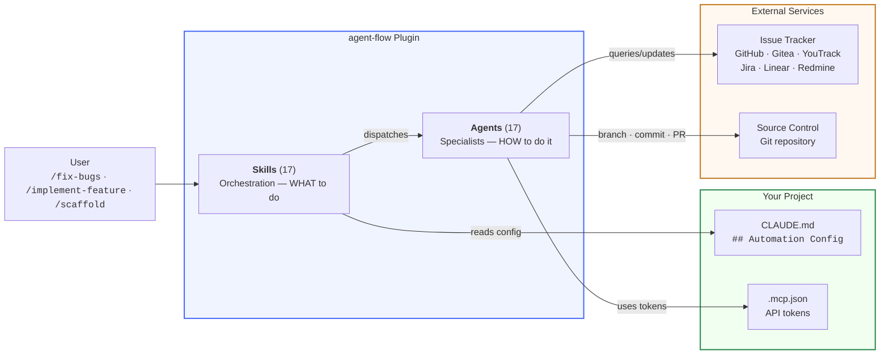
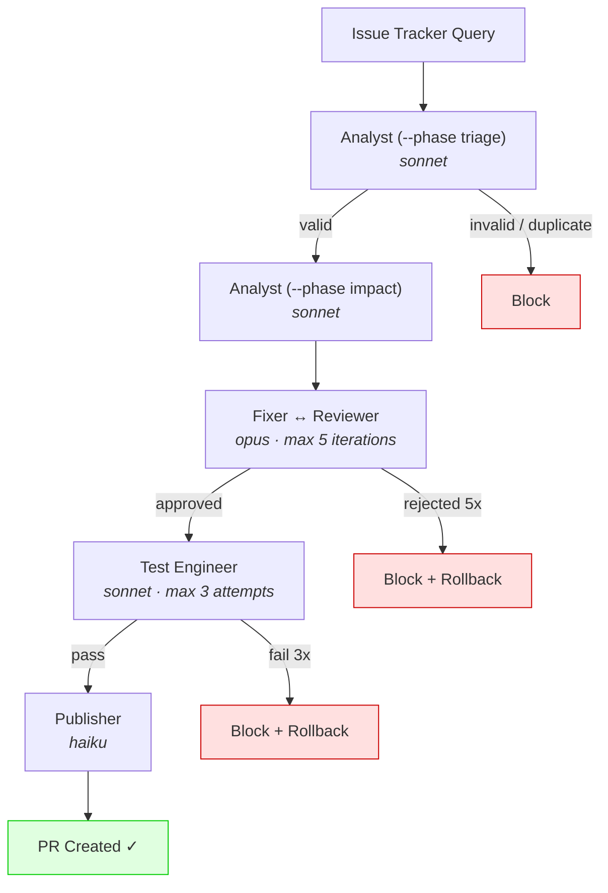
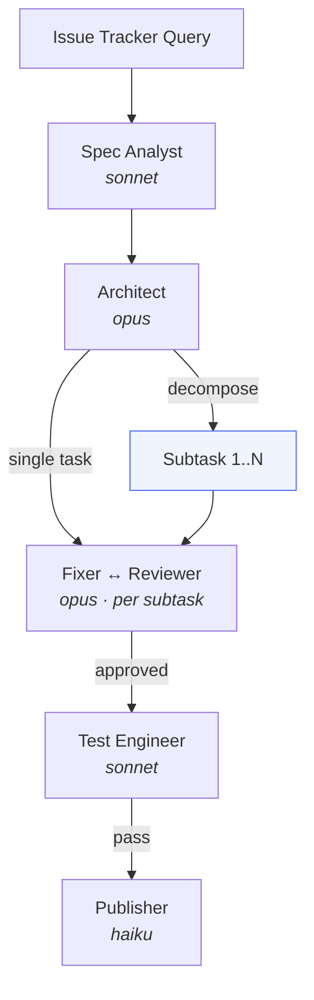
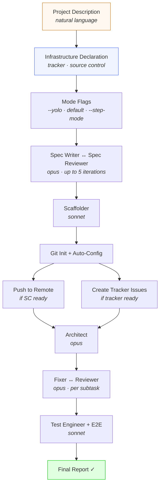

# agent-flow

> **v2.0.0** — Keyed (HMAC-signed) dispatch witness; MAJOR breaking release (see CHANGELOG). [View on GitHub](https://github.com/asysta-act/agent-flow)

A Claude Code plugin that automates the full development lifecycle — from bug triage through fix, review, test, and publish. 17 specialized AI agents, 17 orchestration skills, 17 core contracts, zero third-party PACKAGE dependencies (requires bash + Python 3, stdlib only).



---

## What It Does

- **Bug-fix pipeline** — Triage, analyze, fix, review, test, and publish. Fully automated from issue tracker query to merged PR.
- **Feature pipeline** — Specification extraction, architecture design, task decomposition, implementation, review, test, and publish.
- **Project scaffolding** — Describe a project in natural language. Get a specification, buildable skeleton, and fully implemented features with tests. Use `--yolo` for full automation or `--step-mode` for per-step debugging.
- **17 specialized agents** — Each with a defined role, model assignment (opus/sonnet/haiku), and constraints. Read-only analysts never touch code; execution agents make changes.
- **Zero third-party PACKAGE dependencies** — Pure markdown definitions plus shell + Python hooks. No build system, no package manager; it requires only bash + Python 3 (stdlib only) on PATH. Works on macOS, Linux, and Windows (Git Bash required on Windows).

---

## Quick Start

```bash
# 1. Add the marketplace
/plugin marketplace add asysta-act/agent-flow

# 2. Install the plugin
/plugin install agent-flow@agent-flow

# 3. Run the interactive setup wizard
/agent-flow:onboard

# 4. Validate your configuration
/agent-flow:check-setup

# 5. Fix your first bug
/agent-flow:fix-bugs ISSUE-123
```

The `/onboard` wizard will guide you through setting up your issue tracker, source control, PR rules, and build commands. No manual copy-paste needed.

> **New to agent-flow?** See the [Getting Started tutorial](docs/getting-started.md) for a complete walkthrough.

---

## Pipelines

### Bug-Fix Pipeline



### Feature Pipeline



### Scaffold Pipeline



With `--no-implement`: Infrastructure Declaration → Scaffolder (with stack flags) → Validate → Git Init + Push (skeleton only, no implementation).

Hook integration points (pre-fix, post-fix, pre-publish, post-publish) and pipeline profiles are supported. See [Pipeline Reference](docs/reference/pipelines.md) for full details.

> **Optional dispatch-enforcement hook.** Separately from the pipeline integration-point hooks above, agent-flow ships an opt-in PostToolUse audit hook (`hooks/validate-dispatch.sh`) that records a per-stage dispatch audit to `.agent-flow/dispatch-audit.log`. It is **not** auto-installed — you wire it into `settings.json` manually. This is a different feature from the pre-fix/post-fix/pre-publish/post-publish hooks. See [Dispatch Enforcement](docs/guides/dispatch-enforcement.md) for installation and usage.

---

## Skills

| Command | Description |
|---------|-------------|
| `/analyze-bug ISSUE-ID` | Analyze a bug from the issue tracker (triage + impact, no code changes) |
| `/fix-bugs <ISSUE-ID>` or `/fix-bugs --batch <N>` | Analyzes and fixes issues — single ticket (\<ISSUE-ID\>) or batch (--batch \<N\>) |
| `/implement-feature ISSUE-ID` | Feature pipeline — spec, design, fix, review, test, publish |
| `/scaffold` | Creates a new project from scratch; use 'add \<component\>' to extend an existing project |
| `/publish` | Create PR and update issue tracker states (auto-detects PR-only vs full-publish from branch name) |
| `/check-setup` | Validate Automation Config, MCP servers, and tokens |
| `/onboard` | Interactive wizard for generating Automation Config |
| `/changelog` | Generate changelog from merged PRs |
| `/version-check` | Compare installed plugin version against latest available |
| `/metrics` | Pipeline analytics report — success rates, per-agent effectiveness |
| `/prioritize` | AI backlog prioritization — impact, risk, effort scoring |
| `/create-backlog` | Creates backlog epics in issue tracker from specification |
| `/sprint-plan` | Plans a sprint with capacity constraints and priority ranking |
| `/setup-mcp` | Developer environment setup — MCP servers, tokens, permissions |
| `/discuss` | Multi-agent discussion — 2-3 agents respond from their expertise, then synthesis |
| `/setup-agents` | Project scanner — generates smart TOML customization defaults for all agents |
| `/autopilot` | Headless dispatcher for cron / batch / CI — reads Bug/Feature queries, dispatches fix-bugs / implement-feature |

All skills are namespaced: `/agent-flow:<skill>`. Most support additional flags (`--dry-run`, `--profile <name>`, `--decompose`).

Full syntax, flags, and examples: [Skills Reference](docs/reference/skills.md)

> **Tip:** Always use the namespaced form `/agent-flow:<skill>` to avoid conflicts with Claude Code built-in commands.

---

## Agents

| Agent | Model | Role |
|-------|-------|------|
| analyst | sonnet | Triage and impact analysis — `--phase triage` (severity, AC) or `--phase impact` (affected files, call-graph) |
| fixer | opus | Implements minimal surgical fixes targeting root cause |
| reviewer | opus | Quality gate — ensures root cause fix, convention compliance, no regressions |
| test-engineer | sonnet | Writes and runs unit/E2E tests — default (unit) or `--e2e=true` (E2E flows) |
| publisher | haiku | Creates branch, commits, pushes, creates PR, updates issue tracker |
| rollback-agent | haiku | Reverts failed fix attempts — resets git state, posts block comment |
| spec-analyst | sonnet | Extracts structured specifications with acceptance criteria from feature requests |
| architect | opus | Designs architecture and generates task trees for implementation |
| scaffolder | sonnet | Generates minimal buildable project skeleton with tests, CI, Docker |
| priority-engine | opus | Analyzes backlog and recommends fix order by impact, risk, effort |
| backlog-creator | sonnet | Extracts structured issue cards from specifications or architect task trees |
| sprint-planner | sonnet | Produces capacity-constrained sprint plans from prioritized issue lists |
| spec-writer | opus | Generates complete project specification from user input |
| spec-reviewer | opus | Reviews specification quality, completeness, and consistency |
| acceptance-gate | sonnet | Verifies acceptance criteria are fulfilled — maps each AC to code and test evidence |
| browser-agent | sonnet | Browser automation — `--phase reproduce` (pre-fix evidence) or `--phase verify` (post-fix check) |
| deployment-verifier | sonnet | Verifies a deployment is healthy — checks endpoints, logs, and key flows post-deploy |

Agent details, inputs, outputs, and example output: [Agents Reference](docs/reference/agents.md)

---

## Configuration

Projects using this plugin need `## Automation Config` in their CLAUDE.md. Use `/agent-flow:onboard` to generate it interactively.

### Required Sections

| Section | Purpose |
|---------|---------|
| Issue Tracker | Tracker type, instance, project, query, state transitions |
| Source Control | Remote, base branch, branch naming pattern |
| PR Rules | Labels and optional PR title format |
| PR Description Template | Template for PR body |
| Build & Test | Build and test commands |

**18 optional config sections** cover retry limits, module docs, hooks, custom agents, notifications, worktrees, E2E testing, browser verification, local deployment, sprint planning, error handling, feature workflow, decomposition, pipeline profiles, metrics, agent overrides, and pause limits.

Minimal example:

```markdown
## Automation Config

### Issue Tracker
| Key | Value |
|-----|-------|
| Type | github |
| Instance | github.com |
| Project | my-org/my-repo |
| Bug query | label:bug state:open |

### Source Control
| Key | Value |
|-----|-------|
| Remote | my-org/my-repo |
| Base branch | main |
| Branch naming | fix/{issue-id}-{slug} |
```

Full specification with examples: [Automation Config Reference](docs/reference/automation-config.md). Canonical contract definition: [CLAUDE.md](CLAUDE.md).

---

## Documentation

| | |
|---|---|
| [Getting Started](docs/getting-started.md) | Step-by-step tutorial — install, configure, run your first pipeline |
| [Architecture](docs/architecture.md) | Design philosophy, model selection, pipeline architecture, data flow |
| **Guides** | |
| [Installation](docs/guides/installation.md) | Detailed installation and platform notes |
| [MCP Configuration](docs/guides/mcp-configuration.md) | MCP server setup for each tracker |
| [Tokens](docs/guides/tokens.md) | API token generation for all 6 supported trackers |
| [Cross-Platform](docs/guides/cross-platform.md) | Cross-platform verification checklist |
| [Custom Agents](docs/guides/custom-agents.md) | How to write and integrate custom agents |
| [Troubleshooting](docs/guides/troubleshooting.md) | Common issues and solutions |
| **Reference** | |
| [Skills](docs/reference/skills.md) | All 17 skills — syntax, flags, examples |
| [Agents](docs/reference/agents.md) | All 17 agents — role, model, inputs, outputs |
| [Pipelines](docs/reference/pipelines.md) | Pipeline diagrams, hooks, profiles, error handling |
| [Automation Config](docs/reference/automation-config.md) | Config specification with examples and validation rules |
| [Trackers](docs/reference/trackers.md) | Tracker-specific query syntax, state transitions, validation rules |

---

## Roadmap

See the [Roadmap](docs/roadmap.md) for current priorities and future direction.

---

## Contributing

See [CONTRIBUTING.md](CONTRIBUTING.md) for guidelines on writing custom agents, creating skills, submitting examples, and reporting issues.

---

## Author & License

**Filip Sabacky** — [MIT License](LICENSE)

For security vulnerability reports, see [SECURITY.md](SECURITY.md).

---

Built by [Filip Sabacky](https://www.linkedin.com/in/sabacky/) · [CEOS Data](https://ceosdata.com)
