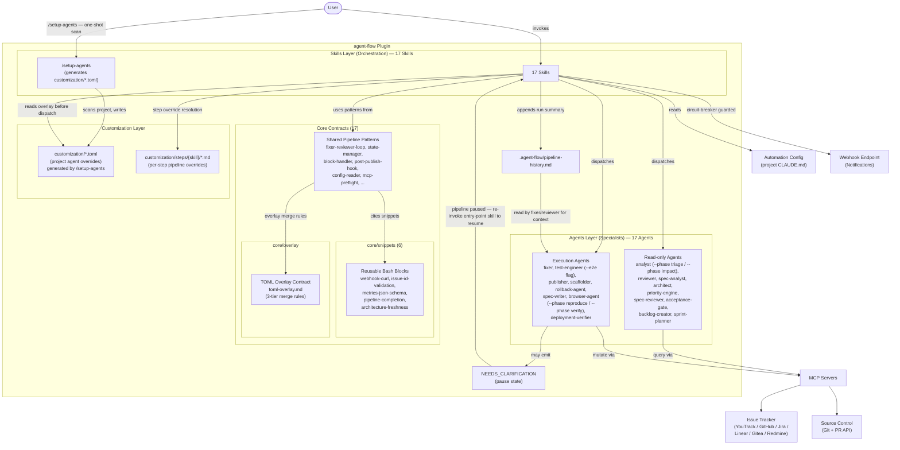
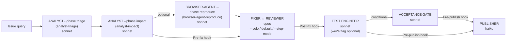
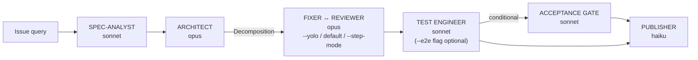
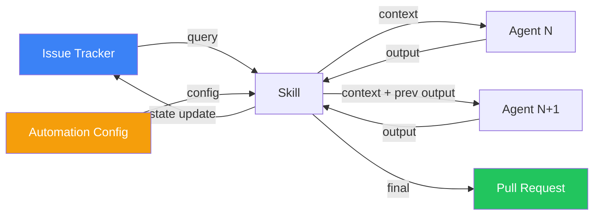

# Architecture

agent-flow is a Claude Code plugin built as a 2-layer system: skills orchestrate WHAT to do, agents specialize in HOW to do it. The plugin is pure markdown with zero runtime dependencies. All project-specific configuration lives outside the plugin in the consuming project's CLAUDE.md.

**Current counts:** 17 agents · 17 skills · 18 optional config sections · 17 core contracts.

This document explains the design decisions behind the architecture, the data flow through pipelines, and the error handling patterns that make the system resilient.

## Design Philosophy

Four core principles drive the architecture:

1. **Skills = orchestration, Agents = specialists.** Skills define pipeline stages, retry logic, and decision points. Agents are stateless, single-purpose workers that receive context and produce structured output. This separation means you can replace or extend agents without changing pipeline logic.

2. **Zero project-specific logic in the plugin.** Every project-specific value (tracker URL, build command, branch naming, labels) comes from Automation Config. The plugin ships no defaults for any project — it reads everything from config at runtime.

3. **Pure markdown, no build system.** Agent definitions are markdown files with YAML frontmatter. Skills are markdown files with step-by-step instructions. There is no compilation, no transpilation, no dependency resolution. What you see in the repository is what runs.

4. **MCP servers as the integration layer.** The plugin never calls REST APIs directly. All external communication (issue trackers, source control) goes through MCP (Model Context Protocol) servers, which handle authentication, rate limiting, and API versioning.

## Architecture Overview

The diagram shows the complete information flow:

- The **user** invokes a skill (e.g., `/agent-flow:fix-bugs PROJ-42`)
- The **skill** reads Automation Config from the project's CLAUDE.md
- The skill dispatches **agents** via Claude Code's Task tool; before each dispatch the skill reads the project's `customization/{agent-name}.toml` overlay (if present) and merges it with the agent's default prompt via 3-tier TOML merge (scalar override, array-of-tables append, table deep merge)
- **Read-only agents** query external systems (issue tracker, source control) through MCP servers but never modify code; read-only inventory (9 agents): `analyst` (dispatched as `analyst --phase triage` / `analyst --phase impact`), `reviewer`, `spec-analyst`, `architect`, `priority-engine`, `spec-reviewer`, `acceptance-gate`, `backlog-creator`, `sprint-planner`
- **Execution agents** modify code, create files, and mutate external state through MCP servers; execution inventory: `fixer`, `test-engineer` (supports `--e2e` flag for E2E flows), `publisher`, `scaffolder`, `rollback-agent`, `spec-writer`, `browser-agent` (dispatched as `browser-agent --phase reproduce` or `browser-agent --phase verify`), `deployment-verifier`
- **17 core contracts** in `core/` define shared pipeline patterns reused across skills; a `core/snippets/` sub-namespace (6 files) holds canonical reusable Bash blocks cited via `<!-- @snippet:<name> -->` markers; a `core/overlay/` sub-namespace holds the TOML overlay contract (`toml-overlay.md`) — neither sub-namespace counts toward the top-level contract total
- **`/setup-agents`** is a one-shot scanner that reads the project root (CLAUDE.md, source layout, framework detection) and generates smart `customization/*.toml` defaults. It produces a preview diff before writing. Files with `# generated:` header are safe to regen; files without that header (user-edited) are never overwritten.
- **Step override**: `customization/steps/{skill}/{step-name}.md` replaces a specific pipeline step for the project without forking the plugin. The skill resolves overrides before dispatching each step.
- **NEEDS_CLARIFICATION** is a pause state emitted by fixer or analyst when ambiguity blocks progress; the pipeline transitions to `paused` and waits for the user to re-invoke the original entry-point skill with `--clarification "answer"` (e.g., `/agent-flow:fix-bugs PROJ-42 --clarification "answer"`)
- After pipeline completion, a run summary is appended to **`.agent-flow/pipeline-history.md`**; fixer and reviewer read this file to learn from past run outcomes on the same issue
- Webhook dispatch is **circuit-breaker guarded**: after 3 consecutive delivery failures, all remaining webhook calls in the current run are suppressed to prevent latency accumulation from a dead endpoint

## Model Selection Rationale

Each agent is assigned a model tier based on the judgment and creativity required for its task:

| Model | Cost | Reasoning | Agents (17 total) |
|-------|------|-----------|--------|
| **opus** | Highest | Tasks requiring critical judgment: writing production code, reviewing code quality, designing architecture, specification, prioritizing issues | fixer, reviewer, architect, priority-engine, spec-writer, spec-reviewer |
| **sonnet** | Medium | Analysis and structured output: triaging bugs, mapping impact, writing tests, extracting specs, scaffolding | analyst (`--phase triage` and `--phase impact`), test-engineer (`--e2e` flag), spec-analyst, scaffolder, acceptance-gate, browser-agent (`--phase reproduce` and `--phase verify`), deployment-verifier, backlog-creator, sprint-planner |
| **haiku** | Lowest | Mechanical, template-driven procedures with minimal judgment | publisher, rollback-agent |

This tiering minimizes cost without sacrificing quality where it matters. The fixer writes production code that ships to users, so it uses opus. The publisher follows a rigid procedure (push branch, create PR, set labels), so it uses haiku.

## Pipeline Architecture

agent-flow has three pipelines, each designed for a different workflow. All three share common patterns: retry loops, block/rollback error handling, and hook integration points.

For complete pipeline diagrams with all decision points and stage details, see [Pipeline Reference](reference/pipelines.md).

### Mode Flags

All three pipelines accept mode flags that control the level of human interaction:

| Mode Flag | Status | Behavior |
|-----------|--------|----------|
| *(default)* | Existing | Strategic conditional gates (acceptance gate, decomposition approval, NEEDS_CLARIFICATION pauses) — conditional on pipeline triggers |
| `--yolo` | Existing | Zero gates; fully autonomous batch/autopilot mode |
| `--step-mode` | Available | Pause after each agent step (analogous to debugger step-through); operator prompted "Continue / Skip / Abort" at every `steps/*.md` boundary |

`--yolo` and `--step-mode` are mutually exclusive. NEEDS_CLARIFICATION is orthogonal — it fires in all modes when the agent emits an ambiguity block.

### Steps Decomposition

Each pipeline skill is decomposed from a monolithic SKILL.md (~600 lines) into an entry point plus per-step files. The entry SKILL.md (~100 lines) handles mode flag parsing, config validity, and step dispatch. Each step file (~100–200 lines) contains a single focused pipeline stage. Step override via `customization/steps/{skill}/{step-name}.md` replaces a specific step without forking the plugin.

| Pipeline | Step count | Step files |
|----------|------------|------------|
| fix-bugs | **7 steps** (entry + 7 step files) | 01-triage (`analyst-triage`), 02-impact (`analyst-impact`), 03-reproduce (`browser-agent-reproduce`, optional), 04-fixer-reviewer-loop, 05-test, 06-acceptance-gate (conditional), 07-publisher |
| implement-feature | **7 steps** (entry + 7 step files) | 01-spec-analyst, 02-architect, 03-decompose (conditional), 04-fixer-reviewer-loop, 05-test, 06-acceptance-gate (conditional), 07-publisher |
| scaffold | **8 steps** (entry + 8 step files) | 00-infra, 01-mode-select, 02-spec-writer-reviewer, 03-scaffolder, 04-git-init, 05-architect, 06-fixer-reviewer, 07-test-e2e (`browser-agent-verify`), 08-report |

**Named-phase identifiers** (used in Pipeline Profiles `Skip stages:` syntax):

| Named-phase identifier | Pipeline stage |
|------------------------|----------------|
| `analyst-triage` | analyst agent (`--phase triage`) dispatch |
| `analyst-impact` | analyst agent (`--phase impact`) dispatch |
| `browser-agent-reproduce` | browser-agent (`--phase reproduce`) dispatch |
| `browser-agent-verify` | browser-agent (`--phase verify`) dispatch |

### Bug-Fix Pipeline

The bug-fix pipeline (fix-bugs: 7 steps) takes a bug from triage through fix, review, test, and publish:

Key characteristics:
- `analyst --phase triage` detects duplicates and unclear reports, blocking them early (named-phase: `analyst-triage`)
- `analyst --phase impact` maps the impact zone — max 5 affected files (named-phase: `analyst-impact`)
- `browser-agent --phase reproduce` (optional) reproduces the bug with Playwright (named-phase: `browser-agent-reproduce`)
- Fixer and reviewer loop up to 5 iterations (configurable) across `--yolo`, default, and `--step-mode`
- Acceptance gate fires conditionally (AC count ≥ 3 or complexity ≥ M)
- Decomposition is available for complex bugs (risk HIGH, many affected files)

### Feature Pipeline

The feature pipeline (implement-feature: 7 steps) adds specification and architecture stages:

Key characteristics:
- Spec-analyst extracts acceptance criteria from feature requests
- Architect designs the solution and optionally decomposes it into subtasks
- The user confirms the decomposition plan before execution starts (conditional gate)
- Each subtask goes through the full fix/review/test cycle independently
- Acceptance gate always fires in decomposition mode; skipped in single-pass mode

### Scaffold Pipeline

The scaffold pipeline (scaffold: 8 steps) creates a new project from scratch. In spec-first mode (default), it generates a specification, builds the skeleton, and implements all features:

```mermaid
graph LR
  A[User description] --> A2[Infrastructure Declaration<br/>00-infra]
  A2 --> B["Mode selection<br/>01-mode-select<br/>(--yolo / default / --step-mode)"]
  B --> C["SPEC-WRITER ↔ SPEC-REVIEWER<br/>opus<br/>02-spec-writer-reviewer"]
  C --> D["SCAFFOLDER<br/>sonnet<br/>03-scaffolder"]
  D --> E["Git init + Auto-Config<br/>04-git-init"]
  E --> E2[Push / Create Issues]
  E2 --> F["ARCHITECT<br/>opus<br/>05-architect"]
  F --> G["FIXER ↔ REVIEWER<br/>opus<br/>06-fixer-reviewer"]
  G --> H["TEST + E2E<br/>sonnet<br/>07-test-e2e"]
  H --> I["Final report<br/>08-report"]
```

Key characteristics:
- Infrastructure declaration (step 00-infra) and MCP verification run before mode selection
- Mode selection (step 01-mode-select) applies `--yolo` / default / `--step-mode` across the entire scaffold pipeline; scaffold also has its own Interactive / YOLO-with-checkpoint / Full-YOLO progression separate from the mode flags
- Spec-writer ↔ spec-reviewer loop refines the specification (max 5 iterations)
- Scaffolder reads tech stack from spec/README.md (spec-first mode) or from skill-supplied stack flags (--no-implement)
- After git init: auto-fill CLAUDE.md config, push to remote, create tracker issues
- Architect decomposes epics into dependency-aware batches
- Features are implemented per-subtask with fixer/reviewer/test-engineer
- E2E step uses `browser-agent --phase verify` (named-phase: `browser-agent-verify`) for Playwright-based verification
- With `--no-implement`: infrastructure declaration → scaffolder (with stack flags) → validate → git init + push

## Config Contract Design

The Automation Config contract lives in the project's CLAUDE.md for a specific reason: **the majority of skills explicitly reference it** by reading `## Automation Config` from the current project's CLAUDE.md. Extracting it to a separate file would be a high-risk refactoring that touches the majority of skills.

### Table Format

All config sections use the `| Key | Value |` table format. This is enforced by `/agent-flow:check-setup` validation. Bullet-point lists are not accepted because they are ambiguous to parse (is a nested bullet a continuation of the previous value or a new key?).

### Required vs Optional

Required sections (Issue Tracker, Source Control, PR Rules, PR Description Template, Build & Test) must be present for any pipeline to run. Optional sections add capabilities with sensible defaults — if you do not configure Retry Limits, you get 5 fixer iterations, 3 test attempts, 3 build retries, and 5 spec iterations.

### Versioning Policy

The config contract is versioned along with the plugin:

| Level | Trigger | Impact |
|-------|---------|--------|
| MAJOR (X.0.0) | New required key, renamed section | Breaking — consumers must update config |
| MINOR (X.Y.0) | New optional section, new skill/agent | Non-breaking — existing configs work unchanged |
| PATCH (X.Y.Z) | Behavior fix without contract change | Invisible — no config changes needed |

Key rule: Adding a **required** key to Automation Config is always a MAJOR version bump. Adding an **optional** section is MINOR.

## Data Flow

The data flow follows a consistent pattern across all pipelines:

1. The **skill** queries the issue tracker for bug/feature details
2. **Automation Config** provides all configuration values
3. Each **agent** receives context from the skill (including output from previous agents)
4. Each agent produces **structured output** that the skill passes to the next agent
5. The final output is a **pull request** and an **issue tracker state update**

Agents are stateless — they do not remember previous invocations. All context must be passed explicitly by the skill. This makes agents reusable across different pipelines and simplifies debugging (you can see exactly what context each agent received).

## Error Handling and Resilience

### Block/Rollback Pattern

Any agent can **block** an issue when it encounters an unrecoverable error. When a block occurs:

1. The **rollback-agent** (haiku) reverts git state to the pre-fix checkpoint
2. The issue state is set to **Blocked** in the issue tracker
3. A **Block comment** is posted with structured fields (Agent, Step, Reason, Detail, Recommendation)
4. If webhooks are configured, an `issue-blocked` event is sent

The Block comment uses the `[agent-flow]` prefix, which enables machine-parseable detection by entry-point skills (`/agent-flow:fix-bugs`, `/agent-flow:implement-feature`, `/agent-flow:scaffold`) for inline auto-resume and by `/agent-flow:metrics` for analytics.

### NEEDS_CLARIFICATION Pause State

A second pause state supplements the existing NEEDS_DECOMPOSITION signal. When fixer or analyst (triage phase) encounters ambiguity that blocks progress — an underspecified requirement, a missing environment variable, or contradictory acceptance criteria — it emits a `## NEEDS_CLARIFICATION` block containing a `question:` and optional `context:` field.

The skill orchestrator detects the block, writes clarification metadata to `state.json`, transitions pipeline status to `paused`, and (if configured) fires a `pipeline-paused` webhook. The human resumes by re-invoking the original entry-point skill with `--clarification "answer"` (e.g., `/agent-flow:fix-bugs PROJ-42 --clarification "answer"`), which re-dispatches the paused agent with the answer injected into context. Resume detection is handled by `core/resume-detection.md` and is automatic on every entry-point invocation.

Two DoS caps prevent infinite pausing:
- **Per-run cap:** 3 clarifications maximum. A 4th detection blocks the issue.
- **Per-iteration cap:** 1 clarification per fixer iteration. A second emission in the same iteration blocks.

### Webhook Reliability and Circuit Breaker

Webhook dispatch is protected by an **in-memory circuit breaker** to prevent latency accumulation from a dead endpoint (each `curl --max-time 5` call costs up to 5 seconds):

- The failure counter starts at 0 at the beginning of every pipeline run.
- Each `[WARN] Webhook delivery failed` increments the counter.
- After **3 consecutive failures** the circuit opens — all remaining webhook calls in the current run are skipped and the skill logs `[WARN] Circuit breaker open: 3 consecutive webhook failures. Suppressing remaining webhooks for this run.`
- The counter resets at the start of the next run (no cross-run persistence).
- An open circuit never blocks pipeline progression — the circuit breaker is advisory only.

Repeated `Circuit breaker open` lines across runs indicate a misconfigured or dead webhook endpoint and should be treated as an operator alert.

### Retry Limits

Four configurable retry limits prevent infinite loops:

| Retry | Default | What It Controls |
|-------|---------|-----------------|
| Fixer iterations | 5 | Fixer/reviewer loop — how many times the fixer can attempt to satisfy the reviewer |
| Test attempts | 3 | How many times the test-engineer can fix failing tests |
| Build retries | 3 | How many times the build command is retried after failure |
| Spec iterations | 5 | Spec-writer/spec-reviewer loop — how many times the spec can be revised |

When a retry limit is exhausted, the pipeline blocks the issue and triggers rollback.

### CWD vs Worktree Mode

- **CWD mode** (default): All changes happen in the current working directory. One bug at a time. Used by `/agent-flow:fix-bugs <ISSUE-ID>` (single-ticket mode).
- **Worktree mode** (optional): Each bug gets its own git worktree. Multiple bugs processed in parallel batches. Used by `/agent-flow:fix-bugs` when Worktrees config is present.

In both modes, the rollback-agent operates within the correct context (CWD or worktree path).

## Pipeline History and Feedback Loop

After each pipeline run completes, the skill appends a structured entry to `.agent-flow/pipeline-history.md`. This file serves as a lightweight persistent log of past outcomes for the same project.

The **pipeline-history feedback arrow** in the architecture diagram above reflects a key design decision: fixer and reviewer agents receive a summary of recent pipeline-history entries as part of their context. This enables them to avoid repeating approaches that previously blocked, reference tests that were added in prior runs, or detect patterns of recurring failures on the same issue.

Key properties:
- Append-only format — entries are never modified after writing
- Credential redaction before write — 14 redaction tag patterns strip secrets, tokens, and API keys
- File size cap — entries beyond the configured retention limit are trimmed from the top
- Advisory failure semantics — if the append fails, `[WARN] pipeline-history.md append failed: <reason>` is logged and the pipeline continues

The file lives under `.agent-flow/` (not `.claude/`), consistent with all other plugin runtime state.

## State Management

The state schema (`state/schema.md`) defines `schema_version`: `"1.0"` for legacy keyless runs and **`"2.0"`** for keyed runs (PR #15 gate-as-signer dispatch witness — the first **non-additive** change). All earlier additions remain **additive** and backward-compatible; a v1.0 state stays valid and is verified under the legacy sha256 dual-mode (never a false `WITNESS_MISMATCH`).

Additive keys in `state.json`:

| Key | Added by | Purpose |
|-----|----------|---------|
| `analyst_triage.*` | analyst agent (`--phase triage`) | Triage output — severity, area, complexity, AC count, reproduction steps |
| `analyst_impact.*` | analyst agent (`--phase impact`) | Impact output — affected files list (max 5), root cause area |
| `mode_flag` | pipeline skill | Active mode: `yolo`, `default`, or `step-mode` |
| `overlay_source` | skill (pre-dispatch) | `toml`, `none`, or `md_rejected` — provenance of agent customization |
| `overlay_digest` | skill (pre-dispatch) | v2.0: sha256 of the RAW LF-normalized `.toml` file bytes when `overlay_source=toml` (v1.0 legacy: of the rendered overlay block); the literal `none` or `md_rejected` otherwise |
| `prompt_head_128` | skill (pre-dispatch) | v1.0 only. On keyed v2.0 runs the gate OBSERVES `head128(tool_input.prompt)` and signs it as ground truth — it is not an orchestrator-committed/compared field |
| `claim_nonce` / `dispatch_seq` / `override_path` | skill (pre-dispatch, v2.0) | Per-dispatch nonce + monotonic counter + resolved overlay dir, written into the CLAIM and the top-level marker |

**Overlay-bound dispatch witness (v2.0 gate-as-signer).** On keyed runs (`schema_version "2.0"`) the witness is an **HMAC-SHA256 keyed tag** the PreToolUse `Task` gate (`hooks/validate-dispatch-pre.sh`, the sole per-run key holder) computes over a per-field sub-hashed canonical preimage (`subagent_type | model | prompt_head_128 | overlay_source | overlay_digest | stage | run_id | claim_nonce`) and records in the gate-owned ledger `.agent-flow/{RUN-ID}/dispatch-ledger.jsonl` — never in `state.json`. The gate observes-and-signs the dispatched prompt head as ground truth, recomputes `overlay_digest` from the RAW `.toml` bytes, and on a verified match ALLOWs; on a mismatch it emits a deny envelope and `exit 2`, which **blocks the dispatch before the tool runs** (Claude Code ≥ 2.1.90). The PostToolUse audit (`hooks/validate-dispatch.sh` — pure Python; it sources nothing, and the bash `core/lib/stage-invariant.sh` keyed path is demoted to a parity-pinned self-test) re-verifies every ledger tag as a second layer and **cannot block** (it runs after the tool — finding A8). The security authority for "is this run keyed" is the presence of the `0600 dispatch.key`. Legacy v1.0 keyless runs keep the additive `sha256("<subagent_type>|<model>|<prompt_head_128>|<overlay_source>|<overlay_digest>")` 5-tuple receipt with the V1 recompute + V2 overlay-presence dual-mode. Verification is **strict by default**: `AGENT_FLOW_STRICT_DISPATCH` is strict unless explicitly `"0"` (or a `STRICT_DISPATCH_OFF` flag file is present).

The dedup logic in `core/state-manager.md` identifies in-progress pipelines by reading `state.json.status`. The analyst agent writes to `state.analyst_triage` and `state.analyst_impact` sub-objects, providing a natural split of triage+impact data.

## Core Contracts

The `core/` directory contains **17 shared pipeline pattern contracts** — markdown files that define reusable behaviors referenced by multiple skills. Examples: `fixer-reviewer-loop.md` (retry/block logic), `state-manager.md` (state.json schema and write patterns), `block-handler.md` (block comment format and rollback trigger), `post-publish-hook.md` (webhook events, circuit breaker, pipeline-history append), `resume-detection.md` (inline auto-resume detection used by entry-point skills).

The `core/snippets/` sub-namespace (not counted in the 17) holds **5 canonical reusable Bash snippets (plus README rollback contract)** cited via `<!-- @snippet:<name> -->` markers. The 5 snippets are: `webhook-curl`, `issue-id-validation`, `metrics-json-schema`, `pipeline-completion`, and `architecture-freshness`. Any skill or core contract that needs the standard webhook-curl pattern, issue-id validation regex, or metrics JSON schema cites the snippet rather than inlining it.
The `core/overlay/` sub-namespace (not counted in the 17) holds **`toml-overlay.md`** — the TOML overlay contract. It specifies the 3-tier merge rules (scalar override, array-of-tables append, table deep merge), error handling, backward-compatibility with legacy `.md` overlays, and the provenance log format. The bash implementation lives in `skills/setup-agents/lib/toml-merge.sh`. Note: plugin agents do NOT support `hooks:`, `mcpServers:`, or `permissionMode:` in agent frontmatter — Claude Code ignores those fields for security reasons. All hooks are skill-orchestrated (via SKILL.md bash calls or `### Hooks` in Automation Config), not agent-frontmatter-configured.

## Scalability Boundaries

The plugin has intentional boundaries that keep agent output quality high:

| Boundary | Limit | Reason |
|----------|-------|--------|
| Prioritization | 50 issues max | Context window limit for meaningful analysis |
| Decomposition | 7 subtasks max | Beyond 7, subtask dependencies become unmanageable |
| Fixer diff | 100 lines max | Larger diffs have exponentially more review issues |
| Analyst impact files | 5 affected files max | Forces focus on the most relevant impact zone (`analyst --phase impact`) |

These limits can be adjusted via Automation Config (Max subtasks in Decomposition section). The 100-line diff limit is a hard constraint in the fixer agent and cannot be overridden — if a fix requires more than 100 lines, decomposition should be used.
