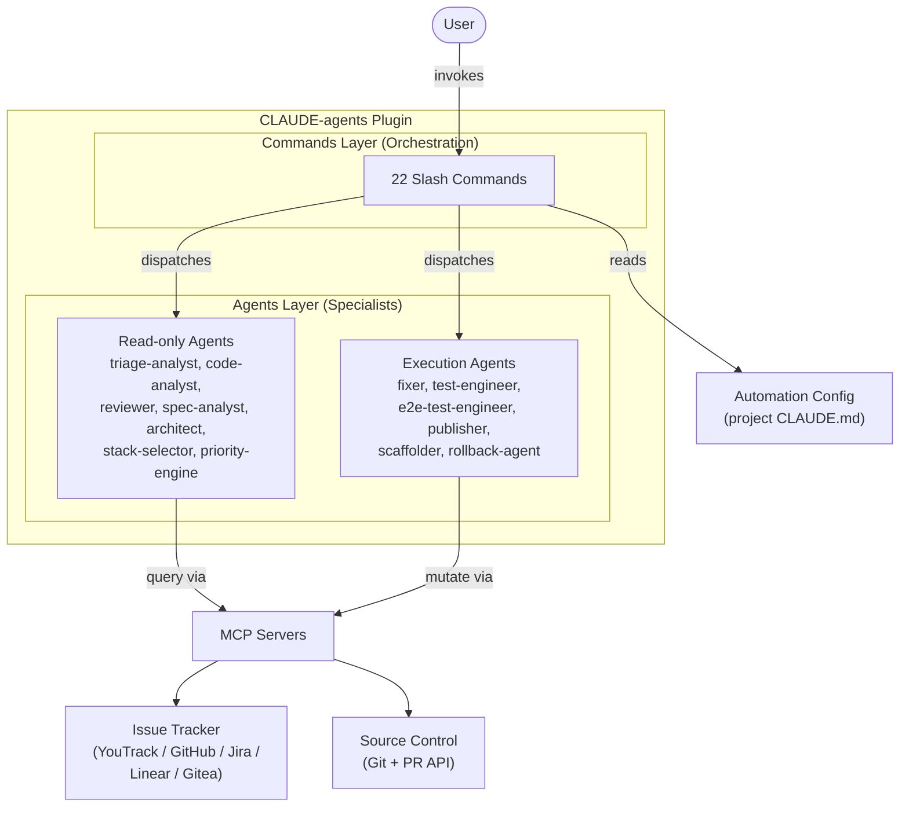
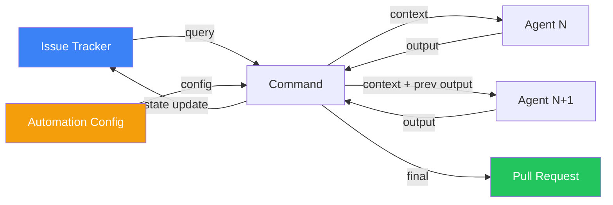
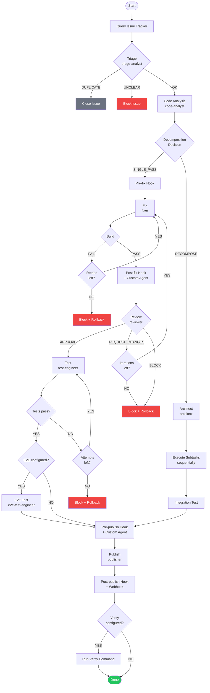
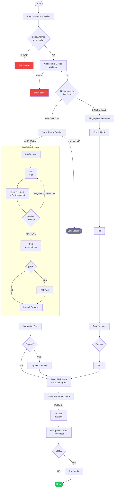
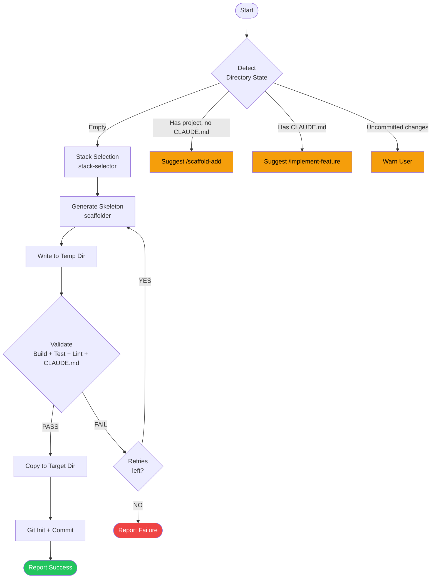

# Phase 3: New Documentation — Implementation Plan

**Phase:** 3 of 4 (Documentation Overhaul)
**Scope:** Create 8 new documentation files (~2,150 lines total)
**Risk:** NONE (purely additive — no existing files are modified)
**Date:** 2026-03-02

## Prerequisites

- Phase 1 (Translation) MUST be complete — all commands and agents are in English
- Phase 2 (Restructure) MUST be complete — `docs/guides/` and `docs/reference/` directories exist
- After Phase 2, the directory structure is:
  - `docs/guides/` — installation.md, mcp-configuration.md, tokens.md, cross-platform.md
  - `docs/reference/` — empty, ready for new files
  - `docs/plans/` — design docs + README.md index

## Steps

### Step 1: docs/getting-started.md

**Type:** Tutorial (Diataxis)
**Estimated size:** ~200 lines

#### Outline:

```
# Getting Started with CLAUDE-agents

Brief intro: what the plugin does, what you will accomplish in this tutorial.

## Prerequisites

System requirements: Claude Code CLI installed, git, a running project with an issue tracker.
List supported issue trackers (YouTrack, GitHub, Jira, Linear, Gitea) and source control hosts.
Mention that MCP servers are required — link to docs/guides/mcp-configuration.md.

## Step 1: Install the Plugin

One-command installation: `/plugin install CLAUDE-agents@CLAUDE-agents`.
How to verify installation succeeded. Link to docs/guides/installation.md for
platform-specific notes and troubleshooting.

## Step 2: Configure Your Project

Run `/CLAUDE-agents:onboard` — describe what the interactive wizard does.
Walk through the key questions: issue tracker type, source control remote,
build/test commands. Show a minimal Automation Config example output.
Link to docs/reference/automation-config.md for full config reference.

## Step 3: Validate the Setup

Run `/CLAUDE-agents:check-setup` — explain each block of the validation report
(Automation Config, MCP servers, Connectivity, Build & Test, Plugin Composability).
Show an example of a successful report. Explain what to do if something fails.

## Step 4: Fix Your First Bug

End-to-end walkthrough of `/CLAUDE-agents:fix-ticket <ISSUE-ID>`.
Explain what happens at each pipeline stage: triage, code analysis, fix,
review, test, and the publish prompt. Show the expected output summary.
Mention `--dry-run` flag for a safe preview.

## Step 5: Implement Your First Feature

Brief walkthrough of `/CLAUDE-agents:implement-feature <ISSUE-ID>`.
Highlight the differences from bug-fix: spec-analyst instead of triage,
architect for design, decomposition for large features.
Link to docs/reference/pipelines.md for full pipeline details.

## Next Steps

Link to docs/architecture.md for understanding the design.
Link to docs/reference/commands.md for the full command list.
Link to docs/guides/custom-agents.md for extending the plugin.
Link to docs/guides/troubleshooting.md for common issues.
```

---

### Step 2: docs/architecture.md

**Type:** Explanation (Diataxis)
**Estimated size:** ~300 lines

#### Outline:

```
# Architecture

Brief intro: why a 2-layer system, how commands and agents interact.

## Design Philosophy

Explain the core principle: commands = orchestration (WHAT), agents = specialists (HOW).
Commands contain zero project-specific logic — all config comes from Automation Config.
Agents are stateless, single-purpose, and composable.
The plugin is pure markdown — no build system, no runtime dependencies.

## Architecture Overview

Mermaid diagram showing the 2-layer system: User -> Commands -> Agents,
with Automation Config feeding into commands, and MCP servers as the
external integration layer for issue trackers and source control.

## Model Selection Rationale

Explain why each model tier exists and the trade-off reasoning.
- opus: Used for tasks requiring judgment and code generation (fixer, reviewer,
  architect, priority-engine). These agents make decisions that directly affect
  code quality and architecture.
- sonnet: Used for analysis, testing, and scaffolding tasks (triage-analyst,
  code-analyst, test-engineer, e2e-test-engineer, spec-analyst, stack-selector,
  scaffolder). These agents need strong reasoning but do not write production code.
- haiku: Used for mechanical, template-driven tasks (publisher, rollback-agent).
  These agents follow rigid procedures with minimal judgment.

## Pipeline Architecture

Detailed explanation of the 3 pipelines with Mermaid diagrams.
Explain the shared patterns: retry loops, block handling, hook integration.
Cross-reference docs/reference/pipelines.md for the complete diagrams.

### Bug-Fix Pipeline

Describe the flow: query -> triage -> code-analyst -> [hooks] -> fixer <-> reviewer
-> test-engineer -> [hooks] -> publisher. Explain the decomposition decision point
and how it applies to bugs with high risk or many affected files.

### Feature Pipeline

Describe the flow: query -> spec-analyst -> architect -> decomposition decision ->
fixer <-> reviewer -> test-engineer -> publisher. Explain how decomposition is more
common here due to feature scope.

### Scaffold Pipeline

Describe the flow: user description -> stack-selector -> scaffolder -> validate ->
git init. Explain the temp directory strategy and the validation loop.

## Config Contract Design

Explain why the config contract lives in CLAUDE.md (9 commands explicitly reference it).
Describe the table format requirement and the required vs optional section distinction.
Explain the versioning policy: MAJOR for new required keys, MINOR for new optional
sections, PATCH for behavior fixes.

## Data Flow

Mermaid diagram showing the data flow from issue tracker through pipeline stages
to PR creation. Show how each agent receives context from the previous stage and
how Automation Config feeds into every command.

## Error Handling and Resilience

Explain the block/rollback pattern: any agent can block, rollback-agent reverts
git state, block comment posted to issue tracker. Explain retry limits and how
they are configurable. Explain the difference between CWD mode and worktree mode
for batch processing.

## Scalability Boundaries

Document the current boundaries: 50 issues max for prioritization, 7 subtasks
max for decomposition, 100-line diff limit for fixer. Explain why these limits
exist and how they can be adjusted via Automation Config.
```

#### Mermaid Diagrams:

**Architecture Overview:**

~~~

~~~

**Data Flow:**

~~~

~~~

---

### Step 3: docs/guides/custom-agents.md

**Type:** How-to Guide (Diataxis)
**Estimated size:** ~150 lines

#### Outline:

```
# Custom Agents

How to create and integrate custom agents into the CLAUDE-agents pipeline.

## Agent Definition Format

Explain the frontmatter structure: name, description, model.
Explain the body structure: Goal, Expertise, Process, Constraints.
Show the exact template with placeholder values.

## Read-Only vs Execution Agents

Explain the distinction: read-only agents NEVER modify code, execution agents
make changes. Explain why this matters for pipeline safety.
List which built-in agents are read-only and which are execution agents.

## Integration Points

Explain the two integration points in the pipeline:
- Post-fix agent: runs after fixer, before reviewer. Use case: custom linting,
  security scanning, compliance checks.
- Pre-publish agent: runs after test-engineer, before publisher. Use case:
  documentation generation, changelog validation, release notes.

Show how to configure each in Automation Config (Custom Agents section).

## Writing Your First Custom Agent

Step-by-step walkthrough: create a file, define the frontmatter, write the
process steps, add constraints. Use a concrete example: a security scanner
agent that checks for hardcoded secrets.

## Testing Custom Agents

How to test a custom agent in isolation before integrating it into the pipeline.
Run it via Task tool directly, verify the output format, check that it can
Block correctly.

## Example: Security Scanner Agent

Complete example of a custom agent that scans for hardcoded secrets.
Show the full agent file content, the Automation Config entry, and
the expected output. Reference the examples/custom-agents/ directory.

## Constraints and Best Practices

- Custom agents receive pipeline context (issue details, fixer output, etc.)
- A BLOCK from a custom agent stops the pipeline for that issue
- Custom agents should follow the same naming convention (namespace prefix)
- Keep agents focused on a single responsibility
```

---

### Step 4: docs/guides/troubleshooting.md

**Type:** How-to Guide (Diataxis)
**Estimated size:** ~200 lines

#### Outline:

```
# Troubleshooting

Common issues and their solutions, organized by category.

## Installation Issues

### Plugin Not Found After Install
Cause: cache invalidation issue. Solution: restart Claude Code session.
Reference docs/guides/installation.md for platform-specific cache paths.

### Plugin Version Mismatch
Cause: local version differs from remote. Solution: run
`/CLAUDE-agents:version-check` to compare versions, then re-install
if needed.

### Permission Errors on Linux/macOS
Cause: file permission issues with plugin directory. Solution: check
ownership of `.claude/` directory.

## Configuration Issues

### "No Automation Config found"
Cause: CLAUDE.md is missing or does not contain `## Automation Config`.
Solution: run `/CLAUDE-agents:onboard` to generate config.

### check-setup Reports FAIL
Walk through each FAIL category:
- Missing required keys: which keys are required in each section.
- Placeholder values: how to identify `<...>` placeholders.
- Wrong table format: must use `| Key | Value |` tables, not bullet lists.
- MCP server not found: how to configure MCP servers for your tracker type.
Link to docs/reference/automation-config.md for full config reference.

### Config Migration from Older Versions
How to use `/CLAUDE-agents:migrate-config` to upgrade from v1.x or v2.x
config format to v3.1. Explain what changes between versions.

## Pipeline Issues

### Agent Blocks the Issue
Explain what a block means, how to read the Block Comment Template fields
(Agent, Step, Reason, Detail, Recommendation). Explain the rollback behavior.
How to use `/CLAUDE-agents:resume-ticket` to retry after fixing the underlying issue.

### Fixer Exceeds 100-Line Diff Limit
Cause: the fix is too large for a single pass. Solution: use `--decompose`
flag or let the auto-decomposition heuristic handle it. Explain the decomposition
thresholds (risk HIGH, affected_files >= 4, etc.).

### Reviewer Loop Exhausts Iterations
Cause: fixer and reviewer cannot agree after max iterations. Solution: review
the block comment, manually fix the issue the reviewer flagged, then
`/CLAUDE-agents:resume-ticket` to continue.

### Build or Tests Fail Repeatedly
Cause: pre-existing build/test issues or environment mismatch. Solution: run
build and test commands manually to verify they pass outside the pipeline.
Check Retry Limits configuration.

### Pipeline Hangs or Times Out
Cause: MCP server connectivity issues or large codebase scan. Solution: check
MCP server configuration, verify tokens are valid, try `--skip-build` with
check-setup.

## Platform-Specific Issues

### Windows: Path Length Limits
Worktree paths may exceed Windows MAX_PATH. Solution: use shorter base paths
or enable long path support.

### Windows: Line Ending Issues
Git autocrlf can cause diff noise. Solution: configure `.gitattributes`.

### Linux: Shell Compatibility
Some build commands may assume bash features. Solution: ensure bash is the
default shell or prefix commands with `bash -c`.

## Getting Help

How to report issues, how to gather diagnostic information
(`/CLAUDE-agents:check-setup` output, `/CLAUDE-agents:version-check` output).
```

---

### Step 5: docs/reference/automation-config.md

**Type:** Reference (Diataxis)
**Estimated size:** ~200 lines

**Key constraint:** This is a GUIDE with examples referencing CLAUDE.md as the canonical spec — NOT a copy of the config contract.

#### Outline:

```
# Automation Config Reference

Explain that the canonical Automation Config specification lives in CLAUDE.md
(Config Contract section). This document provides extended examples, validation
rules, and migration guidance.

## Overview

Brief summary: Automation Config is a set of sections in the consuming project's
CLAUDE.md that configures the CLAUDE-agents pipeline. All sections use table
format. Required sections must exist; optional sections add capabilities.

## Required Sections

### Issue Tracker

Explain each key with examples for all 5 supported tracker types:
- Type: youtrack | github | jira | linear | gitea
- Instance: URL examples per tracker type
- Project: format examples per tracker type (short name, owner/repo, key, team)
- Bug query: example queries per tracker type
- State transitions: example transition syntax per tracker type
- On start set: example state change per tracker type

Show a complete example table for GitHub and YouTrack.

### Source Control

Explain each key:
- Remote: owner/repo format
- Base branch: typically main or development
- Branch naming: pattern with {issue-id} and {description} placeholders

### PR Rules

Explain the Labels key. Show examples.

### PR Description Template

Explain that this is a multi-line template. Show a complete example with
Summary, Root Cause, Changes, Testing, Issue Link sections.

### Build & Test

Explain Build, Test, and the optional Verify command.
Explain that Verify runs after PR merge and re-opens the issue on failure.

## Optional Sections

For each optional section, provide:
- What it enables
- Default values (from CLAUDE.md spec)
- A complete example table
- Which commands use it

Sections: Retry Limits, Hooks, Custom Agents, Notifications, Worktrees,
E2E Test, Error Handling, Extra labels, Feature Workflow, Decomposition,
Pipeline Profiles, Metrics.

## Validation Rules

Summary of what `/CLAUDE-agents:check-setup` validates:
- All required sections present
- All required keys have non-placeholder values
- Table format (not bullet lists)
- Per-tracker format checks (query syntax, state transition syntax)
- MCP server presence matching tracker type

## Pipeline Profiles

Explain the profile system: how to define profiles, which stages can be
skipped (triage, code-analyst, spec-analyst, test-engineer, e2e-test-engineer),
which cannot (fixer, reviewer, publisher). Show a complete example with
fast, strict, and minimal profiles.

## Migration

Brief guide on using `/CLAUDE-agents:migrate-config` to upgrade config format.
Link to version history for what changed between versions.

## Complete Example

Full Automation Config example with all required and selected optional sections
filled in for a GitHub + Node.js project.
```

---

### Step 6: docs/reference/pipelines.md

**Type:** Reference (Diataxis)
**Estimated size:** ~200 lines

#### Outline:

```
# Pipeline Reference

Complete reference for all 3 CLAUDE-agents pipelines with Mermaid diagrams,
hook integration points, profile support, and error handling.

## Bug-Fix Pipeline

Full Mermaid diagram with all stages, decision points, hooks, and block handling.
Table listing each stage: agent used, model, skippable (yes/no), retry behavior.
Explain the decomposition decision for bugs (risk HIGH, affected_files >= 4, etc.).

### Stages

Table with columns: Stage, Agent, Model, Skippable, Retries, Notes.

### Hook Integration Points

List all 4 hook points with when they run and what happens on failure:
Pre-fix, Post-fix, Pre-publish, Post-publish.

### Worktree Mode

Explain parallel processing with worktrees: batch size, base path, cleanup.
Explain the difference from sequential CWD processing.

## Feature Pipeline

Full Mermaid diagram. Table listing each stage.
Explain the decomposition decision for features and the task tree format.

### Stages

Table with stages specific to feature pipeline.

### Decomposition

Explain the task tree YAML format, validation rules (DAG, max subtasks),
subtask execution order, integration step, squash strategy.

## Scaffold Pipeline

Full Mermaid diagram. Table listing each stage.
Explain the temp directory strategy, validation loop, and CLAUDE.md generation.

## Pipeline Profiles

Explain how profiles modify pipeline behavior. Table of skippable stages.
Example profiles: fast, strict, minimal. Show the `--profile` flag usage.

## Error Handling

Explain the block/rollback pattern. Block Comment Template format.
Rollback behavior by agent type. Error Handling config options (on block, max blocked per run).

## Dry-Run Mode

Explain the `--dry-run` flag: runs analysis stages only, no side effects.
Show the dry-run report format for both fix-ticket and implement-feature.

## Fix Verification

Explain the optional Verify command: runs after PR merge, re-opens issue on failure.
```

#### Mermaid Diagrams:

**Bug-Fix Pipeline:**

~~~

~~~

**Feature Pipeline:**

~~~

~~~

**Scaffold Pipeline:**

~~~

~~~

---

### Step 7: docs/reference/commands.md

**Type:** Reference (Diataxis)
**Estimated size:** ~400 lines

#### Outline:

```
# Command Reference

All 22 CLAUDE-agents commands with syntax, description, flags, and usage examples.

## Conventions

- All commands are namespaced: `/CLAUDE-agents:<command>`
- Commands read Automation Config from the consuming project's CLAUDE.md
- Commands dispatch agents via Claude Code's Task tool
- Commands contain zero project-specific logic

## Command Index

Quick-reference table of all 22 commands organized by category.

[Full command details below, organized by category]

## Bug-Fix Commands
### /analyze-bug
### /fix-ticket
### /fix-bugs
### /resume-ticket

## Feature Commands
### /implement-feature

## Scaffold Commands
### /scaffold
### /scaffold-add
### /scaffold-validate

## Publishing Commands
### /create-pr
### /publish

## Configuration Commands
### /onboard
### /check-setup
### /migrate-config
### /template

## Monitoring Commands
### /status
### /dashboard
### /metrics

## Planning Commands
### /estimate
### /prioritize

## Versioning Commands
### /version-bump
### /version-check
### /changelog
```

#### Command Reference Table:

| # | Command | Syntax | Description | Flags | Reads Config | Modifies |
|---|---------|--------|-------------|-------|-------------|----------|
| 1 | `/analyze-bug` | `/CLAUDE-agents:analyze-bug <ISSUE-ID>` | Analyzes a specific bug from the issue tracker (triage + code analysis, no code changes) | (none) | Issue Tracker | Nothing (read-only) |
| 2 | `/fix-ticket` | `/CLAUDE-agents:fix-ticket <ISSUE-ID> [flags]` | Analyzes and fixes a single ticket in CWD (no worktree) — full pipeline from triage through publish | `--dry-run`, `--decompose`, `--no-decompose`, `--profile <name>` | Full Automation Config | Code, issue tracker, git |
| 3 | `/fix-bugs` | `/CLAUDE-agents:fix-bugs <N> [flags]` | Automatically fixes N bugs from the issue tracker query — batch pipeline with optional worktrees | `--dry-run`, `--decompose`, `--no-decompose`, `--profile <name>` | Full Automation Config | Code, issue tracker, git |
| 4 | `/resume-ticket` | `/CLAUDE-agents:resume-ticket <ISSUE-ID>` | Resumes a pipeline from its last checkpoint without re-analyzing completed stages | (none) | Full Automation Config | Code, issue tracker, git |
| 5 | `/implement-feature` | `/CLAUDE-agents:implement-feature <ISSUE-ID> [flags]` | Implements a feature from spec through design, fix, review, test, and publish | `--dry-run`, `--decompose`, `--no-decompose`, `--profile <name>` | Full Automation Config | Code, issue tracker, git |
| 6 | `/scaffold` | `/CLAUDE-agents:scaffold <description> [flags]` | Creates a new project from scratch — tech stack selection, skeleton generation, validation, git init | `--lang <language>`, `--framework <framework>`, `--db <database>`, `--ci <provider>` | N/A (generates new config) | Files (new project) |
| 7 | `/scaffold-add` | `/CLAUDE-agents:scaffold-add <component>` | Adds a component to an existing project (claude-md, ci, docker, tests) | (none) | Build & Test (if exists) | Files |
| 8 | `/scaffold-validate` | `/CLAUDE-agents:scaffold-validate [path]` | Validates a project — build, tests, lint, CLAUDE.md structure | (none) | Build & Test (if exists) | Nothing (read-only, except Docker build) |
| 9 | `/create-pr` | `/CLAUDE-agents:create-pr` | Creates a PR for the current branch (lightweight — no publisher agent) | (none) | PR Rules, Source Control | Git (commit + push + PR) |
| 10 | `/publish` | `/CLAUDE-agents:publish` | Creates a PR and updates issue tracker state via the publisher agent | (none) | Full Automation Config | Git, issue tracker |
| 11 | `/onboard` | `/CLAUDE-agents:onboard` | Interactive wizard that generates an Automation Config block for your project | (none) | N/A (generates new config) | CLAUDE.md (optional) |
| 12 | `/check-setup` | `/CLAUDE-agents:check-setup [flags]` | Validates Automation Config, MCP servers, connectivity, and build/test commands | `--skip-build` | Full Automation Config | Nothing (read-only) |
| 13 | `/migrate-config` | `/CLAUDE-agents:migrate-config` | Detects config version and proposes upgrade to current v3.1 format | (none) | Full Automation Config | CLAUDE.md (after confirmation) |
| 14 | `/template` | `/CLAUDE-agents:template <list\|name>` | Lists available config templates or displays a specific template | (none) | N/A | Nothing (read-only) |
| 15 | `/status` | `/CLAUDE-agents:status` | Displays a table of in-progress issues with branch and PR status | (none) | Issue Tracker, Source Control, Feature Workflow | Nothing (read-only) |
| 16 | `/dashboard` | `/CLAUDE-agents:dashboard [flags]` | Generates an HTML dashboard with pipeline status, blocked issues, and activity timeline | `--days <N>`, `--output <path>`, `--state <filter>`, `--stage <filter>` | Issue Tracker, Source Control, Feature Workflow | File (HTML output) |
| 17 | `/metrics` | `/CLAUDE-agents:metrics [flags]` | Generates a pipeline analytics report with success rate, per-agent effectiveness, and failure patterns | `--period <N>`, `--output <path>`, `--format <md\|json>` | Issue Tracker, Source Control, Metrics | File (optional output) |
| 18 | `/estimate` | `/CLAUDE-agents:estimate <ISSUE-ID> [flags]` | Estimates token consumption and cost before running a pipeline on an issue | `--profile <name>` | Issue Tracker, Pipeline Profiles, Decomposition, Retry Limits | Nothing (read-only) |
| 19 | `/prioritize` | `/CLAUDE-agents:prioritize [flags]` | Analyzes the backlog and recommends fix order using AI prioritization | `--limit <N>`, `--output <path>` | Issue Tracker, Feature Workflow, Metrics | File (optional output) |
| 20 | `/version-bump` | `/CLAUDE-agents:version-bump [type]` | Bumps the plugin version in plugin.json and marketplace.json, commits, and tags | `patch` (default), `minor`, `major` | N/A (plugin repo only) | plugin.json, marketplace.json, git |
| 21 | `/version-check` | `/CLAUDE-agents:version-check` | Compares installed plugin version with the latest remote version | (none) | N/A (plugin repo only) | Nothing (read-only) |
| 22 | `/changelog` | `/CLAUDE-agents:changelog` | Generates a changelog from merged PRs since the last git tag | (none) | Source Control, Issue Tracker | CHANGELOG.md |

#### Per-Command Detail Format:

Each command section will follow this structure:

```
### /command-name

> One-line description from frontmatter.

**Syntax:**
\`\`\`
/CLAUDE-agents:command-name <required-arg> [optional-flags]
\`\`\`

**Arguments:**
- `<arg>` — description

**Flags:**
- `--flag` — description (default: value)

**What it does:**
2-3 sentences explaining the command behavior.

**Example:**
\`\`\`
/CLAUDE-agents:command-name PROJ-42 --dry-run
\`\`\`

**Related commands:** /other-command, /another-command
```

---

### Step 8: docs/reference/agents.md

**Type:** Reference (Diataxis)
**Estimated size:** ~500 lines

#### Outline:

```
# Agent Reference

All 13 CLAUDE-agents agents with their role, model, inputs, outputs,
constraints, and realistic example output.

## Agent Overview

Table of all agents: name, model, type (read-only / execution), pipeline(s).

## Agent Format

Brief explanation of the agent definition format: frontmatter (name,
description, model) + body (Goal, Expertise, Process, Constraints).

## Read-Only Agents

Agents that analyze but never modify code.

### triage-analyst
### code-analyst
### reviewer
### spec-analyst
### architect
### stack-selector
### priority-engine

## Execution Agents

Agents that modify code, create files, or interact with external systems.

### fixer
### test-engineer
### e2e-test-engineer
### publisher
### scaffolder
### rollback-agent
```

#### Agent Reference:

**1. triage-analyst**

| Field | Value |
|-------|-------|
| Model | sonnet |
| Type | Read-only |
| Pipeline(s) | Bug-fix |
| Inputs | Bug report from issue tracker (summary, description, comments, attachments) |
| Outputs | Structured triage analysis (summary, area, severity, reproduction steps) |
| Constraints | Never modifies code. Blocks if unclear (confidence < 50%). Must search for duplicates first. |

Example output:
```
## Triage Analysis
- **Summary:** Login form crashes when email contains a plus sign
- **Area:** auth/login
- **Severity:** HIGH — Core functionality broken, no workaround, affects users with + in email
- **Reproduction:**
  1. Navigate to /login
  2. Enter email with + character (e.g., user+test@example.com)
  3. Click "Sign In"
  4. Application crashes with uncaught TypeError
- **Attachments:** Screenshot shows blank page after crash, browser console shows TypeError at login.ts:42
```

---

**2. code-analyst**

| Field | Value |
|-------|-------|
| Model | sonnet |
| Type | Read-only |
| Pipeline(s) | Bug-fix |
| Inputs | Triage analysis from triage-analyst |
| Outputs | Impact report (root cause, affected files, callers, test coverage, risk, history, approach) |
| Constraints | Never modifies code. Max 5 affected files. Risk criteria: LOW (1-2 callers), MEDIUM (3-10), HIGH (>10 or cross-module). |

Example output:
```
## Impact Report
- **Root cause location:** src/auth/login.ts:42 (email validation regex)
- **Affected files:**
  - src/auth/login.ts — email parsing logic
  - src/auth/validators.ts — shared validation utility
- **Callers at risk:** LoginForm component, PasswordReset component
- **Test coverage:** tests/auth/login.test.ts covers basic login but no + character test
- **Risk level:** MEDIUM — 4 callers in auth module, no cross-module impact
- **Historical context:**
  - Past fixes: 3 commits in login.ts in last 30 days (regex refactoring)
  - Known patterns: Email validation has had 2 prior bugs (encoding issues)
  - Pipeline history: No prior [CLAUDE-agents] blocks in this area
  - Risk modifier: Recurring email validation bugs — risk elevated from LOW to MEDIUM
- **Suggested approach:** Fix the email validation regex to properly handle RFC 5322 special characters including +
```

---

**3. fixer**

| Field | Value |
|-------|-------|
| Model | opus |
| Type | Execution |
| Pipeline(s) | Bug-fix, Feature |
| Inputs | Triage analysis, impact report, reviewer feedback (iterations 2+) |
| Outputs | Fix report (root cause, approach, files changed, build status, test status) |
| Constraints | Diff must not exceed 100 lines. No drive-by refactoring. Build must pass. Runs in a loop with reviewer (max 5 iterations). |

Example output:
```
## Fix Report
- **Root cause:** Email validation regex at login.ts:42 used `[a-zA-Z0-9._-]` which excludes the + character, valid per RFC 5322
- **Approach:** Updated regex to include + in the allowed character set. Chose this over a full RFC 5322 parser because the existing codebase uses simple regex validation consistently, and a full parser would be over-engineering for this context.
- **Files changed:**
  - src/auth/validators.ts — Updated EMAIL_REGEX to include + in local part: `[a-zA-Z0-9._+-]`
- **Build:** PASS
- **Tests:** PASS (12/12, including 1 pre-existing skip)
```

---

**4. reviewer**

| Field | Value |
|-------|-------|
| Model | opus |
| Type | Read-only |
| Pipeline(s) | Bug-fix, Feature |
| Inputs | Bug report, triage analysis, impact report, fixer output (diff + approach) |
| Outputs | Code review (verdict: APPROVE / REQUEST_CHANGES / BLOCK, issues list) |
| Constraints | Never modifies code. Never runs build/test. Approves correct fixes even if not "perfect". Blocks only for fundamentally wrong fix, security vulnerability, zero changes, or max iterations exhausted. |

Example output:
```
## Code Review
- **Verdict:** APPROVE
- **Issues:**
  1. [Suggestion] Consider adding a code comment explaining why + is included in the regex — future maintainers may not know RFC 5322 details
```

---

**5. test-engineer**

| Field | Value |
|-------|-------|
| Model | sonnet |
| Type | Execution |
| Pipeline(s) | Bug-fix, Feature |
| Inputs | Bug report, fixer output (changed files, root cause), impact report (test coverage section) |
| Outputs | Test report (existing test results, new tests with descriptions) |
| Constraints | Never writes flaky tests. Tests behavior not implementation. Max 3 attempts to fix failing tests. Follows project test conventions. |

Example output:
```
## Test Report
- **Existing tests:** 12/12 PASS
- **New tests:**
  - `tests/auth/login.test.ts::should accept email with plus sign` — Verifies that user+tag@example.com passes validation and login succeeds
  - `tests/auth/login.test.ts::should reject email without domain` — Verifies that user+tag@ is rejected (edge case boundary)
```

---

**6. e2e-test-engineer**

| Field | Value |
|-------|-------|
| Model | sonnet |
| Type | Execution |
| Pipeline(s) | Bug-fix (optional), Feature (optional) |
| Inputs | Bug report, fix diff, E2E Test config from Automation Config |
| Outputs | E2E test report (existing E2E results, new tests, auth handling) |
| Constraints | Requires running application. Never writes flaky tests. No hardcoded credentials. Uses resilient selectors (data-testid preferred). Max 3 attempts. |

Example output:
```
## E2E Test Report
- **Existing E2E tests:** 8/8 PASS
- **New tests:**
  - `e2e/auth/login.e2e.ts::should login with plus-sign email` — Verifies end-to-end login flow with user+test@example.com
- **Auth handling:** Reused existing auth helper from e2e/helpers/auth.ts
```

---

**7. publisher**

| Field | Value |
|-------|-------|
| Model | haiku |
| Type | Execution |
| Pipeline(s) | Bug-fix, Feature |
| Inputs | Automation Config (Source Control, PR Rules, PR Description Template, Issue Tracker) |
| Outputs | Publish report (branch name, commit count, PR URL, issue state update) |
| Constraints | Never pushes to main/dev directly. Never force pushes. Never uses `git add .`. PR description always in English. |

Example output:
```
## Publish Report
- **Branch:** fix/PROJ-123-login-plus-sign
- **Commits:** 2 commits
- **PR:** https://gitea.internal.example.com/org/app/pulls/87
- **Issue updated:** PROJ-123 → For Review
```

---

**8. rollback-agent**

| Field | Value |
|-------|-------|
| Model | haiku |
| Type | Execution |
| Pipeline(s) | Bug-fix, Feature (triggered on block) |
| Inputs | Block context (agent name, step, reason, detail, recommendation), Automation Config |
| Outputs | Rollback report (context type, base branch, rollback status, stash status, issue state) |
| Constraints | Never force pushes. Never deletes remote branches. Skips rollback for read-only agent blocks (triage, code-analyst, spec-analyst, architect, stack-selector), publisher blocks, and scaffolder blocks. Single pass, no retries. |

Example output:
```
## Rollback Report
- **Context:** CWD
- **Base branch:** main
- **Rollback:** completed
- **Stash:** created (user changes preserved)
- **Issue:** PROJ-123 → Blocked
- **Comment:** posted
```

---

**9. spec-analyst**

| Field | Value |
|-------|-------|
| Model | sonnet |
| Type | Read-only |
| Pipeline(s) | Feature |
| Inputs | Feature request from issue tracker (summary, description, comments, attachments/mockups) |
| Outputs | Structured specification (summary, type, area, acceptance criteria, scope, dependencies, constraints) |
| Constraints | Never modifies code. Never designs architecture. Blocks if request is too vague. Flags epic features (>7 criteria) and bug reports misclassified as features. |

Example output:
```
## Feature Specification
- **Summary:** Add CSV export for transaction reports
- **Type:** single feature
- **Area:** reports/export
- **Acceptance Criteria:**
  1. User can click "Export CSV" button on the transaction report page
  2. Exported CSV includes columns: date, description, amount, category, balance
  3. CSV uses UTF-8 encoding with BOM for Excel compatibility
  4. Export respects current date range filter
  5. Large exports (>10,000 rows) complete within 10 seconds
- **Scope:**
  - IN: CSV export from transaction report page with current filters
  - OUT: PDF export, scheduled/automated exports, custom column selection
- **Dependencies:** none
- **Constraints:** Must handle 50,000+ rows without memory issues
- **Attachments:** Mockup shows "Export CSV" button in top-right corner of report header
```

---

**10. architect**

| Field | Value |
|-------|-------|
| Model | opus |
| Type | Read-only |
| Pipeline(s) | Feature, Bug-fix (decomposition) |
| Inputs | Specification from spec-analyst (features) or impact report from code-analyst (bugs) |
| Outputs | Architecture design (approach, rationale, files affected, risk, decomposition decision, task tree YAML) |
| Constraints | Never modifies code. Never over-architects. Each subtask must be <=100 lines diff. Dependencies must form a DAG. Max 7 subtasks. |

Example output:
```
## Architecture Design
- **Architecture:** Add a CsvExporter service in the reports module that reads filtered transaction data and streams CSV output. Reuse existing ReportFilter for date range filtering.
- **Approach rationale:** Streaming approach chosen over in-memory buffering to handle 50k+ rows. Using existing ReportFilter avoids duplicating filter logic.
- **Files affected:**
  - src/reports/csv-exporter.ts — New service (CSV generation + streaming)
  - src/reports/report-controller.ts — New endpoint GET /reports/transactions/csv
  - src/components/ReportHeader.tsx — Add "Export CSV" button
  - tests/reports/csv-exporter.test.ts — Unit tests for CSV generation
- **Risk assessment:** MEDIUM — 4 files, new API endpoint, touches shared ReportFilter
- **Decomposition:** YES (3 subtasks, sequential)
- **Task tree:**
  ```yaml
  decomposition:
    strategy: sequential
    reason: "Controller depends on exporter, UI depends on endpoint"
    subtasks:
      - id: "sub-1"
        title: "Create CsvExporter service"
        scope: "Implement CSV generation with streaming support"
        files: [src/reports/csv-exporter.ts]
        estimated_lines: 45
        depends_on: []
        acceptance_criteria:
          - "CsvExporter.export() returns a readable stream"
          - "Output includes header row with column names"
          - "Handles 50k rows without exceeding 100MB memory"
      - id: "sub-2"
        title: "Add CSV export endpoint"
        scope: "Add GET /reports/transactions/csv endpoint using CsvExporter"
        files: [src/reports/report-controller.ts]
        estimated_lines: 25
        depends_on: ["sub-1"]
        acceptance_criteria:
          - "GET /reports/transactions/csv returns Content-Type: text/csv"
          - "Endpoint respects date range query parameters"
      - id: "sub-3"
        title: "Add Export CSV button to UI"
        scope: "Add button to ReportHeader that triggers CSV download"
        files: [src/components/ReportHeader.tsx]
        estimated_lines: 15
        depends_on: ["sub-2"]
        acceptance_criteria:
          - "Export CSV button visible in report header"
          - "Click triggers file download via the new endpoint"
  ```
```

---

**11. stack-selector**

| Field | Value |
|-------|-------|
| Model | sonnet |
| Type | Read-only |
| Pipeline(s) | Scaffold |
| Inputs | User project description, optional flags (--lang, --framework, --db, --ci) |
| Outputs | Stack selection (language, framework, database, testing, linting, CI, containerization, project structure, key dependencies) |
| Constraints | Never modifies code. Picks one option per category. Max 3 clarifying questions. Uses latest stable versions only. Respects explicit user choices from flags. |

Example output:
```
## Stack Selection
- **Stack summary:** Python 3.12 + FastAPI + PostgreSQL + pytest + Gitea Actions
- **Rationale:** FastAPI is the best fit for a REST API project — it provides async support, automatic OpenAPI docs, and type safety via Pydantic. PostgreSQL handles the relational data model with asyncpg for non-blocking queries.
- **Project structure:**
  ```
  src/
    app/
      __init__.py
      main.py
      config.py
      models/
      routes/
      services/
  tests/
  Dockerfile
  docker-compose.yml
  pyproject.toml
  ```
- **Key dependencies:**
  | Package | Version | Purpose |
  |---------|---------|---------|
  | fastapi | 0.115.6 | Web framework |
  | uvicorn | 0.34.0 | ASGI server |
  | asyncpg | 0.30.0 | PostgreSQL async driver |
  | pydantic | 2.10.3 | Data validation |
  | pytest | 8.3.4 | Testing framework |
  | pytest-asyncio | 0.24.0 | Async test support |
  | ruff | 0.8.4 | Linter + formatter |
```

---

**12. scaffolder**

| Field | Value |
|-------|-------|
| Model | sonnet |
| Type | Execution |
| Pipeline(s) | Scaffold |
| Inputs | Stack selection from stack-selector |
| Outputs | Scaffold report (stack, files generated, Automation Config status, verification results) |
| Constraints | Never generates business logic. Always pins dependency versions. Must include at least 1 passing smoke test. All required Automation Config sections must be present. Generated skeleton must build, pass tests, and pass linter. |

Example output:
```
## Scaffold Report
- **Stack:** Python 3.12 + FastAPI + PostgreSQL + pytest + Gitea Actions
- **Files generated:** 14
  - pyproject.toml — Project config with pinned dependencies
  - src/app/__init__.py — Package init
  - src/app/main.py — FastAPI app entry point with health endpoint
  - src/app/config.py — Settings via pydantic-settings
  - src/app/models/__init__.py — Models package
  - src/app/routes/__init__.py — Routes package
  - src/app/services/__init__.py — Services package
  - tests/test_smoke.py — Smoke test (app starts, health endpoint responds)
  - .gitignore — Python-specific ignores
  - .env.example — Environment variables template
  - ruff.toml — Ruff linter configuration
  - Dockerfile — Multi-stage build with python:3.12-slim
  - .dockerignore — Docker build exclusions
  - .gitea/workflows/ci.yml — Lint → Test → Build pipeline
- **Automation Config:** 3 sections need manual TODO completion (Instance, Remote, Project)
- **Verification:**
  - Build: PASS
  - Tests: PASS (1/1)
  - Linter: PASS
```

---

**13. priority-engine**

| Field | Value |
|-------|-------|
| Model | opus |
| Type | Read-only |
| Pipeline(s) | Standalone (via /prioritize) |
| Inputs | List of open issues from issue tracker, optional historical metrics data |
| Outputs | Ranked backlog (P0/P1/P2 tiers), dependency graph, batch recommendation |
| Constraints | Never modifies code or issues. Max 50 issues per analysis. Fixed scoring formula: (Impact x 2 + Risk x 1.5) / Effort + dependency_bonus. Assigns Effort = 3 for vague issues. |

Example output:
```
## Backlog Prioritization

### P0 — Fix Now (2 issues)
| # | Issue | Impact | Risk | Effort | Score | Rationale |
|---|-------|--------|------|--------|-------|-----------|
| 1 | PROJ-89: Payment processing timeout | 5/5 | 5/5 | 2/5 | 11.3 | Critical business flow, blocks checkout for all users |
| 2 | PROJ-92: Data export corrupts UTF-8 | 4/5 | 4/5 | 1/5 | 14.0 | Data integrity issue, trivial fix (encoding header) |

### P1 — Fix Next (3 issues)
| # | Issue | Impact | Risk | Effort | Score | Rationale |
|---|-------|--------|------|--------|-------|-----------|
| 3 | PROJ-78: Dark mode contrast issues | 3/5 | 2/5 | 2/5 | 4.5 | Accessibility concern, affects 15% of users |
| 4 | PROJ-85: Slow dashboard load | 3/5 | 3/5 | 3/5 | 3.5 | Performance degradation, workaround exists |
| 5 | PROJ-91: Missing email validation | 2/5 | 3/5 | 2/5 | 4.3 | Edge case, similar to recently fixed PROJ-123 |

### P2 — Backlog (1 issue)
| # | Issue | Impact | Risk | Effort | Score | Rationale |
|---|-------|--------|------|--------|-------|-----------|
| 6 | PROJ-70: Tooltip alignment on Firefox | 1/5 | 1/5 | 1/5 | 3.5 | Cosmetic, minimal user impact |

### Dependencies
PROJ-89 → blocks → PROJ-85 (shared database connection pool)

### Recommendations
- Suggested batch: PROJ-92, PROJ-89 (2 issues — P0 priority, estimated low effort)
- Estimated cost for batch: ~$1.50-$4.00
```

---

## Critical Points

1. **Cross-references must be accurate.** All links between the 8 new files and to existing files (`CLAUDE.md`, `docs/guides/installation.md`, etc.) must use correct relative paths based on the Phase 2 directory structure.

2. **Mermaid diagrams must render.** Test all Mermaid diagrams in a Gitea/GitHub preview before finalizing. The diagrams in `docs/architecture.md` and `docs/reference/pipelines.md` are the most complex and most likely to have rendering issues.

3. **Command reference must be complete.** All 22 commands must be documented with accurate syntax, flags, and descriptions. Cross-check against the actual command frontmatter and body.

4. **Agent reference must match actual definitions.** All 13 agents must be documented with correct model assignments, input/output descriptions, and constraints. Cross-check against the actual agent files in `agents/`.

5. **Automation Config reference must NOT duplicate the canonical spec.** It references `CLAUDE.md` as the source of truth and provides extended examples and guidance. If CLAUDE.md changes, this file should not need updating (only the examples might).

6. **Pipeline diagrams must match actual pipeline logic.** The Mermaid flowcharts in `docs/reference/pipelines.md` must accurately reflect the stage ordering, decision points, retry loops, and hook integration points from `commands/fix-bugs.md`, `commands/fix-ticket.md`, `commands/implement-feature.md`, and `commands/scaffold.md`.

7. **Example outputs must be realistic.** Agent example outputs in `docs/reference/agents.md` should demonstrate real-world scenarios (not trivial "hello world" examples) and must match the actual output format defined in each agent's Process section.

8. **All content in English.** No Czech text in any of the 8 new files. Block Comment Template fields use the English names (Agent, Step, Reason, Detail, Recommendation) — these will have been translated in Phase 1.

## File Creation Order

The 8 files can be created in any order since they are all new. However, for logical coherence and to enable cross-referencing while writing:

1. `docs/reference/pipelines.md` — Mermaid diagrams referenced by architecture and getting-started
2. `docs/reference/agents.md` — Agent details referenced by commands reference
3. `docs/reference/commands.md` — Command details referenced by getting-started
4. `docs/reference/automation-config.md` — Config reference linked from multiple docs
5. `docs/architecture.md` — References pipelines and agents
6. `docs/guides/custom-agents.md` — References agent format from agents reference
7. `docs/guides/troubleshooting.md` — References commands and config
8. `docs/getting-started.md` — References all other docs, best written last

## Verification

After creating all 8 files, verify:

1. **All 8 files exist:**
   ```bash
   ls docs/getting-started.md \
      docs/architecture.md \
      docs/guides/custom-agents.md \
      docs/guides/troubleshooting.md \
      docs/reference/automation-config.md \
      docs/reference/commands.md \
      docs/reference/agents.md \
      docs/reference/pipelines.md
   ```

2. **File sizes are in expected range:**
   ```bash
   wc -l docs/getting-started.md          # ~200 lines
   wc -l docs/architecture.md             # ~300 lines
   wc -l docs/guides/custom-agents.md     # ~150 lines
   wc -l docs/guides/troubleshooting.md   # ~200 lines
   wc -l docs/reference/automation-config.md  # ~200 lines
   wc -l docs/reference/commands.md        # ~400 lines
   wc -l docs/reference/agents.md          # ~500 lines
   wc -l docs/reference/pipelines.md       # ~200 lines
   ```

3. **All Mermaid diagrams have valid syntax:** Check that each ` ```mermaid ` block has a matching ` ``` ` closure and contains valid Mermaid graph/flowchart syntax.

4. **All 22 commands are documented in commands.md:** `grep -c "^### /" docs/reference/commands.md` should return 22.

5. **All 13 agents are documented in agents.md:** `grep -c "^### " docs/reference/agents.md` should return 13 (excluding the overview sections).

6. **No Czech text:** `grep -riP "[ěščřžýáíéúůďťňó]" docs/getting-started.md docs/architecture.md docs/guides/custom-agents.md docs/guides/troubleshooting.md docs/reference/` should return 0 matches (excluding any Czech code examples that quote the block template field names for historical context).

7. **Cross-references are valid:** All `[text](path)` links in the new files point to files that exist (either other new files or files from Phase 1/2).

## Commit Message

```
docs: add 8 new documentation files (Phase 3 of documentation overhaul)

New files:
- docs/getting-started.md — Tutorial: install, configure, first bug fix
- docs/architecture.md — Explanation: design philosophy, Mermaid diagrams
- docs/guides/custom-agents.md — How-to: create and integrate custom agents
- docs/guides/troubleshooting.md — How-to: common issues and solutions
- docs/reference/automation-config.md — Reference: config guide with examples
- docs/reference/commands.md — Reference: all 22 commands
- docs/reference/agents.md — Reference: all 13 agents with example outputs
- docs/reference/pipelines.md — Reference: 3 pipeline Mermaid diagrams
```
