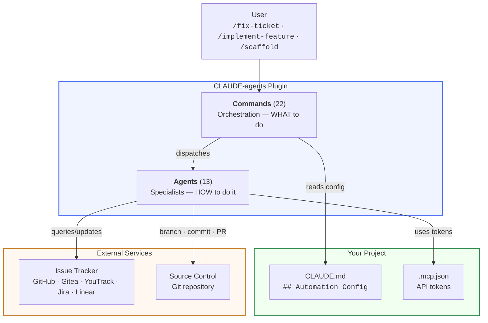
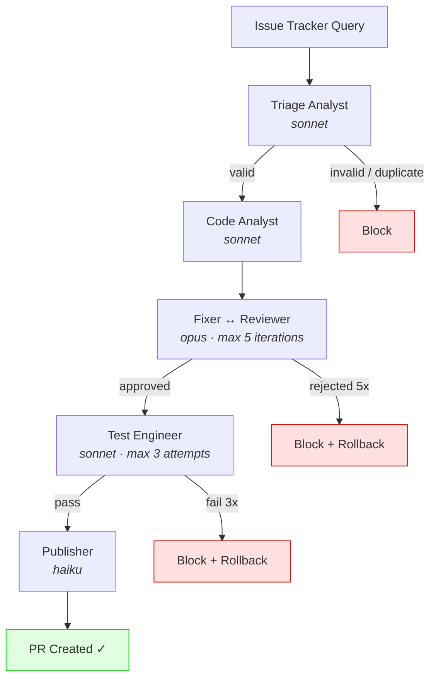
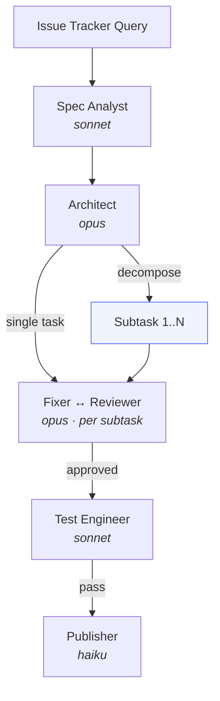
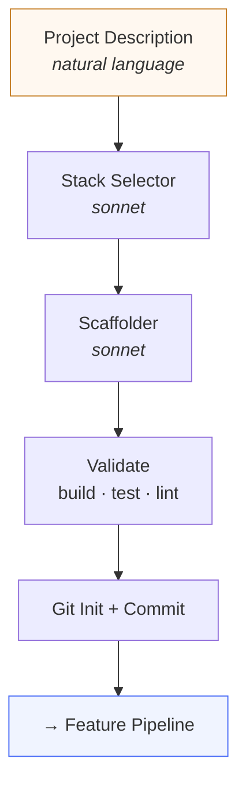

# Phase 4: README Rewrite — Implementation Plan

**Phase:** 4 of 4 (Documentation Overhaul)
**Scope:** Rewrite README.md from scratch as a landing page
**Risk:** LOW
**Target version:** 3.2.0 (part of Documentation Overhaul release)

## Prerequisites

- **Phase 1 (Translation)** must be complete — all content is in English
- **Phase 2 (Restructure)** must be complete — `docs/guides/` and `docs/reference/` directories exist, file paths are finalized
- Phase 3 (New docs) does NOT need to be complete, but links will point to Phase 3 files. If Phase 4 lands before Phase 3, the links will temporarily be dead. This is acceptable — both phases are part of the same version bump.

## Current State

The existing `README.md` (158 lines) is a functional but encyclopedia-style document. It contains:
- Key Features list (12 bullet points)
- Quick Start with 6 code lines
- Architecture paragraph
- 3 pipeline descriptions in ASCII plaintext
- Full commands table (22 entries)
- Full agents table (13 entries)
- Configuration section with required/optional key listings
- Examples directory listing
- Contributing, Author, License sections

**Problems with current README:**
1. Too much detail for a landing page — config section lists all 17 sections by name
2. No visual architecture diagram — plain text only
3. Pipeline diagrams are plaintext, not Mermaid (no rendering in Gitea/GitHub)
4. No links to deeper documentation (because deeper docs do not exist yet — Phase 3 creates them)
5. Quick Start mixes `onboard`, `template`, `check-setup`, and `fix-ticket` without clear flow

## Proposed README Structure

The new README follows the "gateway, not encyclopedia" principle. Every section links to deeper documentation instead of duplicating content. Total target length: ~250 lines.

---

### Section 1: Hero

```markdown
# CLAUDE-agents

A Claude Code plugin that automates the full development lifecycle — from bug triage through fix, review, test, and publish. 13 specialized AI agents, 22 orchestration commands, zero dependencies.


```

**Design notes:**
- The diagram shows the 3-layer data flow: User -> Plugin (Commands -> Agents) -> Project config + External services
- Subgraph labels make it clear what lives where
- The tracker list shows all 5 supported trackers
- Style colors distinguish the 3 zones visually

---

### Section 2: What It Does

```markdown
## What It Does

- **Bug-fix pipeline** — Triage, analyze, fix, review, test, and publish. Fully automated from issue tracker query to merged PR.
- **Feature pipeline** — Specification extraction, architecture design, task decomposition, implementation, review, test, and publish.
- **Project scaffolding** — Describe a project in natural language. Get a buildable skeleton with tests, CI, Docker, and CLAUDE.md.
- **13 specialized agents** — Each with a defined role, model assignment (opus/sonnet/haiku), and constraints. Read-only analysts never touch code; execution agents make changes.
- **Zero dependencies** — Pure markdown definitions. No build system, no runtime, no package manager.
```

**Design notes:**
- Exactly 5 bullet points as specified in the design doc
- Each bullet is one sentence (two max)
- Feature pipeline and scaffold pipeline are separate from bug-fix to show breadth
- "Zero dependencies" is the closing differentiator

---

### Section 3: Quick Start

```markdown
## Quick Start

```bash
# 1. Install the plugin
/plugin install CLAUDE-agents@CLAUDE-agents

# 2. Run the interactive setup wizard
/CLAUDE-agents:onboard

# 3. Validate your configuration
/CLAUDE-agents:check-setup

# 4. Fix your first bug
/CLAUDE-agents:fix-ticket ISSUE-123
```

The `/onboard` wizard will guide you through setting up your issue tracker, source control, PR rules, and build commands. No manual copy-paste needed.

> **New to CLAUDE-agents?** See the [Getting Started tutorial](docs/getting-started.md) for a complete walkthrough.
```

**Design notes:**
- Exactly 4 steps as specified
- Uses `/CLAUDE-agents:onboard` wizard, NOT manual config copy-paste
- Each step has a comment explaining what it does
- One-line explanation below the code block explains what `onboard` does
- Links to Getting Started for detail

---

### Section 4: Pipelines

```markdown
## Pipelines

### Bug-Fix Pipeline



### Feature Pipeline



### Scaffold Pipeline



> Hook integration points (pre-fix, post-fix, pre-publish, post-publish) and pipeline profiles are supported. See [Pipeline Reference](docs/reference/pipelines.md) for full details.
```

**Design notes:**
- 3 compact Mermaid diagrams, one per pipeline
- Bug-fix is the most detailed (shows block paths with red styling)
- Feature shows the decomposition decision point
- Scaffold shows the handoff to feature pipeline
- Model names are shown in italics under each agent
- Retry limits are shown inline (max 5, max 3)
- Hook details are NOT shown — linked to reference instead
- One-line note below links to `docs/reference/pipelines.md`

---

### Section 5: Commands

```markdown
## Commands

| Command | Description |
|---------|-------------|
| `/analyze-bug ISSUE-ID` | Analyze a bug from the issue tracker (triage + impact, no code changes) |
| `/fix-ticket ISSUE-ID` | Analyze and fix a single ticket in the current directory |
| `/fix-bugs N` | Automatically fix N bugs from the issue tracker |
| `/implement-feature ISSUE-ID` | Feature pipeline — spec, design, fix, review, test, publish |
| `/scaffold` | Create a new project from scratch — tech stack, skeleton, validation, git init |
| `/scaffold-add COMPONENT` | Add a component to an existing project (claude-md, ci, docker, tests) |
| `/scaffold-validate` | Validate a project — build, tests, lint, CLAUDE.md structure |
| `/create-pr` | Create a PR for the current branch |
| `/publish` | Create PR and update issue tracker states |
| `/resume-ticket ISSUE-ID` | Resume a pipeline from its failure point without re-analysis |
| `/check-setup` | Validate Automation Config, MCP servers, and tokens |
| `/onboard` | Interactive wizard for generating Automation Config |
| `/status` | Overview of in-progress issues — pipeline state, branch, PR |
| `/changelog` | Generate changelog from merged PRs |
| `/version-bump [patch\|minor\|major]` | Bump plugin version in plugin.json and marketplace.json |
| `/version-check` | Compare installed plugin version against latest available |
| `/dashboard` | Generate HTML dashboard — pipeline state, blocked issues, statistics |
| `/metrics` | Pipeline analytics report — success rates, per-agent effectiveness |
| `/estimate ISSUE-ID` | Estimate token cost before running a pipeline |
| `/prioritize` | AI backlog prioritization — impact, risk, effort scoring |
| `/migrate-config` | Detect Automation Config version and upgrade to current |
| `/template` | Generate Automation Config template for a tech stack |

All commands are namespaced: `/CLAUDE-agents:<command>`. Most support additional flags (`--dry-run`, `--profile <name>`, `--decompose`).

> Full syntax, flags, and examples: [Commands Reference](docs/reference/commands.md)
```

**Design notes:**
- All 22 commands listed
- Descriptions are in English (Phase 1 translates the Czech originals; this plan provides the final EN wording)
- Grouped loosely by function: core pipelines first, then utility commands, then analytics
- One-line note about namespace prefix and flags
- Links to `docs/reference/commands.md` for full details
- NO flag variants in the table (no `--dry-run`, `--profile` rows) — keeps table compact

---

### Section 6: Agents

```markdown
## Agents

| Agent | Model | Role |
|-------|-------|------|
| triage-analyst | sonnet | Analyzes and triages bug reports — validates clarity, detects duplicates |
| code-analyst | sonnet | Maps impact zone — call hierarchy, dependencies, test coverage gaps, risk |
| fixer | opus | Implements minimal surgical fixes targeting root cause |
| reviewer | opus | Quality gate — ensures root cause fix, convention compliance, no regressions |
| test-engineer | sonnet | Writes and runs unit tests verifying the fix and preventing regressions |
| e2e-test-engineer | sonnet | Writes and runs E2E tests verifying user flows end-to-end |
| publisher | haiku | Creates branch, commits, pushes, creates PR, updates issue tracker |
| rollback-agent | haiku | Reverts failed fix attempts — resets git state, posts block comment |
| spec-analyst | sonnet | Extracts structured specifications with acceptance criteria from feature requests |
| architect | opus | Designs architecture and generates task trees for implementation |
| stack-selector | sonnet | Analyzes project requirements and selects optimal technology stack |
| scaffolder | sonnet | Generates minimal buildable project skeleton with tests, CI, Docker |
| priority-engine | opus | Analyzes backlog and recommends fix order by impact, risk, effort |

> Agent details, inputs, outputs, and example output: [Agents Reference](docs/reference/agents.md)
```

**Design notes:**
- All 13 agents listed
- Role descriptions derived directly from agent frontmatter `description` fields
- Model column shows the assigned model tier
- Ordered by pipeline position: bug-fix agents first, then feature agents, then scaffold agents, then utility
- Links to `docs/reference/agents.md` for full details

---

### Section 7: Configuration

```markdown
## Configuration

Projects using this plugin need `## Automation Config` in their CLAUDE.md. Use `/CLAUDE-agents:onboard` to generate it interactively, or `/CLAUDE-agents:template list` for pre-built templates.

**Required sections:**

| Section | Purpose |
|---------|---------|
| Issue Tracker | Tracker type, instance, project, query, state transitions |
| Source Control | Remote, base branch, branch naming pattern |
| PR Rules | Labels for pull requests |
| PR Description Template | Template for PR body |
| Build & Test | Build and test commands |

**12 optional sections** cover retry limits, hooks, custom agents, notifications, worktrees, E2E testing, error handling, labels, feature workflow, decomposition, pipeline profiles, and metrics.

> Full specification with examples: [Automation Config Reference](docs/reference/automation-config.md)
> Canonical contract definition: [CLAUDE.md](CLAUDE.md)
```

**Design notes:**
- Minimal — shows required sections only as a small table
- Optional sections summarized in one line (count + category names), not listed individually
- Links to both the reference guide AND the canonical CLAUDE.md
- Encourages `/onboard` and `/template` instead of manual setup

---

### Section 8: Documentation

```markdown
## Documentation

| | |
|---|---|
| [Getting Started](docs/getting-started.md) | Step-by-step tutorial — install, configure, run your first pipeline |
| [Architecture](docs/architecture.md) | Design philosophy, model selection, pipeline architecture, data flow |
| **Guides** | |
| [Installation](docs/guides/installation.md) | Detailed installation and platform notes |
| [MCP Configuration](docs/guides/mcp-configuration.md) | MCP server setup for each tracker |
| [Tokens](docs/guides/tokens.md) | API token generation for all 5 supported trackers |
| [Cross-Platform](docs/guides/cross-platform.md) | Cross-platform verification checklist |
| [Custom Agents](docs/guides/custom-agents.md) | How to write and integrate custom agents |
| [Troubleshooting](docs/guides/troubleshooting.md) | Common issues and solutions |
| **Reference** | |
| [Commands](docs/reference/commands.md) | All 22 commands — syntax, flags, examples |
| [Agents](docs/reference/agents.md) | All 13 agents — role, model, inputs, outputs |
| [Pipelines](docs/reference/pipelines.md) | Pipeline diagrams, hooks, profiles, error handling |
| [Automation Config](docs/reference/automation-config.md) | Config specification with examples and validation rules |
```

**Design notes:**
- All 12 documentation files linked (4 from Phase 2 moves + 8 from Phase 3 new docs)
- Organized following Diataxis: Tutorial, Explanation, Guides, Reference
- Table format for scannability
- Bold section headers for Guides and Reference sub-groups
- No separate column for Diataxis type — implicit from grouping

---

### Section 9: Contributing

```markdown
## Contributing

See [CONTRIBUTING.md](CONTRIBUTING.md) for guidelines on writing custom agents, creating commands, submitting examples, and reporting issues.
```

**Design notes:**
- Single line with link
- Lists the 4 main contribution types inline for discoverability

---

### Section 10: Author + License

```markdown
## Author

**Filip Sabacky**

## License

See [plugin.json](.claude-plugin/plugin.json) for license details.
```

**Design notes:**
- Author name bolded
- License references plugin.json (current license: UNLICENSED)
- No inline license text — link to source of truth

---

## Complete README.md (assembled)

For reference, here is the complete file that would be written when implementing this plan. The content above is the authoritative specification; this assembly shows how the sections connect.

Total sections: 10
Estimated total lines: ~230-250

The file starts with the H1 header and ends with the License section. No trailing content, no badges, no table of contents (the document is short enough to not need one).

## Critical Points

1. **No Czech text anywhere** — Every string in the README must be English. The current README is already English, but the Quick Start and Configuration sections must not accidentally pull Czech from config examples.

2. **No content duplication** — The README must NOT reproduce the full config contract, full pipeline hook details, or full command flag lists. It links to reference docs instead.

3. **Link paths depend on Phase 2** — All `docs/guides/` and `docs/reference/` links assume Phase 2 directory restructure is complete. If Phase 2 is not done, every link in Sections 4, 5, 6, 7, and 8 will be broken.

4. **Mermaid rendering** — Diagrams must be tested in Gitea's markdown renderer. Known constraints:
   - Gitea uses Mermaid.js — `flowchart TD` and `graph TD` are both supported
   - HTML tags in node labels (like `<b>`, `<i>`, `<br/>`, `<code>`) are supported in Mermaid but may render differently across platforms
   - `style` directives for coloring are supported
   - If Gitea's Mermaid version is old, fall back to simpler syntax (remove HTML tags, use plain text labels)

5. **Command namespace** — All commands in Quick Start and throughout use the full `/CLAUDE-agents:` prefix, which is the correct invocation form.

6. **Agent descriptions** — The Role column in the agents table uses the exact `description` field from each agent's YAML frontmatter (post-Phase 1 translation). These descriptions are the single source of truth.

7. **README.cs.md** — This file is deleted in Phase 1. Phase 4 does NOT need to preserve any content from it. The Mermaid diagrams in Phase 4 are new designs, not translations of the ASCII art from README.cs.md.

8. **No roadmap section** — The current README.cs.md has an extensive roadmap. The new README intentionally omits it. Roadmap information belongs in CHANGELOG.md and design docs, not the landing page.

9. **No examples section** — The current README has an Examples section listing `examples/` contents. The new README omits it. Examples are discoverable via the Getting Started tutorial and the Automation Config reference.

## Verification

After writing the new README.md, verify the following:

### Content checks

- [ ] H1 is `# CLAUDE-agents`
- [ ] One-liner description is present immediately after H1
- [ ] Architecture Mermaid diagram renders (test in Gitea preview)
- [ ] "What It Does" has exactly 5 bullet points
- [ ] Quick Start has exactly 4 steps using `/CLAUDE-agents:onboard`
- [ ] Quick Start does NOT include manual config copy-paste
- [ ] All 3 pipeline Mermaid diagrams render correctly
- [ ] Bug-fix diagram shows block paths (red nodes)
- [ ] Feature diagram shows decomposition decision point
- [ ] Scaffold diagram shows handoff to feature pipeline
- [ ] Commands table has exactly 22 rows (not counting header)
- [ ] Agents table has exactly 13 rows (not counting header)
- [ ] Configuration section does NOT list all 17 config sections individually
- [ ] Documentation section links to all 12 documentation files
- [ ] Contributing links to CONTRIBUTING.md
- [ ] Author is "Filip Sabacky"
- [ ] License references plugin.json

### Link checks

- [ ] `docs/getting-started.md` exists (Phase 3)
- [ ] `docs/architecture.md` exists (Phase 3)
- [ ] `docs/guides/installation.md` exists (Phase 2 move)
- [ ] `docs/guides/mcp-configuration.md` exists (Phase 2 move)
- [ ] `docs/guides/tokens.md` exists (Phase 2 move)
- [ ] `docs/guides/cross-platform.md` exists (Phase 2 move + rename)
- [ ] `docs/guides/custom-agents.md` exists (Phase 3)
- [ ] `docs/guides/troubleshooting.md` exists (Phase 3)
- [ ] `docs/reference/commands.md` exists (Phase 3)
- [ ] `docs/reference/agents.md` exists (Phase 3)
- [ ] `docs/reference/pipelines.md` exists (Phase 3)
- [ ] `docs/reference/automation-config.md` exists (Phase 3)
- [ ] `CONTRIBUTING.md` exists
- [ ] `CLAUDE.md` exists
- [ ] `.claude-plugin/plugin.json` exists

### Negative checks

- [ ] No Czech text anywhere in the file
- [ ] No ASCII-art pipeline diagrams (replaced by Mermaid)
- [ ] No roadmap section
- [ ] No examples section
- [ ] No config contract duplication (full key listings)
- [ ] No inline flag documentation for commands
- [ ] File length is under 300 lines

## Files Modified

| File | Action |
|------|--------|
| `README.md` | Complete rewrite (current 158 lines -> ~240 lines) |

Total: **1 file**

## Commit Message

```
docs: rewrite README.md as landing page with Mermaid diagrams

Replace encyclopedia-style README with a gateway landing page.
Architecture overview diagram, 3 pipeline Mermaid diagrams,
compact commands/agents tables, links to docs/ reference pages.
Part of Documentation Overhaul Phase 4.
```
