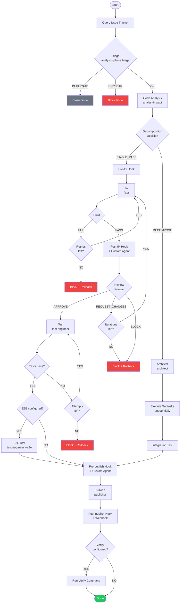
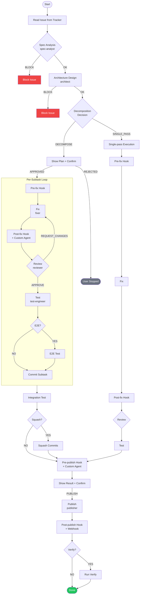
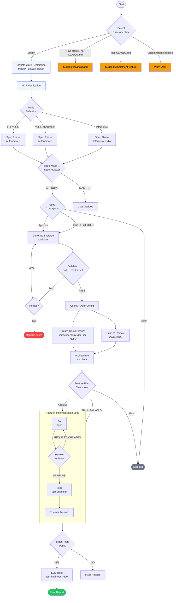

# Pipeline Reference

agent-flow orchestrates three distinct pipelines, each designed for a specific workflow: fixing bugs, implementing features, and scaffolding new projects. This document provides complete pipeline diagrams, stage tables, profile support, and error handling details.

All pipelines share common patterns:

- **Retry loops** with configurable limits (Retry Limits section in Automation Config)
- **Block/rollback** pattern for error handling (any agent can block; rollback-agent reverts git state)
- **Hook integration** at four points (Pre-fix, Post-fix, Pre-publish, Post-publish)
- **Pipeline profiles** for skipping optional stages

## Bug-Fix Pipeline

The bug-fix pipeline takes a bug from triage through fix, review, test, and publish. It is invoked by `/agent-flow:fix-bugs` (single bug or batch; optional worktrees).



### Stages

| Stage | Agent | Model | Skippable | Retries | Notes |
|-------|-------|-------|-----------|---------|-------|
| Triage | analyst --phase triage | sonnet | Yes | None | Blocks on DUPLICATE or UNCLEAR; pauses on NEEDS_CLARIFICATION |
| Code Analysis | analyst-impact | sonnet | Yes | None | Max 5 affected files |
| Decomposition | architect | opus | Auto | None | Triggered by risk/complexity heuristics |
| Create Tracker Subtasks | (skill) | N/A | N/A | None | Creates tracker sub-issues for each decomposition subtask. Skippable via config. |
| Pre-fix Hook | (user-defined) | N/A | N/A | None | Failure triggers block handler |
| Fix | fixer | opus | **No** | Build retries (default: 3) | Diff limit: 100 lines; pauses on NEEDS_CLARIFICATION; signals NEEDS_DECOMPOSITION when scope exceeds 100-line limit |
| Post-fix Hook | (user-defined) | N/A | N/A | None | Runs after successful build |
| Post-fix Agent | (custom agent) | (per agent) | N/A | None | One-shot gate; BLOCK stops pipeline |
| Review | reviewer | opus | **No** | Fixer iterations (default: 5) | Loops with fixer |
| Test | test-engineer | sonnet | Yes | Test attempts (default: 3) | Follows project test conventions |
| E2E Test | test-engineer --e2e | sonnet | Yes | 3 attempts | Requires E2E Test config or profile |
| Pre-publish Hook | (user-defined) | N/A | N/A | None | Failure triggers block handler |
| Pre-publish Agent | (custom agent) | (per agent) | N/A | None | One-shot gate |
| Publish | publisher | haiku | **No** | None | Creates PR, updates issue tracker |
| Post-publish Hook | (user-defined) | N/A | N/A | None | Failure is warning only |
| Verify | (skill) | N/A | N/A | None | Runs after PR merge; re-opens issue on failure |

### Hook Integration Points

| Hook | When | On Failure |
|------|------|------------|
| Pre-fix | Before fixer, after code analysis | Block + rollback |
| Post-fix | After successful build, before reviewer | Block + rollback |
| Pre-publish | After all tests pass, before publisher | Block + rollback |
| Post-publish | After PR creation | Warning only (PR already exists) |

### Worktree Mode

When the Worktrees section is configured in Automation Config, `/agent-flow:fix-bugs` processes bugs in parallel using git worktrees:

- **Batch size** controls how many bugs run concurrently (default: 3)
- **Base path** sets the worktree directory (default: `.worktrees/`)
- **Cleanup** determines whether worktrees are removed after completion (`auto` or `manual`)
- Each bug gets its own worktree with an isolated branch
- Block/rollback operates within the worktree context

Without Worktrees config, bugs are processed sequentially in the current working directory.

### Decomposition Decision

The pipeline evaluates analyst-impact output to decide between single-pass and decomposition:

- `risk == HIGH` --> DECOMPOSE
- `affected_files >= 4` --> DECOMPOSE
- `estimated_diff_lines > 60 AND affected_files >= 3` --> DECOMPOSE
- `independent_changes >= 2` --> DECOMPOSE
- Otherwise --> SINGLE_PASS

Use `--decompose` to force decomposition or `--no-decompose` to disable it.

## Feature Pipeline

The feature pipeline adds spec analysis and architecture design stages before the fix/review/test cycle. It is invoked by `/agent-flow:implement-feature`.



### Stages

| Stage | Agent | Model | Skippable | Retries | Notes |
|-------|-------|-------|-----------|---------|-------|
| Spec Analysis | spec-analyst | sonnet | Yes | None | Blocks if request is too vague |
| Architecture | architect | opus | No | None | Produces task tree YAML for decomposition |
| Decomposition | (decision) | N/A | N/A | N/A | User confirms plan before execution |
| Create Tracker Subtasks | (skill) | N/A | N/A | None | Creates tracker sub-issues for each decomposition subtask. Skippable via config. |
| Fix (per subtask) | fixer | opus | **No** | Build retries (default: 3) | Each subtask scoped to 100-line diff |
| Review (per subtask) | reviewer | opus | **No** | Fixer iterations (default: 5) | Loops with fixer per subtask |
| Test (per subtask) | test-engineer | sonnet | Yes | Test attempts (default: 3) | Runs per subtask |
| Integration Test | (skill) | N/A | No | 3 attempts | Full test suite after all subtasks |
| Publish | publisher | haiku | **No** | None | Creates PR, updates issue tracker |

### Decomposition Details

The architect produces a task tree in YAML format:

- **Max subtasks:** Configurable (default: 7)
- **Dependencies:** Must form a DAG (directed acyclic graph); each subtask lists `depends_on`
- **Execution order:** Topological sort of the dependency graph
- **Fail strategy:** `fail-fast` (stop on first failure) or `continue` (attempt remaining subtasks)
- **Commit strategy:** `squash` (single commit) or `individual` (one commit per subtask)
- **Task tree is saved** to `.claude/decomposition/{ISSUE-ID}.yaml` for resume support
- **Per-subtask state:** After each subtask commit, `status`, `commit_hash`, and `restore_point` are updated in both the YAML file and `state.json` `decomposition.subtasks[N]`
- **Tracker sub-issues:** After decomposition plan approval, sub-issues are created in the tracker (configurable via `Create tracker subtasks`). Idempotent on resume via dual-store check.

## Scaffold Pipeline

The scaffold pipeline creates a new project from scratch. In spec-first mode (default), it generates a specification, builds the skeleton, and implements all features. It is invoked by `/agent-flow:scaffold`.

### Scaffold Pipeline (default)



### Stages

| Step | Stage | Agent | Model | Notes |
|------|-------|-------|-------|-------|
| 0-INFRA | Infrastructure Declaration | (skill) | N/A | Collects tracker/SC intent; always runs (even Full YOLO) |
| 0-MCP | MCP Verification | (skill) | N/A | Verifies MCP for declared "ready" services; auto-downgrades in Full YOLO |
| 0 | Mode Selection | (skill) | N/A | Interactive / YOLO with checkpoint / Full YOLO |
| 1 | Specification | spec-writer ↔ spec-reviewer | opus | Loop up to Spec iterations (default 5) |
| 2 | Spec Checkpoint | (skill) | N/A | Skip in Full YOLO; user approves or aborts |
| 3 | Skeleton Generation | scaffolder | sonnet | Reads tech stack from spec/README.md; generates E2E Test + Decomposition config |
| 4 | Git Init + Auto-Config | (skill) | N/A | Commits spec/ + skeleton; auto-fills CLAUDE.md from 0-INFRA; generates .mcp.json.example |
| 4d | Push to Remote | (skill) | N/A | If SC ready; WARN on failure |
| 4e | Create Tracker Issues | (skill) | N/A | If tracker ready, not Full YOLO; accumulator pattern for partial failure |
| 5 | Architecture | architect | opus | Decomposes epics into dependency-aware batches |
| 6 | Feature Plan Checkpoint | (skill) | N/A | Skip in Full YOLO; user approves batch plan |
| 7 | Feature Implementation | fixer ↔ reviewer + test-engineer | opus/sonnet | Per-subtask loop with block handler + rollback |
| 8 | E2E Tests | test-engineer --e2e | sonnet | Covers critical user flows from spec |
| 9 | Final Report | (skill) | N/A | Summary with infrastructure status, features, tests, next steps |

### Legacy Mode (--no-implement)

With `--no-implement`, the scaffold pipeline falls back to v3.x behavior: stack-selector → scaffolder → validate → git init → report. No specification phase, no feature implementation.

| Stage | Agent | Model | Notes |
|-------|-------|-------|-------|
| Directory Detection | (skill) | N/A | Guards against overwriting existing projects |
| Stack Selection | stack-selector | sonnet | Picks one option per category; respects `--lang`, `--framework`, `--db`, `--ci` flags |
| Skeleton Generation | scaffolder | sonnet | Writes to temp directory; includes CLAUDE.md with Automation Config |
| Validation | (skill) | N/A | Build + test + lint + CLAUDE.md structure check; max 3 retries |
| Copy to Target | (skill) | N/A | Copies validated skeleton to target directory |
| Git Init | (skill) | N/A | `git init` + initial commit |

## Autopilot Pipeline

The Autopilot pipeline is a headless dispatcher for unattended cron / batch / CI invocation. It reads issue queries from Automation Config, classifies issues, and dispatches the existing `/agent-flow:fix-bugs` (bugs) and `/agent-flow:implement-feature` (features) skills sequentially. It is invoked by `/agent-flow:autopilot`.

```
Preflight ──► Dry-run check ──► Lock (.agent-flow/autopilot.lock/) ──► Read queries
    │                                                                          │
    ▼                                                                          ▼
[exit on config/MCP error]                                            Classify issues
                                                                   (bugs first; bug wins on overlap)
                                                                              │
                                                                              ▼
                                                                    Dispatch sequentially
                                                              fix-bugs (bug) | implement-feature (feature)
                                                                              │
                                                                              ▼
                                                                   Summary table ──► Release lock
```

### Key Properties

| Property | Detail |
|----------|--------|
| Dispatch order | Bugs first (in tracker order), then features; if an issue matches both queries, it is classified as bug |
| Lock mechanism | Directory-based: `mkdir .agent-flow/autopilot.lock/` (atomic on POSIX and NTFS); stale threshold 120 minutes |
| Observability | Child skills (`fix-bugs`, `implement-feature`) fire events per issue: `pipeline-started`, `step-completed`, `pipeline-completed`. Block events fire as `issue-blocked`. When configured, also fires `pipeline-paused` per paused transition. Autopilot itself fires no per-issue webhooks. |
| Dry-run | Full short-circuit — no lock, no state, no webhook, no dispatch; safe for concurrent cron |
| Concurrency | Sequential dispatch only; one issue at a time |
| Multi-host | Process-local lock only; multi-host deployments must use disjoint `Bug query` / `Feature query` filters per host |

### Exit Codes

| Exit | Meaning |
|------|---------|
| 0 | All issues dispatched (or dry-run, or empty queue) |
| 1 | Preflight failure (missing config, missing Bug query) |
| 2 | Lock held by another run |
| 3 | MCP ping failed — tracker unreachable |
| >0 (other) | Dispatch loop broke due to `On error: stop` config |

## Pipeline Profiles

Pipeline profiles allow you to customize which stages run for different use cases. Profiles are defined in the `Pipeline Profiles` section of Automation Config and apply to `/agent-flow:fix-bugs` and `/agent-flow:implement-feature`.

### Skippable Stages

| Stage | Skippable | Pipeline(s) |
|-------|-----------|-------------|
| triage | Yes | Bug-fix |
| analyst-impact | Yes | Bug-fix |
| spec-analyst | Yes | Feature |
| test-engineer | Yes | Bug-fix, Feature |
| test-engineer-e2e | Yes | Bug-fix, Feature |
| fixer | **No** | All |
| reviewer | **No** | All |
| publisher | **No** | All |

### Example Profiles

| Profile | Skip stages | Extra stages | Use case |
|---------|-------------|--------------|----------|
| fast | triage, analyst-impact, test-engineer | (none) | Quick fixes where analysis is already done |
| strict | (none) | test-engineer-e2e | Maximum quality gate with E2E tests |
| minimal | triage, analyst-impact, test-engineer, test-engineer-e2e | (none) | Hotfix with minimum overhead |

Usage: `/agent-flow:fix-bugs PROJ-42 --profile fast`

## Error Handling

### Block/Rollback Pattern

When any agent encounters an unrecoverable error, it triggers a **block**:

1. The **rollback-agent** (haiku) reverts git state to the pre-fix checkpoint
2. The issue state is set to **Blocked** in the issue tracker
3. A **Block comment** is posted to the issue with structured fields

Block comments follow this format:

```
[agent-flow] Pipeline Block
Agent: {agent name}
Step: {pipeline step where failure occurred}
Reason: {max 2 sentences}
Detail: {technical output — error message, diff, test output}
Recommendation: {what the human should do}
```

The `[agent-flow]` prefix enables machine-parseable detection by the inline auto-resume contract (`core/resume-detection.md`) used by all pipeline entry-point skills (`fix-bugs`, `implement-feature`, `scaffold`).

### Rollback Behavior by Agent

| Blocked By | Rollback? | Reason |
|------------|-----------|--------|
| analyst (--phase triage) | No | No git changes to revert |
| analyst (--phase impact) | No | No git changes to revert |
| fixer | Yes | Reverts code changes |
| reviewer | Yes | Reverts code changes from fixer |
| test-engineer | Yes | Reverts test and code changes |
| test-engineer (--e2e) | Yes | Reverts E2E test changes |
| Build failure | Yes | Reverts broken code changes |
| Hook failure | Yes | Reverts code changes |
| Custom agent | Yes | Reverts code changes |

### Error Handling Config

The Error Handling section in Automation Config controls block behavior:

- **On block:** `comment` (default) posts a comment, `close` posts a comment and closes the issue
- **Max blocked per run:** Limits how many issues can block before the batch stops (default: `unlimited`)

## Dry-Run Mode

The `--dry-run` flag runs analysis stages only with no side effects. No issue tracker state changes, no git operations, no worktrees.

For bug-fix pipelines, dry-run executes triage and code analysis, then produces a report:

```
## Dry-Run Report — PROJ-42

**Triage:** OK
**Severity:** HIGH
**Area:** auth/login
**Affected files:** src/auth/login.ts, src/auth/validators.ts
**Risk:** MEDIUM
**Est. complexity:** S

No changes made. To run the fix, use `/agent-flow:fix-bugs PROJ-42` (without --dry-run).
```

For batch processing with `/agent-flow:fix-bugs`, the report includes a summary table with complexity estimates and resource projections.

## Fix Verification

When the `Verify` command is configured in the Build & Test section of Automation Config, the pipeline runs a post-merge verification step:

1. After the PR is created, the pipeline waits for the PR to be merged (max 5 attempts, 30s interval)
2. Once merged, it checks out the base branch and pulls
3. Runs the Verify command
4. **On success:** Posts a verification comment to the issue
5. **On failure:** Posts a failure comment and re-opens the issue via state transition

This ensures that the fix works correctly in the context of the target branch after merge, catching integration issues that unit tests might miss.
